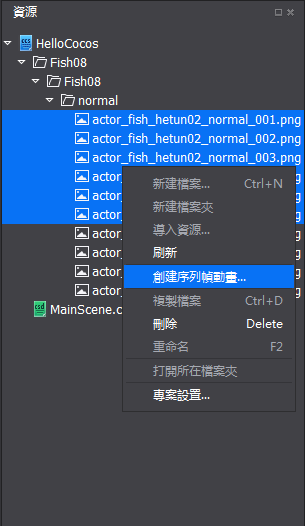
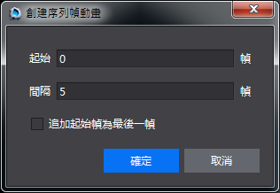
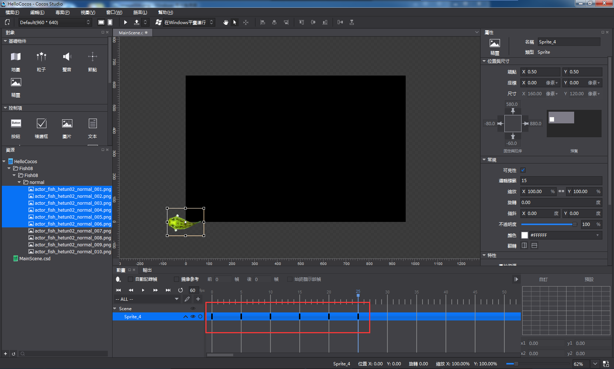
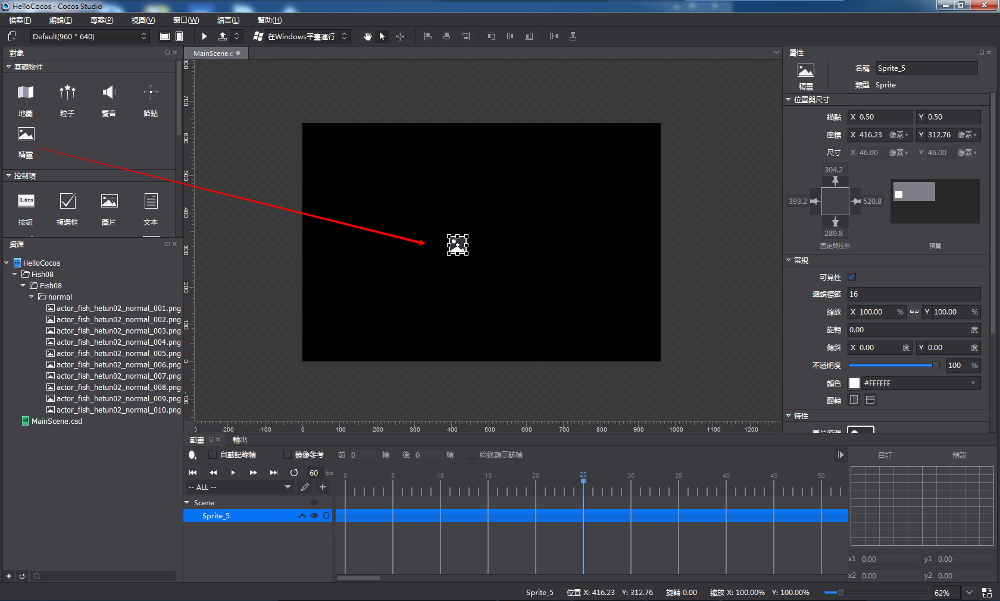
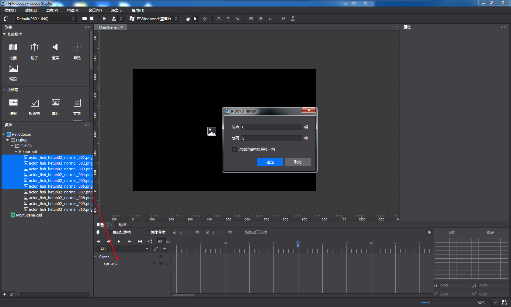
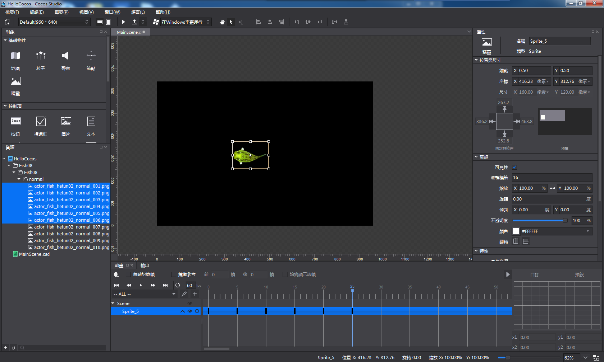

#序列幀動畫編輯
Cocos製作序列幀動畫非常簡單易用，它可以由兩種操作方式來實現：

1,在資源面板選中兩個或兩個以上的圖片資源右鍵點擊“創建序列幀動畫”：

可以通過下面的彈窗調整起始幀和幀間隔控制，“追加起始幀為最後一幀”是只在最後一幀添加與與起始幀完全一樣的幀，以保證動畫的完整性和流暢性。

點擊確定動畫創建完成。

2,添加一個精靈控制項到渲染區。

選中資源面板的兩張或兩張以上的圖片資源拖拽到物件結構樹的精靈控制項上。

設置起始幀,幀間隔,追加起始幀為最後一幀選項，點擊確定。

