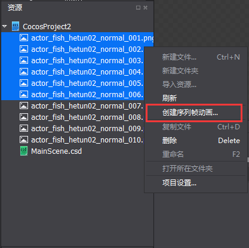
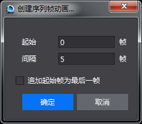
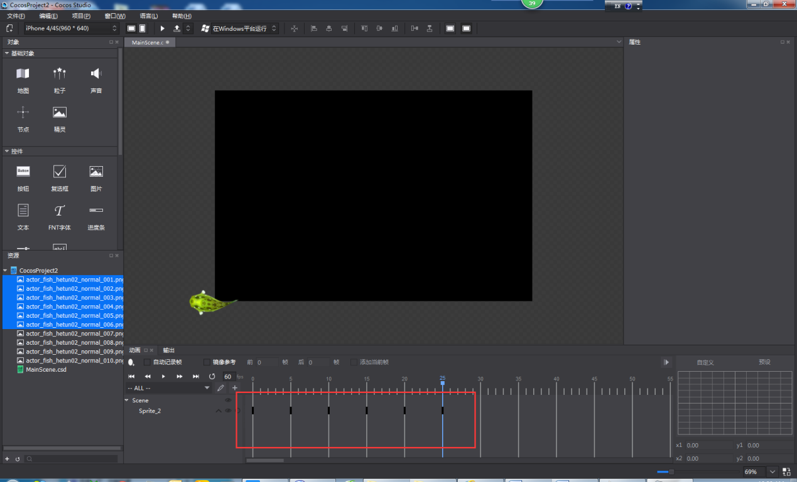
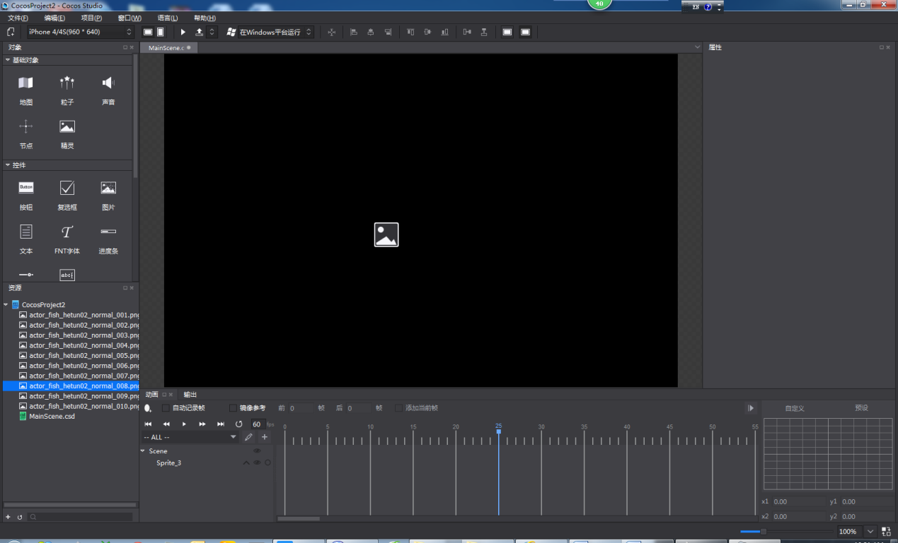
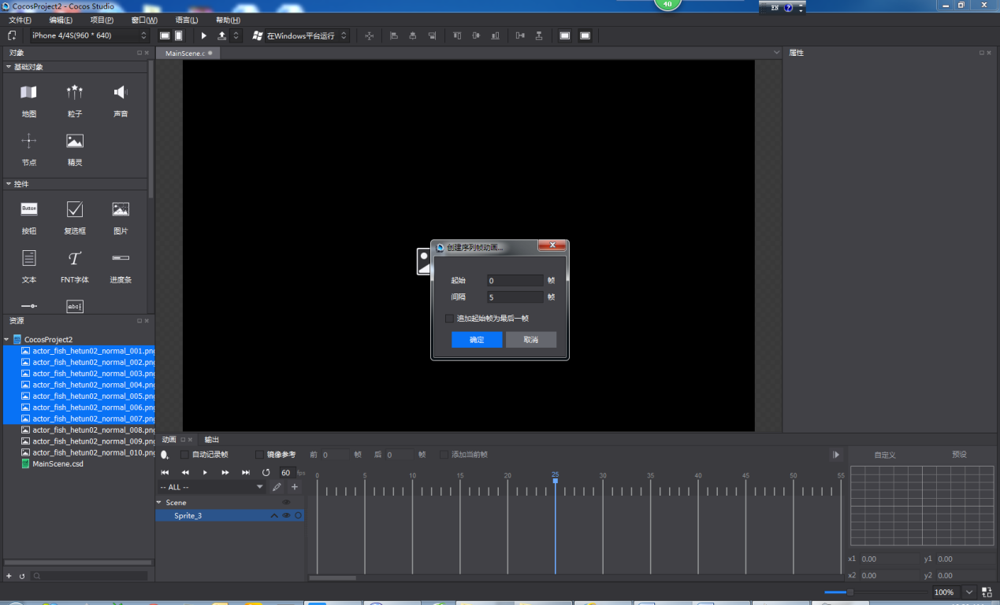
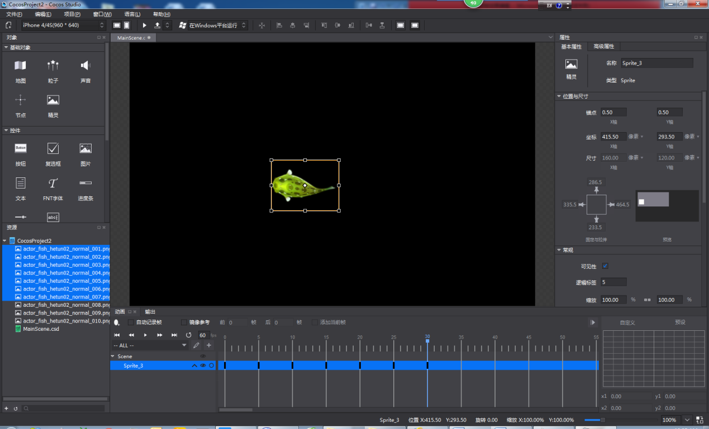

#序列帧动画编辑
Cocos Studio制作序列帧动画非常简单易用，它可以由两种操作方式来实现：

1,在资源面板选中两个或两个以上的图片资源右键点击“创建序列帧动画”：

可以通过下面的弹窗调整起始帧和帧间隔控制，“追加起始帧为最后一帧”是只在最后一帧添加与与起始帧完全一样的帧，以保证动画的完整性和流畅性。

点击确定动画创建完成。

2,添加一个精灵控件到渲染区。

选中资源面板的两张或两张以上的图片资源拖拽到对象结构树的精灵控件上。

设置起始帧,帧间隔,追加起始帧为最后一帧选项，点击确定。

