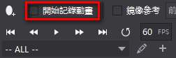
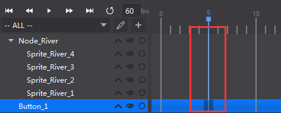
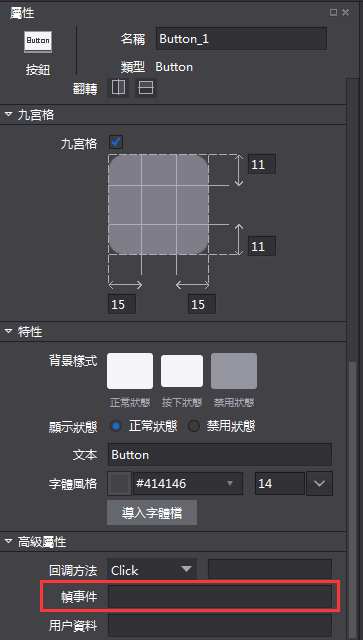
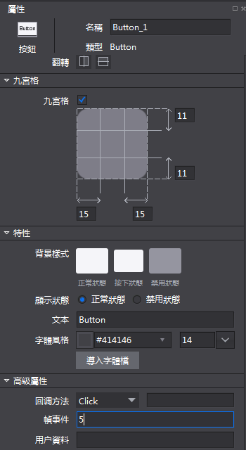
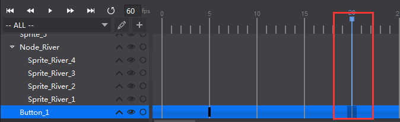
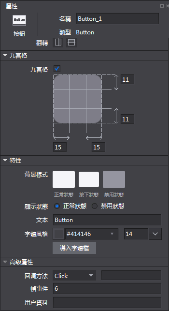
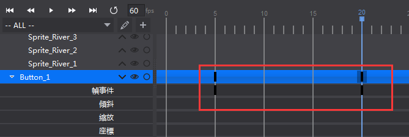

# 添加幀事件
幀事件屬性是指可以在同一個控制項的每一幀設置自訂資料，用於使用者自己的後端調用。

如何使用幀事件？

&emsp;&emsp;1.勾選開始記錄動畫。

&emsp;&emsp;&emsp;

&emsp;&emsp;2.選中控制項，在時間軸上點擊需要添加幀事件的位置。

&emsp;&emsp;&emsp;

&emsp;&emsp;3.屬性區切換到高級屬性。

&emsp;&emsp;&emsp;

&emsp;&emsp;4.為幀事件賦值。

&emsp;&emsp;&emsp;

&emsp;5.切換到時間軸的下一位置。

&emsp;&emsp;&emsp;

&emsp;6.再次為幀事件賦值（可與前一幀不同）。

&emsp;&emsp;&emsp;

&emsp;&emsp;&emsp;
