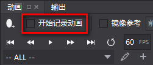
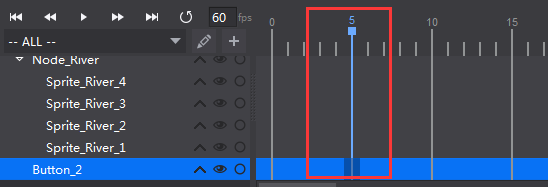
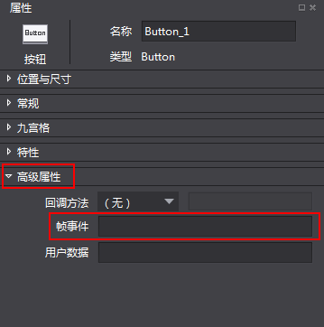
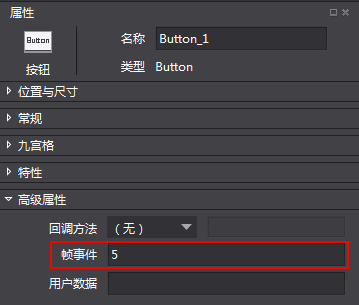
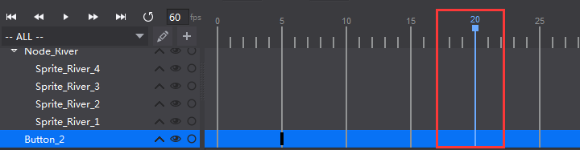
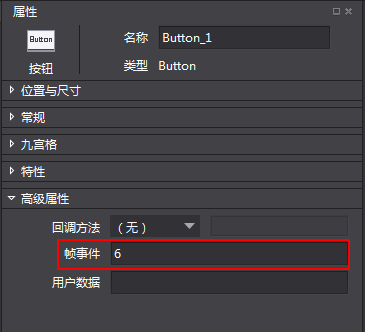
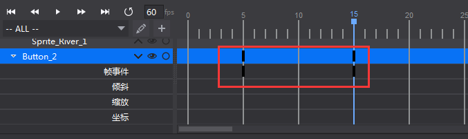

# 添加帧事件
帧事件属性是指可以在同一个控件的每一帧设置自定义数据，用于用户自己的后端调用。

如何使用帧事件？

&emsp;&emsp;1.勾选开始记录动画。

&emsp;&emsp;&emsp;

&emsp;&emsp;2.选中控件，在时间轴上点击需要添加帧事件的位置。

&emsp;&emsp;&emsp;

&emsp;&emsp;3.属性区切换到高级属性。

&emsp;&emsp;&emsp;

&emsp;&emsp;4.为帧事件赋值。

&emsp;&emsp;&emsp;

&emsp;5.切换到时间轴的下一位置。

&emsp;&emsp;&emsp;

&emsp;6.再次为帧事件赋值（可与前一帧不同）。

&emsp;&emsp;&emsp;

&emsp;&emsp;&emsp;