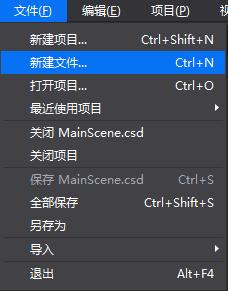
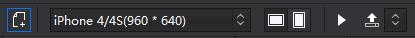
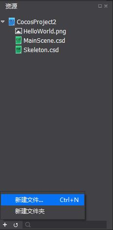
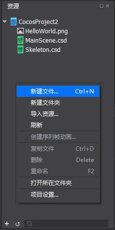
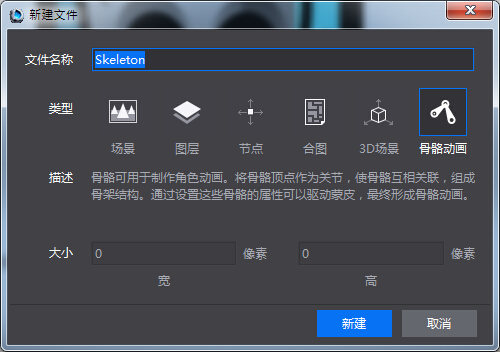

## 创建骨骼文件 ##
===============

有3种方法可以新建一个骨骼文件，下文将一一介绍。

####方法一：菜单栏新建文件

用户可单击菜单栏中‘文件——新建文件’，进行骨骼文件的创建。

####方法二：工具栏新建文件

用户可单击工具栏中的新建文件快捷按钮，进行骨骼文件的创建。

####方法三：资源区新建文件

用户可单击资源区左下角的‘ + ’，选择‘新建文件’；

或在资源区内单击右键，选择‘新建文件’，进行骨骼文件的创建。

在新建文件时选择‘骨骼’，并可以自定义骨骼文件的文件名称，最后单击确定，完成创建。

