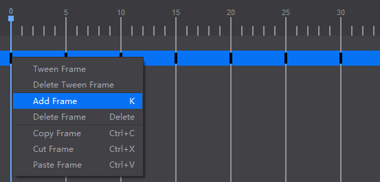
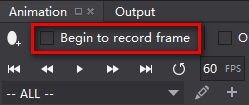

# Key Frames 

Frame is the minimum single image in a motion picture. In Cocos Studio, the time is represented on the timeline by frames. Key Frame refers to a single still image in an animated sequence that occurs at an important point in that sequence. Following is an example to show how to create key frames. 

1 Create four footprints and put them at a start position. 

2 Realize walking footprints that requires four footprints appear and disappear alternately, then assume the footprints appear to disappear need 10 frame, then we can think that the first step to set keyframes between 0 and 10, the second in the between 10 and 20, and so on. Why the same space to set two keyframes? To make the footprints appear and disappear from the animation, we need to edit the last two keyframes. Key frame records the time that stores the value of a property. 

There are four ways to **add keyframes**:

- Right-click on the timeline marker, and select "add frame". 

&emsp;&emsp;&emsp;

- Click "Add Frame" button. 

&emsp;&emsp;&emsp;

- Click the timeline marker, and press K on the keyboard to add a key frame. 

- Select "Begin to record frame" checkbox. 

&emsp;&emsp;&emsp;

Cocos Studio provides an effective method to record key frames: Begin to record frame. When you select "AutoRecord Frame"check box, and move timeline marker to a position, you can adjust its values for a perfect effects. All the widgets and their changed properties will be saved and recorded automatically. 

**Note:** Remove the timeline marker to a desired position, and then customize widgets' settings.

**Edit keyframes**

- Perform the following operations on a single key frame: move around, copy, cut, paste, delete.

- Select multiple frames and perform the above function at the same time.