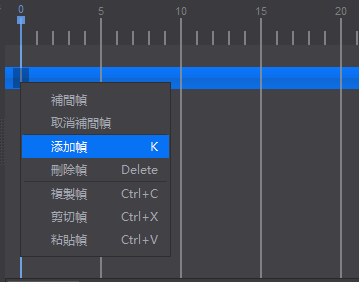
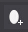

# 添加關鍵幀
&emsp;&emsp;首先介紹概念：幀——動畫中最小單位的單幅影像畫面，相當於電影膠片上的每一格鏡頭。在Cocos Studio的時間軸上幀表現為一刻度。關鍵幀——相當於二維動畫中的原畫，指角色或者物體運動或變化中的關鍵動作所處的那一幀。

&emsp;何時應該添加關鍵幀 

&emsp;我們以“腳印”這個動作為例，來說明如何創建關鍵幀。

&emsp;1.首先我們要添加四個腳印，將它們放置在合理的初始位置。

&emsp;2.實現腳印走的過程，需要四個腳印交替出現並消失，那麼假設腳印出現到消失需要10幀，那麼我們便可以為第一個腳印在第0幀和第10幀設置關鍵幀，第二個在第10幀和第20幀設置，以此類推。為什麼同一空間要設置兩個關鍵幀？原因在於要製作腳印從出現逐漸消失的動畫，需要首尾兩個關鍵幀來實現。

&emsp;添加關鍵幀

&emsp;關鍵幀記錄的是運動或變化的關鍵動作，設置好關鍵幀的狀態對動畫製作至關重要。添加關鍵幀有四種方式：

&emsp;(1)在時間軸的刻度線上按下滑鼠右鍵，選擇“添加幀”來添加：

&emsp;&emsp;&emsp;

&emsp;(2) 點擊“添加幀”按鈕。

&emsp;&emsp;&emsp;

&emsp;(3) 在時間軸的刻度線上按下滑鼠左鍵，按下鍵盤按鍵K鍵，添加關鍵幀。

&emsp;(4) 使用開始記錄動畫功能。

&emsp;&emsp;&emsp;

&emsp;勾選開始記錄動畫

&emsp;Cocos Studio提供了一種便捷記錄關鍵幀的方式：開始記錄動畫。當您勾選了這個選項時，移動刻度線至所需的位置，調整控制項直到理想效果，系統將會在此刻度線上為您所有改變狀態的控制項和屬性記錄關鍵幀。

在使用自動記錄幀時，有一點需要注意：一定要先移動刻度線至所需的位置，再改變控制項的狀態。

&emsp;編輯關鍵幀 

&emsp;您可以對單個關鍵幀進行以下操作：左右移動,複製,剪切,粘貼,刪除。 您也可以選擇多個幀進行上述操作。
