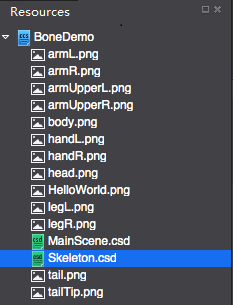
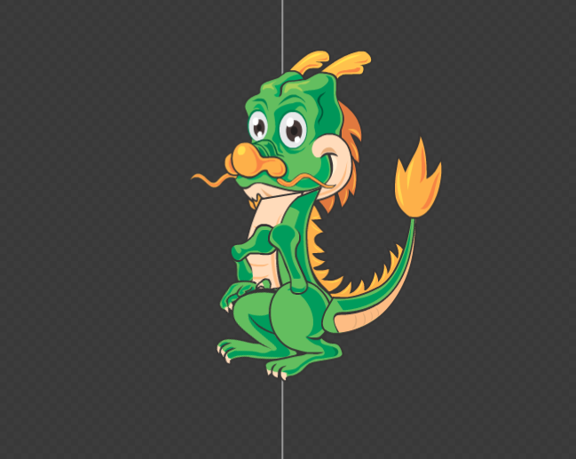
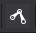
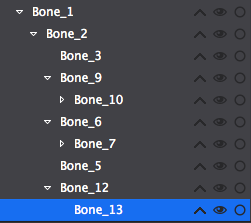
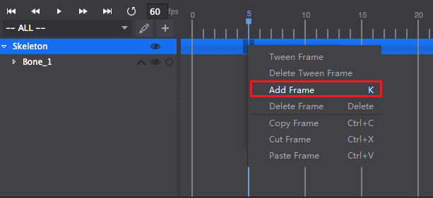
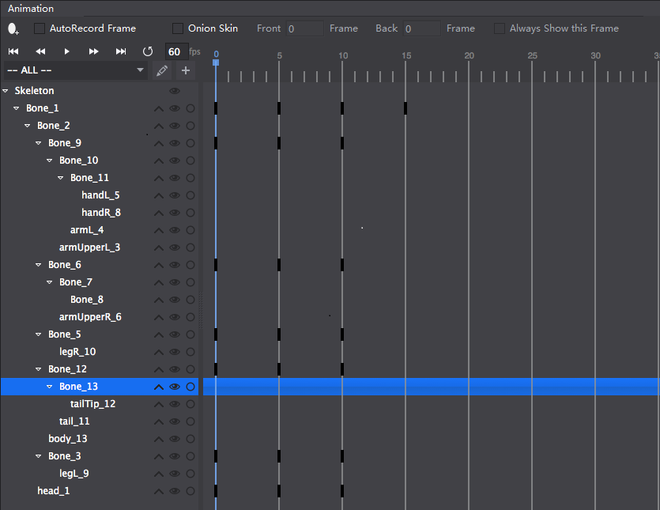

#How to: Create a Skeletal Animation with cocos

Follow the steps below build a skeletal animation. 

1. Create a skeletal animation file. Details about creating a skeletal animation, please see [Create a Skeletal Animation](../CreateSkeletalAnimation/en.md). 

2. Prepare resources for skeletal animation. Import the resources to Resources panel. 

	 

3. Drag and drop resources to the rendering section. 

	 
	
4. Click the Create Bone button  to build the skeletal structure of the dragon example. 

5. The skeletal structure and hierarchical relationship are shown below: 

	
	
	
	
	It can be seen from the hierarchical relationship the binding of vertices is not correct. Next rearrange the bones by using Binding and UnBinding  feature. About Binding and UnBinding, please see [Edit Skeletal Animation](../EditSkeletalAnimation/en.md).

6. The new hierarchical relationship is shown below: 

	

7. Bind skin to bones.

8. Add keyframes in the Timeline at frame 5 and frame 10. 

	
	
	Build seperate animations for legs, arms and tails. 

	

9. Change settings for bones' position, scale and rotation. In the following example, we set the position of bones, the movement of legs, arms and tails. 

 		

You can change the apperance or color of bones by replacing them with new skin. Editing the apperance will not change the animation. 

