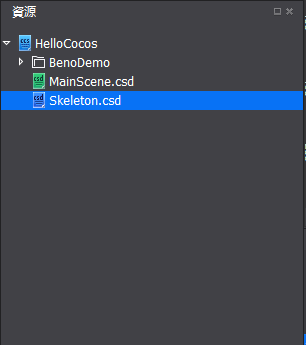
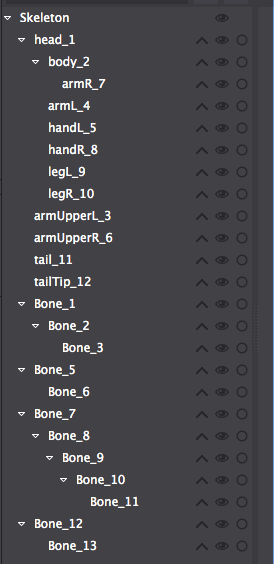
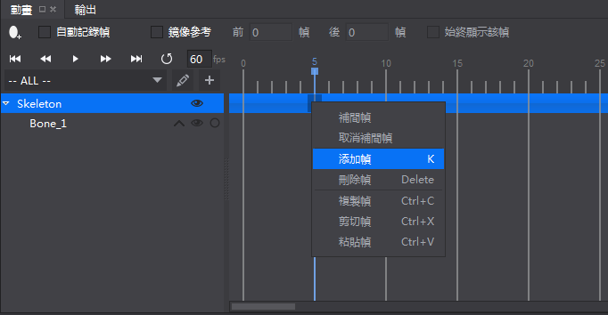
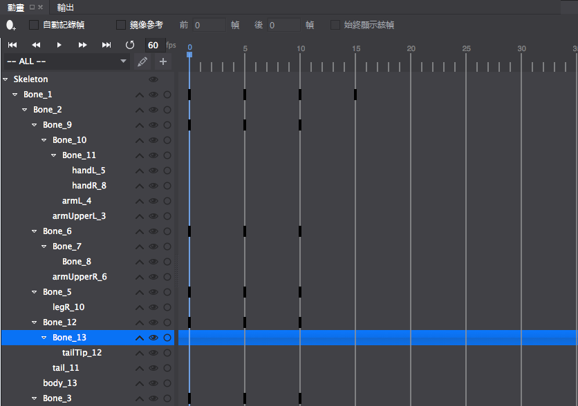

##骨骼動畫實例
===============

這裡通過一個骨骼動畫的實際製作過程，來給讀者演示如何製作骨骼動畫。

1. 首先，我們來創建一個骨骼動畫檔，創建骨骼動畫請查閱[創建骨骼文件](../CreateSkeletalAnimation/tw.md)

2. 然後把骨骼動畫需要用到的素材準備好，並導入到資源區中。

     

3. 把素材按照動畫的結構，拖拽到骨骼動畫渲染區並按照結構擺放好，通過動畫結構來確定骨骼以及骨骼彼此之間的關節點。

     
    
4. 點擊右上角的創建骨骼 開始創建例子中的龍的骨骼結構，每個動畫的關鍵部位需要創建一個骨骼。

5. 創建完的骨骼的結構，以及層級關係如下二圖所示：

    
    
    
    
    通過層級關係可以明顯看出來骨骼的綁定關係不正確，接下來我們來通過綁定與解綁來重新處理。關於如何使用綁定和解綁，請參照[編輯骨骼動畫](../EditSkeletalAnimation/tw.md)

6. 重新綁定完成的層級結構如下圖所示：

    

7. 然後把各部位的皮膚綁定到對應骨骼上，綁定方法和骨骼綁定相同。

8. 在動畫時間軸標號為5,10的位置分別插入關鍵幀，如下圖所示：
    
    
    針對腿部骨骼,胳膊骨骼,以及尾部骨骼製作動畫，各動畫在動畫軸的位置如下圖所示：
    

9. 分別在關鍵幀位置調節骨骼的位置,縮放,旋轉等屬性值，然後就得到一個簡單的骨骼動畫了，在這裡作者調節了兩腿,胳膊,尾巴的擺動以及各骨骼的位置，最終做出來的效果如下圖所示：

        

如果覺得小龍的那個身體部位不好看，或者想換個顏色，只需要把綁定在這個部位的皮膚換掉就行了，原來做的動畫不受任何影響，仍然顯示正常。
