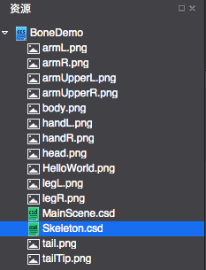
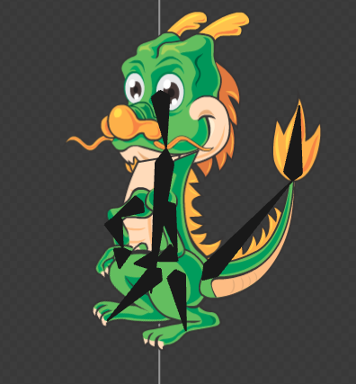
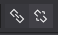
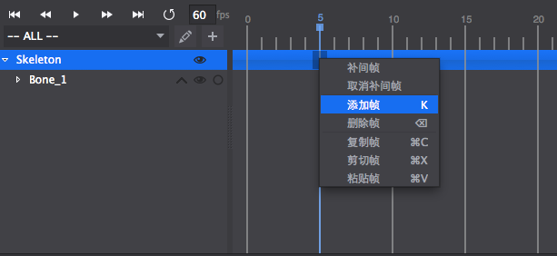
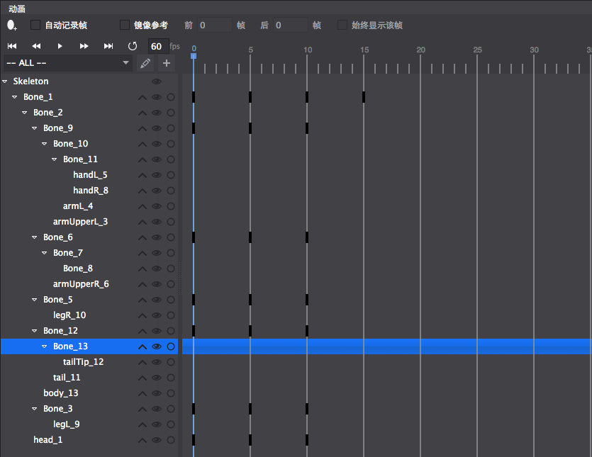

##骨骼动画实例
===============

这里通过一个骨骼动画的实际制作过程，来给读者演示如何制作骨骼动画。

1. 首先，我们来创建一个骨骼动画文件，创建骨骼动画请查阅[创建骨骼文件](../CreateSkeletalAnimation/zh.md)。

2. 然后把骨骼动画需要用到的素材准备好，并导入到资源区中。

	 

3. 把素材按照动画的结构，拖拽到骨骼动画渲染区并按照结构摆放好，通过动画结构来确定骨骼以及骨骼彼此之间的关节点。

	 
	
4. 点击右上角的创建骨骼 开始创建例子中的龙的骨骼结构，每个动画的关键部位需要创建一个骨骼。

5. 创建完的骨骼的结构，以及层级关系如下二图所示：

	
	
	
	
	通过层级关系可以明显看出来骨骼的绑定关系不正确，接下来我们来通过绑定与解绑来重新处理。关于如何使用绑定和解绑，请参照[编辑骨骼动画](../EditSkeletalAnimation/zh.md)

6. 重新绑定完成的层级结构如下图所示：

	

7. 然后把各部位的皮肤绑定到对应骨骼上，绑定方法和骨骼绑定相同。

8. 在动画时间轴标号为5,10的位置分别插入关键帧，如下图所示：
	
	
	针对腿部骨骼,胳膊骨骼,以及尾部骨骼制作动画，各动画在动画轴的位置如下图所示：
	

9. 分别在关键帧位置调节骨骼的位置,缩放,旋转等属性值，然后就得到一个简单的骨骼动画了，在这里作者调节了两腿,胳膊,尾巴的摆动以及各骨骼的位置，最终做出来的效果如下图所示：

		

如果觉得小龙的那个身体部位不好看，或者想换个颜色，只需要把绑定在这个部位的皮肤换掉就行了，原来做的动画不受任何影响，仍然显示正常。

