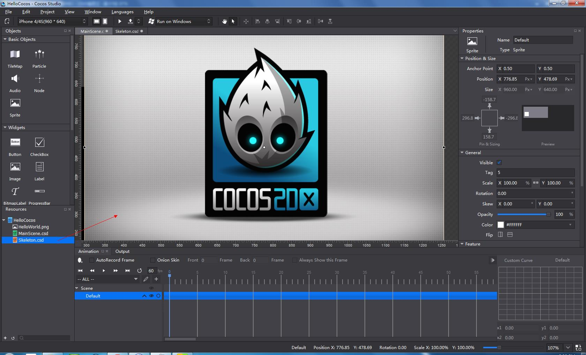

#Use Skeletal Animation#

Skeletal animation files can be used in cocos after being nested to Scene, Node or Layer. To use skeletal files, do the following: 

- Select the skeletal files from the Resources panel. 

- Drag and drop the files to a Scene, Node or Layer file in the rendering section, and release the mouse button. 

- You may receive an error message when nesting skeletal files, if those files do not conform to the nested rules. 

   

Skeletal files are used as nodes in the nested files, therefore their properties are the same as Node. 

***Note***

*1. Other types of files annot be nested in skeletal animation files. SpriteSheet  files cannot nest or be nexted with other files.*

*2. The  type of skeletal files is Node, with a default name ProjectNode_X.*

*3. After the skeletal files being nested, no spritesheet in ProjectNode_X.*