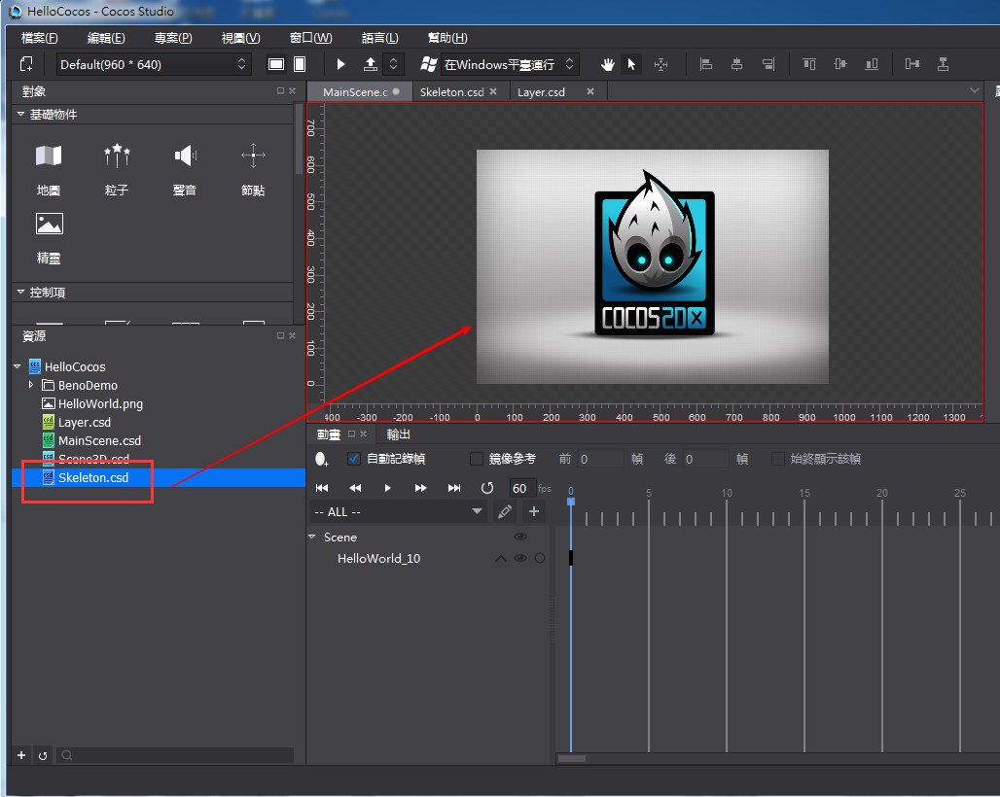

## 使用骨骼動畫 ##
===============

使用者創建的骨骼檔需要通過嵌套到場景,節點,圖層這3種檔中才可以進行使用。

**操作方法：**

&emsp;&emsp;1,在渲染區中打開要嵌套骨骼檔且符合要求的檔。

&emsp;&emsp;2,在資源區內按一下左鍵選中骨骼文件，並將其拖拽到渲染區的檔內，然後釋放左鍵，完成嵌套。

&emsp;&emsp;3,若彈出嵌套失敗的提示，則表示檔不滿足嵌套規則，嵌套失敗；否則嵌套成功。

   

骨骼檔在其嵌套檔中作為節點類型使用，其屬性區內容與節點物件保持一致。

***Note***

1. 骨骼文件不可嵌套其他文件；合圖檔不可以嵌套其他檔，也不可以被嵌套。
2. 骨骼文件嵌套在其他文件中後，類型為節點，名稱默認為——ProjectNode_X，並可在屬性中設置嵌套動畫。
3. 嵌套後，ProjectNode_X的結構樹中沒有序列幀。
