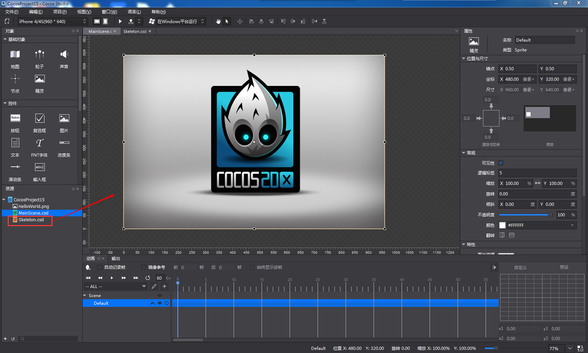

## 使用骨骼动画 ##
===============

用户创建的骨骼文件需要通过嵌套到场景,节点,图层这3种文件中才可以进行使用。

**操作方法：**

&emsp;&emsp;1,在渲染区中打开要嵌套骨骼文件且符合要求的文件。

&emsp;&emsp;2,在资源区内单击左键选中骨骼文件，并将其拖拽到渲染区的文件内，然后释放左键，完成嵌套。

&emsp;&emsp;3,若弹出嵌套失败的提示，则表示文件不满足嵌套规则，嵌套失败；否则嵌套成功。

   

骨骼文件在其嵌套文件中作为节点类型使用，其属性区内容与节点对象保持一致。

***Note***

1. 骨骼文件不可嵌套其他文件；合图文件不可以嵌套其他文件，也不可以被嵌套。
2. 骨骼文件嵌套在其他文件中后，类型为节点，名称默认为——ProjectNode_X，并可在属性中设置嵌套动画。
3. 嵌套后，ProjectNode_X的结构树中没有序列帧。