#Workspace Overview

The workspace of Cocos Studio is composed of Menu, Toolbar, Objects panel, Resources panel, Canvas, Properties panel, Animation panel, Output panel and Status bar.

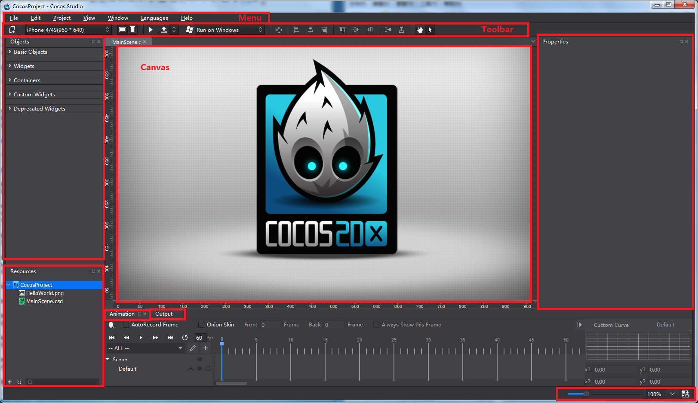
 
###Menu
Cocos menu bar is composed of seven items, which are File, Edit, View, Project, Languages and Help. The menu on Mac is same with that on Windows, but items are displayed in different order. The following part is designed to give a brief introduction to the items from each drop-down menu. Here will take the Windows version as an example. 

 
#### 1 File ####
 
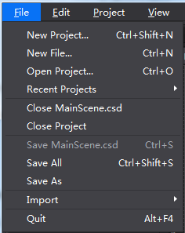

**New Project**: to create a cocos project. Keyboard shortcut is Ctrl+Shift+N (Win)/ Command+Shift+N (Mac). 

**New File**: to create a file. The existing file types include Scene, Layer, Node, SpriteSheet and 3D Scene. Keyboard shortcut is Ctrl+N (Win)/ Command+N (Mac). 

**Open Project**: to open cocos projects. Keyboard shortcut is Ctrl+O (Win)/ Command+O (Mac). 

**Recent Projects**: to provide a quick access to recently opened projects, the maximum number of which is ten. The last-opened project is at the top. 

**Close XXXX.csd/csi**: to close current project XXXX.csd/csi. 

**Close Project**: to close current cocos project. 

**Save XXXX.csd/csi**: to save current project XXXX.csd/csi. Keyboard shortcut is Ctrl+S (Win)/ Command+S (Mac).

**Save All**: to save all files in a project. Keyboard shortcut is Ctrl+Shift+S (Win)/ Command+Shift+S (Mac). 

**Save As**: to save a cocos project to a new location or with a new name. 

**Import -> Import Resources**: to import resources from disk to Resources panel.

**Import -> Import Project from v1.6**: to transfer v1.6 projects to currently supported project files. 

**Quit**: to quit Cocos Studio. Keyboard shortcut is Alt+ F4 (Win)/ Command+Q (Mac). 

#### 2 Edit ####

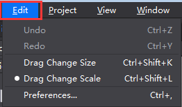
 
**Undo**: to  undo the last action. Keyboard shortcut is Ctrl+Z (Win)/ Command+Z (Mac). 

**Redo**: to redo an action that you undid. Keyboard shortcut is Ctrl+Y (Win)/ Command+Y (Mac). 

**Preferences**: keyboard shortcut is Ctrl+, (Win)/ Command+, (Mac).

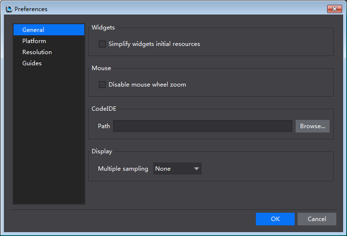
 
- **General**:

    1 Widgets：whether simplify widgets initial resources or not. 

    2 Mouse：to enable/disable zooming with mouse wheel. 

- **Platform**: 

     Android Path: Set path of SDK, NDK, ANT and JDK. For more information, please see [Package and Runtime Environment Settings](../../../chapter2/PackageAndRun/en.md).

- **Resolution**: 
 
    Modify resolution drop-down list: Add, Edit, Up, Down, Remove and Reset. Click OK for any changes to take effect. The list will update in "Screen Resolution & Orientation".   

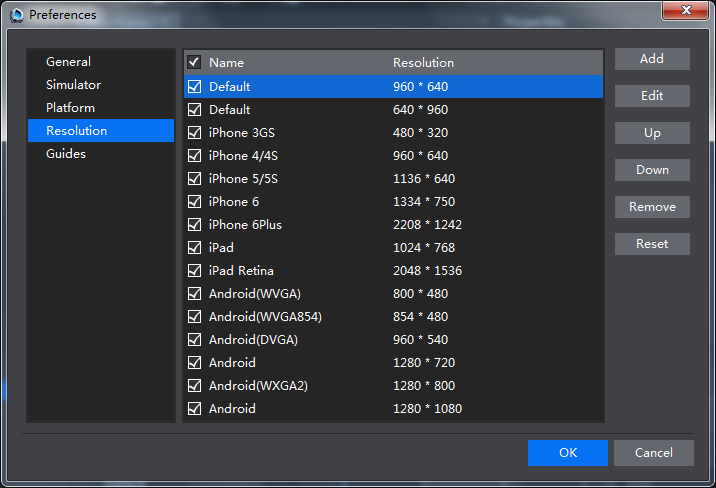

#### 3 Project ####

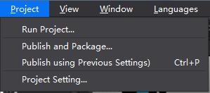

**Run Project**

- Windows Version: to run project on Windows, run on Android device, or run on browsers (JS projects). 

- Mac Version: to run project on iOS, run on Mac, run on Android, or run on browsers (JS projects). 

    For more information, please see [Package and Runtime Environment Settings](../../../chapter2/PackageAndRun/en.md). 

**Publish and Package**: 

- Publish Resource: publish resources, then open project with Cocos 2d-x. The published resources have a small file size and load quickly.  

- Publish to Visual Studio: first publish resources, and then open project with Visual Studio. 

- Android package (.apk): package current project to *.apk* file. Support Windows and Mac versions of cocos. Support C++, JavaScript, Lua. 

- iOS package (.ipa): package current project to *.ipa* file. Support Mac version. Support C++, JavaScript, Lua. 

- HTML5: package current project to HTML5. Support Windows and Mac versions. Support JavaScript.     
      
**Publish and Package (using the previous settings)**: to publish or package projects with previous settings. 

**Project Setting**

**Publish**
 
- Resource and Project File: copy resources to publish directory; publish csd and csi for Cocos 2d-x.  

    ***Note** The transfer speed will be lower if you publish a number of resources. It is recommended to select "Project File Only".*

- Project File Only: only publish *csd* and *csi* for Cocos 2d-x. 

- Publish Directory: users can customize publish directory. Cocos Studio supports absolute and relative path. 

- csb File: FlatBuffers is employed to read binary files, feature in high efficiency, small size, significant security. Support Cocos2d-x C++ and Lua Binding.

- JSON File: Lightweight data transfer format, good readability, and native support for JavaScript. 

- Custom: extended data format. For more information, please see [Customizing Exported Data Formats](../../Extend/CustomExport/en.md).

**Package**

For more information about Package, please see [Package and Runtime Environment Settings](../../../chapter2/PackageAndRun/en.md).

#### 4 View ####

**Anchor Point**: to show or hide the anchor point in rendering section. Keyboard shortcut is Ctrl+Shift+A (Win)/ Command+Shift+A (Mac). 

**Ruler**: to show or hide ruler. Keyboard shortcut is Ctrl+Shift+R (Win)/ Command+Shift+R (Mac).

**Guides**: to show or hide guides. Keyboard shortcut is Ctrl+；(Win)/ Command+; (Mac).

**Lock Guides**: when checked, guides cannot be selected or moved. Keyboard shortcut is Ctrl+Shift+; (Win)/ Command+Alt+; (Mac).

**Clear Guides**: to delete all the guides in the rendering section. 

**New Guides**: to add guides to rendering section. 

####5 Window

 
**Objects, Resources, Animation, Output, Properties**: check/ uncheck to open/ close these panels. 

**Start Launcher**: to start Launcher in Cocos Studio. 

**Reset Window Layout**: to reset the window layout to default settings. 

####6 Language
 
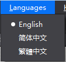

Cocos Studio support English, Simplified Chinese and Traditional Chinese. You need to restart Cocos Studio for your new language setting to take effect.

####7 Help 

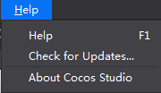
 
**View Help**: official tutorials.

**Check for Updates**: to check if the latest version is installed on your computer. 

**About Cocos Studio**: version and copyright information; links to official website, Weibo and forum. 

###Toolbar
 

The toolbar contains eight basic components: New File, Resolution, Preview, Publish and Package, Platform Switch, Alignment, Move Canvas and Enable left-click. 

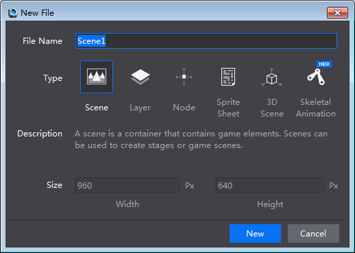

 **New File**: to create a Scene, Layer, Node, SpriteSheet or 3D Scene. 

 **Screen Resolution & Orientation**: to set the screen resolution and to switch the display between landscape and portrait.

 **Preview**: to preview a project in simulator. Currently you can preview 2D/ 3D Scene and Animation projects.

 **Publish and Package**: to publish resources or projects for iOS (.ipa), Android (.apk) and HTML games. 

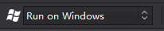 **Platform Switch**: to run projects on Windows or Android. 

 **Alignment**: to align selected widgets on canvas with popular alignment formatting. They are Center, Left-align, Vertical center, Right-align, Vertical Justify, Horizontal Center, Vertical Bottom, Horizontal alignment and Vertical alignment. 
 
 **Move Canvas**: to move Canvas in the rendering section. You can access the tool by clicking the hand shape icon, or using keyboard shortcut Q.

 **Enable left**: click currently only supports four file types, which are Scene, Layer, Node and SpriteSheet files. You can access the tool by clicking the icon, or using keyboard shortcut W. 

 Next we will introduce tools currently only available in 3D Scene. 

 Default state is "Move". Clicking X-axis, Y-axis or Z-axis to decide that along which axis the object moves. 

 Click this button to change the mouse settings to “Rotate". Clicking X-axis, Y-axis or Z-axis to decide that along which axis the object rotates. 

 Click this button to change the mouse settings to "Scale". Clicking X-axis, Y-axis or Z-axis to decide that along which axis the object scales. 

### Objects Panel 

-  Objects panel is divided into four sections by default, which are Basic Objects, Widgets, Containers and Custom Widgets. To create a widget, just select a widget, and then drag and drop it from Widgets panel to Canvas. 

In addition, click Edit on the Menu -> Preferences -> General -> select "Show deprecated widgets" -> click "OK". The widget "AtlasLabel" will show. 

- 3D widgets will be displayed when editing 3D scenes, for example, 3D Camera, Model, 3D particles, etc. 

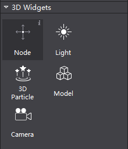
 
 In both 2D & 3D projects, when you hover the mouse over a widget, an information bubble “i” will appear at top right corner. Clicking that icon you can see descriptive texts of each widget and an Internet link for more information.

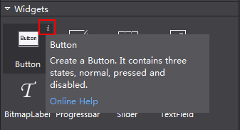
 
###Resources Panel 

Resources panel displays all files related to a game project. Importing resources, creating projects, renaming files, deleting files, etc. can be done here. 

 
Cocos Studio allows you to import an existing resource to Resource panel, you can also drag resources from Resource panel to other panels such as canvas in order to set properties.

***Note** File structure in the Resource panel is the same as that on the disk. When a file is deleted from the local file system, the linked widget will display its name in red indicating unavailable. As shown in the following figure outlined in red.* 

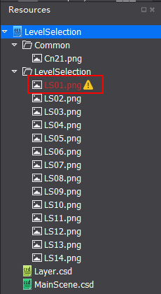

The general workflow to build games with cocos is as follows: 

Add resources to the Resources panel -> create widgets by dragging and dropping them from Objects panel to Canvas -> specify properties of widgets -> edit Scene or Animation. 

###Canvas

***Note** Canvas will automatically adjust itself to the contents on it.* 

1 When editing Scene or Layer, Canvas is displayed as shown below: 
 

Canvas is the most commonly used panel in Cocos Studio. You can visually adjust the position, rotation, scaling, and anchor point of a widget in Canvas. You can also select one or multiple widgets in Canvas, and edit the widget properties using either right-click menu or Property panel.

Press the spacebar, and you can move the Canvas by dragging the mouse. You can also move the Canvas by pressing the scroll wheel on your mouse. 

 
The area with black background represents the screen resolution you set.

2 When editing Nodes, Canvas is displayed as shown below: 
    

3 When editing SpriteSheet, Canvas is displayed as shown below: 
 

4 When editing 3D Scene, Canvas is displayed as shown below: 
 
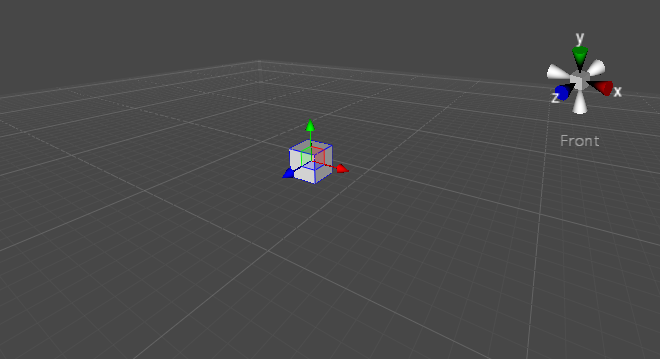

###Animation panel

Animation panel is divided into six sections: Scene Graph, Timeline, Easing Interface, Playback Control, Editing Tools and Animation list. 
 

####Timeline

 
In the timeline, you can insert frames and an animation curve will be created automatically between frames. 

####Easing Interface

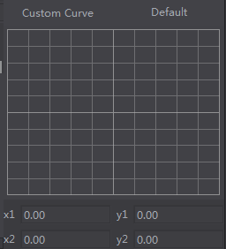
 
Easing refers to acceleration or deceleration of frames. When this function is applied, animations will look more lifelike. 

####Playback Control
 

Animation playback control is to manipulate frames in the timeline. 

   &emsp;&emsp; : Move to the first frame. 

   &emsp;&emsp;  : Move to previous frame.

   &emsp;&emsp; : Play the animation.

   &emsp;&emsp;  : Move to next frame.

   &emsp;&emsp;  : Move to the last frame. 

   &emsp;&emsp; : Loop the animation or not. 

   &emsp;&emsp; : Playback speed of the animation. 

####Editing Tools 
 
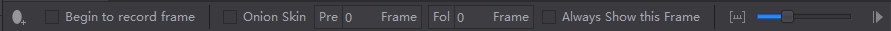

Animation editing tools provide most of the common functionality. 

 Add Frame: Clicking on this icon will add a keyframe at a specific position on the timeline. 

 AutoRecord Frame: What you do after clicking the icon will be recorded in the current frame, become the key frame.  By modifying the widget properties of different frames, you can create rich and colorful animation effects. You can check the modified properties by clicking .

 Animation ghosting, also known as onion skin, is a viewing mode that displays a series of snapshots of frames ahead of and behind the current frame. 

 
 Animations can be created, deleted and renamed from within the Animation List. 

  Add Animation: Create an animation by setting the Start and End frames. 

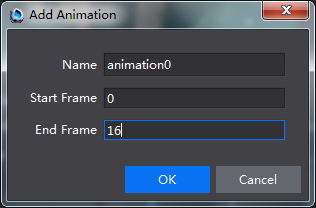 

Animation Name: animation0, from frame 0 to frame 16. 

###Scene Graph

 
The Scene Graph displays a list of currently used widgets, such as buttons, maps, sound, and particle, etc. They are mapped one-to-one with the concrete widgets within Canvas. To add a widget, you can directly drag it from Objects panel to the Scene Graph (also display in the canvas), which provides a way to visually adjust the structure of the widgets. Within the Scene Graph, you can add, delete, adjust the widget’s render order, and adjust parent-child hierarchies of the widgets. 

Click  button to expand animation properties associated with some widget. For example,

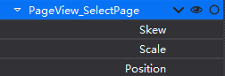 

The above picture means that `Panel_InfoBox_3` only influence three properties: Skew, Scale and Position. 

：to hide a widget in the canvas by selecting this check box.

：to lock a widget to prevent it being edited. 

***Note** You can use the scene graph to hide a widget in the canvas, or lock a widget to prevent it being edited. The operation in the Scene Graph panel, locking or hiding, only affect the display on Canvas, the effect will not be output to a game project, if you need the effect to appear in the game, please modify the properties in property panel.*

The parent-child hierarchies: Cocos Studio uses the concept of parent-child hierarchies, so that any object can become a child of another object, to establish the relationship move the object onto its parent object, will move with the parent.

###Properties panel 

In the Properties panel, you can make modifications of any widgets' properties. 

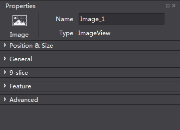 

In Properties panel, there are title section and several tabs, including Position and Size, General properties, 9-Slice, Feature and Advanced properties. 
 
**Title section**: shows the type of the currently selected widget. You can find a widget in the game by searching its name or tag. 

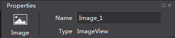

**Position and Size**

This section includes some settings about anchor point, position and size. Adaptive layout feature is newly added, for more information, please see [UI Layout and Multi-resolution Support](../../UI/Layout/en.md).

 
**General Properties**

General properties contain basic properties of a widget, such as Visible, Scale, Rotation, Skew, etc. General properties are the same for most widgets, but there are also exceptions for some widgets, please refer to "Online Help".  

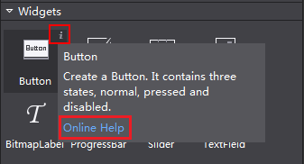

**Advanced properties** include control layout, sub control layout and frame events. When select one or multiple widgets in Canvas, you can adjust the corresponding attributes in the Properties panel. 

 
[**9-Slice**](../../UI/9Slice/en.md)

**Advanced Properties**

- [Create a Frame Event](../../Animation/AddFrameEvents/en.md)

- [Callback Feature](../../HowToCode/CallBack/en.md)

- [Create Custom Data](../../HowToCode/UserData/en.md)
     
    

