#操作介面
&emsp;&emsp;Cocos Studio的介面主要分為功能表列,工具列,對象面板,資源面板,畫布面板,屬性面板,動畫面板,輸出視窗,狀態列九部分組成，如下圖：
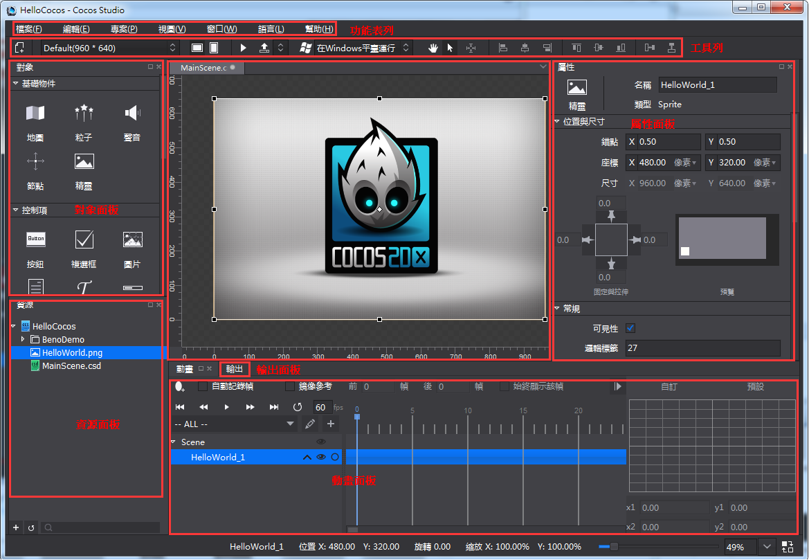
 
###功能表列
&emsp;&emsp;功能表列為cocos功能提供了功能入口，它由檔,編輯,視圖,專案,視窗,語言,説明7個命令功能表組成，Mac和Windows功能表項目中包含的功能是一樣的，只是排序和位置不同而已，下面就以Windows為例對每一個下拉式功能表中的功能表項目進行介紹

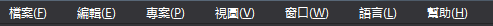
 
####1.文件
 
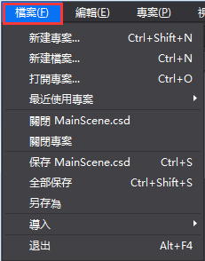

&emsp;&emsp;新建項目：新建cocos項目，快速鍵為Ctrl+Shift+N（Win）,Command+Shift+N（Mac）。

&emsp;&emsp;新建文件：新建場景,圖層,節點,合圖,3d場景文件，快速鍵為Ctrl+N（Win）,Command+N（Mac）。

&emsp;&emsp;打開項目：打開cocos項目功能，快速鍵為Ctrl+O（Win）,Command+O（Mac）。

&emsp;&emsp;最近打開的專案：最近用cocos編輯的專案路徑，最多可顯示10個專案，最後打開的專案其專案路徑顯示在最上面。

&emsp;&emsp;關閉XXXX.csd/csi：關閉當前打開的XXXX.csd/csi專案檔案。

&emsp;&emsp;關閉專案：關閉當前打開的cocos項目。

&emsp;&emsp;保存XXXX.csd/csi：保存當前正在編輯的XXXX.csd/csi，快速鍵為Ctrl+S（Win）,Command+S（Mac）。

&emsp;&emsp;全部保存：保存整個項目中所有的專案檔案，快速鍵為Ctrl+Shift+S（Win）,Command+Shift+S（Mac）。

&emsp;&emsp;另存為：將cocos專案另存到自訂路徑下。

&emsp;&emsp;導入->導入資源...：將資源從磁片導入資源面板。

&emsp;&emsp;導入->導入1.6版本項目...： 將Cocos Studio 1.6的專案檔案轉換為當前版本的專案檔案。

&emsp;&emsp;退出：退出Cocos Studio編輯器，快速鍵為Alt+F4（Win）,Command+Q（Mac）。

####2.編輯

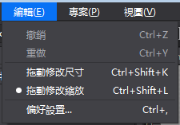
 
&emsp;&emsp;撤銷：在編輯器中做一些操作之後，返回到上一步的狀態，快速鍵為Ctrl+Z（Win）,Command+Z（Mac）。

&emsp;&emsp;重做：撤銷到上一步後再回撤到修改後的狀態，快速鍵為Ctrl+Y（Win）,Command+Y（Mac）。

&emsp;&emsp;偏好設置：快速鍵為Ctrl+,（Win）,Command+,（Mac）。

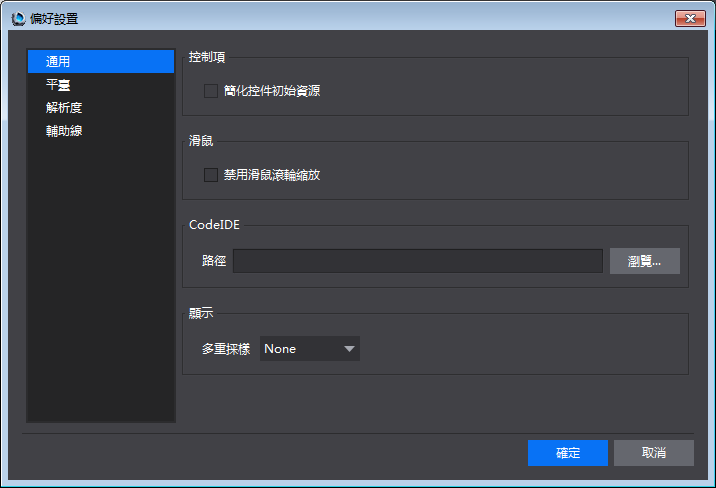
 
&emsp;&emsp;通用：

  &emsp;&emsp;1,控制項：是否簡化控制項初始資源。

  &emsp;&emsp;2,滑鼠：是否禁用滑鼠滾輪縮放。
  

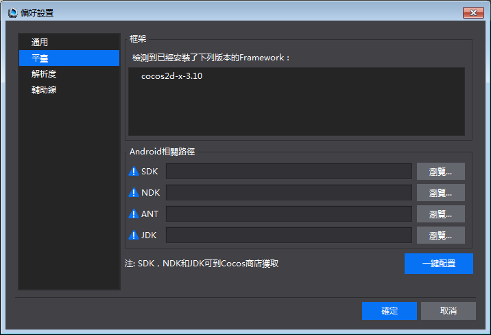

&emsp;&emsp;平臺：

  &emsp;&emsp; Android相關路徑：

  &emsp;&emsp; 設置SDK,NDK,ANT,JDK路徑，以供後續在專案中打包與運行所用，具體請參考：[打包與運行環境配置](../../../chapter2/PackageAndRun/tw.md)

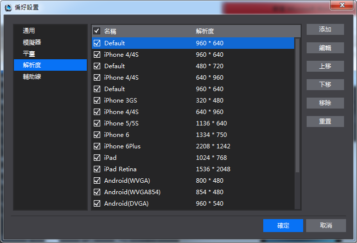

 &emsp;&emsp; 解析度：

 &emsp;&emsp; 可以對解析度設置的下拉清單顯示狀態進行修改，添加,編輯,上移,下移,移除,重置，修改後點擊確定，工具列中的下拉式功能表同步刷新。

####3.項目

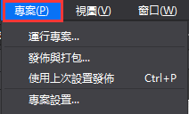

  &emsp;&emsp;運行項目...：

  &emsp;&emsp;Windows：可以選擇在Windows平臺上運行，在Android設備上運行，以及流覽器運行（僅JS語言專案支援）。

  &emsp;&emsp;Mac：在iOS設備上運行，Mac平臺上運行，Android設備上運行，以及流覽器運行（僅JS語言專案支援）。

  &emsp;&emsp;如何運行在各個平臺，具體請參考：[打包與運行環境配置](../../../chapter2/PackageAndRun/tw.md)

  &emsp;&emsp; 發佈與打包：

  &emsp;&emsp; 發佈 - > 選擇發佈類型：

   &emsp;&emsp;1）發佈資源：把編輯器編輯的資源與專案檔案發佈為Cocos 2d-x引擎所使用的資源，發佈後的資源載入速度快，體積小。

   &emsp;&emsp;3）發佈為Visual Studio工程：發佈資源後並使用Visual Studio打開當前專案，方便進一步編碼。

   &emsp;&emsp;打包 - > 選擇打包類型：

   &emsp;&emsp;1）Android 安裝包（.apk）：將當前項目打包為.apk檔，Windows與Mac運行的cocos都支援，c++,js,lua都支持。

   &emsp;&emsp;2）iOS安裝包（.ipa）：將當前項目打包為.ipa檔，僅Mac運行的cocos支持，c++,js,lua專案都支持。

   &emsp;&emsp;3）HTML5： 將當前專案打包為HTML5包，Windows與Mac運行的cocos都支持，僅js專案支持。    
      
  &emsp;&emsp;使用上次設置發佈與打包：若上次做的發佈操作，則繼續使用上次設置發佈，若上次做的打包操作，則繼續使用上次設置打包

  &emsp;&emsp;專案設置

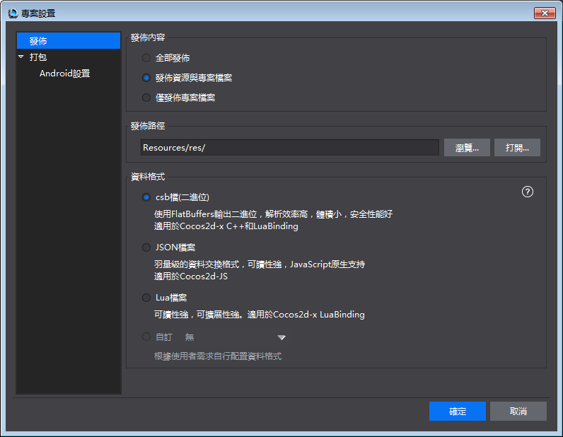
 
  &emsp;&emsp;  發佈：

  &emsp;&emsp; 發佈內容：

  &emsp;&emsp; 1）發佈資源與專案檔案：把編輯所用的資源拷貝到發佈路徑以及把csd,csi檔發佈為Cocos 2d-x所使用的資源。注意：當資源較多的時候，拷貝速度比較慢，建議使用僅發佈專案檔案。

  &emsp;&emsp; 2）僅發佈專案檔案：僅把csd,csi檔發佈為Cocos 2d-x所使用的資源。

  &emsp;&emsp; 發佈路徑：可以自訂資源的發佈路徑，支援絕對與相對路徑。
資料格式：csd檔轉換為的供引擎載入的資料格式。

  &emsp;&emsp; csb：使用Flatbuffers上輸出二進位，解析效率高，體積小，安全性好，適用於c++與lua專案。

  &emsp;&emsp; Json：羽量級的資料交換格式，可讀性強，JavaScript原生支持，適用於js專案。

  &emsp;&emsp; 自訂：使用者擴展的資料格式放在這裡，如何擴展參考[Cocos Studio自訂工程匯出](../../Extend/CustomExport/tw.md)

  &emsp;&emsp; 打包：具體請參考：[打包與運行環境配置](../../../chapter2/PackageAndRun/tw.md)

####4.視圖

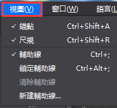

  &emsp;&emsp; 錨點：控制錨點在渲染區的顯示與隱藏，快速鍵為Ctrl+Shift+A（Win）,Command+Shift+A（Mac）。

  &emsp;&emsp; 尺規：控制尺規的顯示與隱藏，快速鍵為：Ctrl+Shift+R（Win）,Command+Shift+R（Mac）。

  &emsp;&emsp; 輔助線：控制輔助線的顯示與隱藏，快速鍵為：Ctrl+;（Win）,Command+;（Mac）。

  &emsp;&emsp; 鎖定輔助線：當點擊鎖定輔助線時，將無法選中或移動輔助線；取消鎖定輔助線時，可以在渲染區選中並移動輔助線。快速鍵為：Ctrl+Alt+;（Win）,Command+Alt+;（Mac）。

  &emsp;&emsp; 清除輔助線：當在渲染區添加輔助線後，點擊清除輔助線，所有輔助線將被刪除。

  &emsp;&emsp; 新建輔助線：添加輔助線到渲染區。

####5.窗口

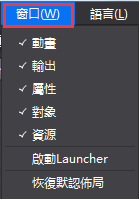
 
  &emsp;&emsp; 物件,資源,動畫,輸出,屬性：控制物件,資源,動畫,輸出,屬性面板的顯示與隱藏。

  &emsp;&emsp; 啟動Launcher：在編輯器中啟動Launcher，若已啟動則將Launcher介面置頂。

  &emsp;&emsp; 恢復默認佈局：若對編輯器中的視窗佈局進行修改後，點擊恢復默認佈局，可還原成初始狀態

####6.語言
 
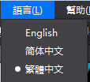

  &emsp;&emsp; 編輯器目前支持英文，簡體中文，繁體中文，若切換語言需要重啟編輯器後才能生效；

####7.幫助

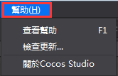
 
  &emsp;&emsp; 查看幫助：Cocos官網教程連結

  &emsp;&emsp; 檢查更新：檢查用戶當前版本是否為最新版本

  &emsp;&emsp; 關於Cocos Studio：Cocos版本及版權資訊等，以及官網,微博,論壇入口

###工具列
 

  &emsp;&emsp; 工具列包含八個部分：新建檔按鈕,解析度調整工具,預覽按鈕,發佈/打包按鈕,平臺運行切換工具,對齊排列工具,移動畫布控制按鈕,滑鼠左鍵狀態組。

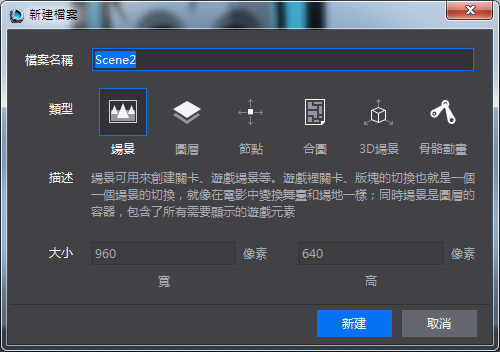

  &emsp;&emsp; 新建文件——用於新建場景,圖層,節點,合圖,3D場景等。

  &emsp;&emsp; 解析度設置,螢幕方向切換按鈕——用於設置當前專案的設計解析度。

  &emsp;&emsp; 預覽按鈕——用於在模擬器中預覽當前專案檔案，目前只有2D/3D場景，動畫專案檔案支持模擬器預覽。

  &emsp;&emsp; 發佈與打包按鈕——用於發佈專案資源或專案工程，打包iOS（.ipa）安裝包,Android（.apk）,HTML5 包。

  &emsp;&emsp; 平臺運行切換工具——在不同的平臺下運行項目

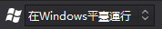

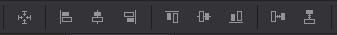
 
  &emsp;&emsp; 對齊,排列——針對畫布多選控制項時的操作，提供了常用的對齊,排列方式。從左到右依次為中心對齊,左對齊,垂直居中,右對齊,上對齊,水準居中,下對齊,水準分佈,垂直分佈。
 

  &emsp;&emsp; 移動畫布控制按鈕——選中手狀按鈕 ，可在渲染區拖動畫布，滑鼠狀態也變成手型，快速鍵為Q。

 
  &emsp;&emsp; 僅出現在編輯場景，圖層，節點，合圖這四類文件。

  &emsp;&emsp; 選中箭頭狀按鈕 ，滑鼠樣式切換到預設狀態，快速鍵為W。

 
  &emsp;&emsp;僅出現在編輯3D場景檔。

   &emsp;&emsp;預設選擇“平移“狀態，可以通過點擊對應x軸，y軸，z軸進行切換，決定在沿著哪個坐標軸進行平移。

   &emsp;&emsp;“旋轉”狀態下拖拽滑鼠，可以通過點擊對應x軸，y軸，z軸進行切換，決定將選中物體圍繞著哪個坐標軸進行旋轉。

   &emsp;&emsp;“縮放”狀態下拖拽滑鼠，可以通過點擊對應x軸，y軸，z軸進行切換，決定將選中物體沿著哪個坐標軸進行縮放。

###對象面板

  &emsp;&emsp; 控制項面板會根據編輯專案類型不同顯示不同控制項

  &emsp;&emsp; 1.編輯場景,圖層,節點,合圖的時候時，物件面板預設分為基礎物件,控制項,容器,自訂控制項四部分。
顯示如下

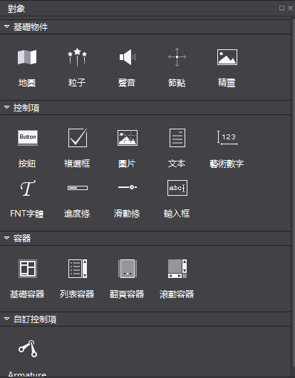

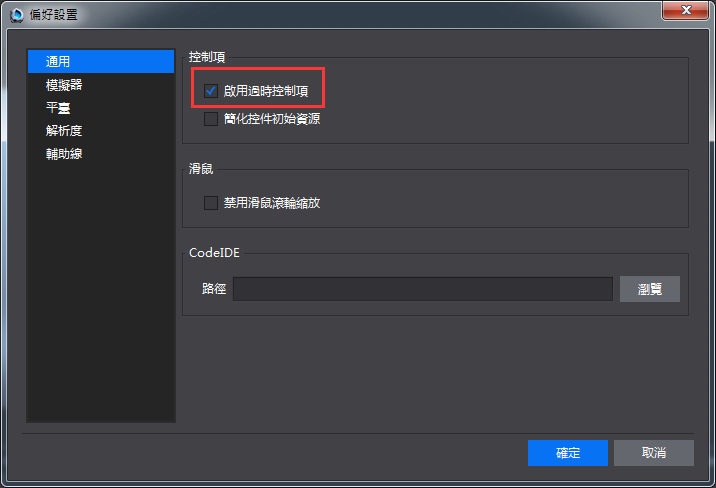
 
  &emsp;&emsp; 在功能表列 -> 編輯 -> 偏好設置 -> 通用中，如下提勾選允許使用過時控制項選項，點擊確定可以將過時的控制項——藝術數字顯示出來，如下圖：

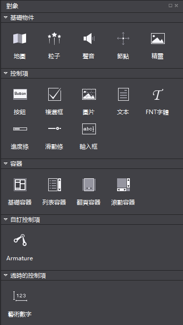

  &emsp;&emsp; 添加控制項：左鍵選中控制項，然後拖拽控制項到畫布面板，然後鬆開滑鼠左鍵，可以實現添加一個控制項的操作。

  &emsp;&emsp; 2.編輯3D場景時。3D狀態下的控制台僅顯示3D控制項。如：3D攝像機,模型,3D粒子等。如下圖所示：

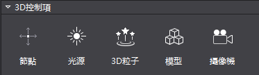
 
  &emsp;&emsp; 無論在2D狀態和3D狀態下，控制項面板中滑鼠懸停時在控制項圖示上會在右上角出現一個“i”按鈕，點擊按鈕會出現有關這個控制項的描述資訊，並提供一個擴展連結以打開流覽器獲取更多關於這個控制項的説明資訊。如下圖所示。

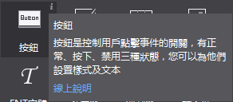
 
###資源面板

  &emsp;&emsp; 資源面板是遊戲專案中所有檔的展示面板，實現導入資源,新建,重命名,複製,刪除檔等功能。

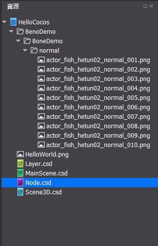
 
  &emsp;&emsp; 在Cocos Studio中可以通過右鍵功能表“導入資源”功能將資源導入到資源面板，從而進行控制項賦值，與資源的管理，也可以將資源通過資源面板拖動到其他區域，以完成資源工作流程。

  &emsp;&emsp; 特別說明：資源面板所展示的檔結構和磁片上的檔結構是一致的，當您在磁片上刪除一個檔時，已經引用這個資源的控制項會顯示資源丟失樣式。如下圖示紅檔：
 
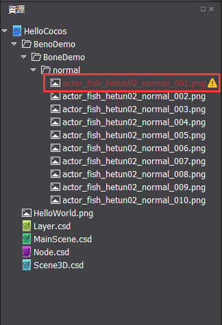

  &emsp;&emsp; Cocos的標準操作流程是：

  &emsp;&emsp; 先把遊戲將要用到的資源拖拽到資源面板，然後從物件面板拖拽需要用到的控制項到畫布面板新建控制項，然後從資源面板把資源給新建的控制項賦值，然後修改控制項的屬性，進行介面,場景,動畫的編輯。

###畫布面板

  &emsp;&emsp; 注意：此面板根據編輯內容不同而動態調整

  &emsp;&emsp; 1）當編輯場景,圖層時，顯示畫布如下：
 

  &emsp;&emsp; 畫布面板是Cocos Studio中最常使用的面板，在該面板中可以進行控制項的位置,旋轉,縮放的調整,對控制項錨點的修改,複製,粘貼等操作，在畫布面板中可以單選或多選控制項，選中後通過右鍵功能表或屬性面板可以對控制項進行進一步的設置。

  &emsp;&emsp; 按住空格，滑鼠拖動空白處可以對畫布進行移動或者按下滑鼠中間對畫布進行移動。

 
  &emsp;&emsp; 畫布面板的黑色區域代表了您所設置的解析度大小。

  &emsp;&emsp; 2）當編輯節點資源時，顯示畫布：
    

  &emsp;&emsp; 3）當編輯合圖資源，顯示畫布：
 
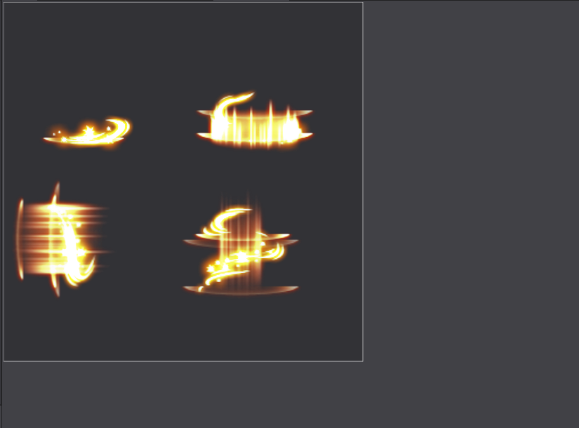

  &emsp;&emsp; 4）當編輯3D場景資源時，顯示3D畫布。
 

###動畫面板

  &emsp;&emsp; 動畫面板分為六部分，物件結構樹,時間軸,緩動介面,動畫控制工具,動畫編輯工具,動畫列表。
 
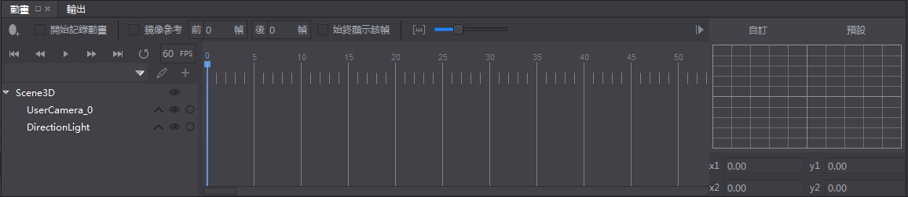

####時間軸

 
Cocos Studio對每個檔提供一個動畫時間軸，在該時間軸上可以添加關鍵幀，編輯器將自動在兩幀之間添加動畫曲線，以實現動畫效果。

####緩動介面

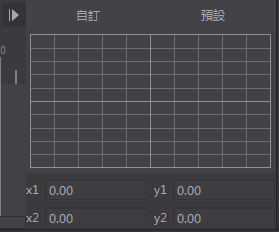
 
  &emsp;&emsp; 動畫在兩幀之間默認做勻速運動，而當在前一幀添加緩動效果後，動畫會從前一幀到後一幀漸進加速或減速運動，它會使您的動畫看起來更逼真。
動畫控制工具
 

   &emsp;&emsp; 動畫控制工具能夠控制當前時間軸上的動畫：

   &emsp;&emsp; ：移動到第0幀。

   &emsp;&emsp;  ：移動到前一幀。

   &emsp;&emsp; ：播放動畫。

   &emsp;&emsp;  ：移動到後一幀。

   &emsp;&emsp;  ：移動到最後一幀。

   &emsp;&emsp; ：是否為迴圈動畫。

   &emsp;&emsp; ：控制動畫播放哪個速度。

  &emsp;&emsp; 動畫編輯工具
 
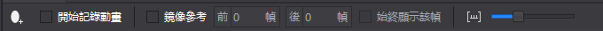

  &emsp;&emsp; 動畫編輯工具提供了一些編輯動畫時常用的操作：

   &emsp;&emsp; ：添加動畫幀，點擊後會在時間軸上您選中的位置上添加一關鍵幀。

   &emsp;&emsp; 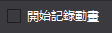：點擊後您所做的變化會被記錄在當前幀，成為關鍵幀，通過在不同的幀上修改控制項的屬性，被修改的屬性會添加到 ，通過不同屬性的變化創造出豐富多彩的動畫效果。

   &emsp;&emsp; ：鏡像參考又稱洋蔥皮，能夠以當前幀為基礎，將當前幀前後的幀通過線框的形式展現出來輔助動畫編輯的操作，如下圖：

 
   &emsp;&emsp;  動畫列表可實現新建動畫,刪除,重命名等功能。

   &emsp;&emsp; ：新建動畫，標識動畫的起始幀與結束幀，並把起始幀與結束幀保存下來作為一個動畫，比如，如下圖：
 
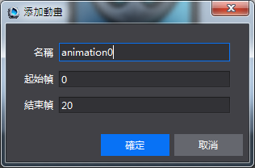

  &emsp;&emsp; 動畫名稱為：animation0，從第0幀到第16幀。

###物件結構樹

 
  &emsp;&emsp; 物件結構樹表示當前專案檔案中所有控制項如按鈕,地圖,聲音,粒子等等的在當前專案檔案的結構，它與畫布面板中顯示的控制項一一對應，將物件面板的控制項直接拖動到物件結構樹中即可添加相應的物件到該位置（同時在畫布面板上被渲染），該結構樹提供了一個視覺化的調整專案檔案中的控制項掛載結構的方式，通過物件結構樹，可以添加控制項,刪除控制項,調整控制項渲染順序,調整控制項父子結構的功能。

   &emsp;&emsp; ：點擊這個按鈕，可以展開控制項的動畫屬性，當前動畫影響的控制項的哪些屬性，比如：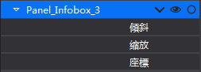 ， 表示Panel_InfoBox_3當前只改變傾斜，縮放，座標這三個屬性。

   &emsp;&emsp; ：控制控制項在畫布面板是否隱藏。

   &emsp;&emsp; ：鎖定該控制項在畫布面板的編輯，不會被點選以及框選。

  &emsp;&emsp; 注意：物件結構樹上設置某個控制項在畫布面板是否隱藏，或鎖定該控制項在畫布面板的編輯，但在物件結構樹的面板中不論鎖定還是隱藏，都只會影響畫布面板的顯示或編輯的效果，這個效果不會輸出到最終的遊戲和模擬器，如果您需要對控制項的顯隱,是否接受交互在遊戲最終效果上有所調整請在屬性面板修改控制項的屬性。

  &emsp;&emsp; 父子結構：Cocos採用父子結構這一概念，使任何物件成為另一物件的子物件，將欲移動的子物件拖動到目標的父物件中即可建立父子關係，子物件會繼承父物件的移動,旋轉路徑，需要注意的是子物件並不會繼承父物件的不透明度和顏色疊加屬性。

###屬性面板

  &emsp;&emsp; 屬性面板展示了控制項的所有屬性，方便您進行調整和修改。

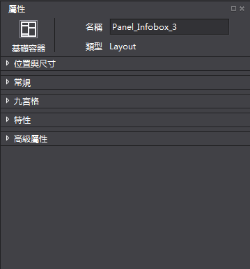
 
  &emsp;&emsp; 頂部是固定的標題區，屬性面板有位置與尺寸，常規，九宮格，特性和高級屬性等幾個頁簽。

  &emsp;&emsp; 標題區域：標題區域展示了當前選中的控制項類型，您可以通過定義的名稱在程式中獲取當前的控制項。

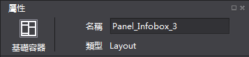

&emsp;&emsp; 位置與尺寸屬性包含了關於錨點,位置,尺寸的一些常規設置。除此之外，還設置了自我調整佈局功能，佈局功能[UI佈局與多解析度適配](../../UI/Layout/tw.md)

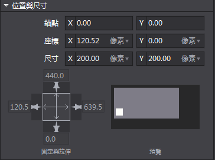

  &emsp;&emsp; 常規屬性包含了一些控制項的基礎設置，如可見性,旋轉角度,傾斜角度,翻轉等，大部分控制項的常規屬性是統一的，但也有一些控制項有特殊情況，具體控制項的使用方法請參考線上說明，如下圖：

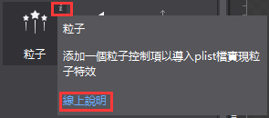

  &emsp;&emsp; 高級屬性：包括幀事件的設置和回檔屬性的設置。當您在畫布面板選中了一個或多個控制項時屬性面板會出現相應的屬性，可以通過輸入數值,添加檔等方式調整。

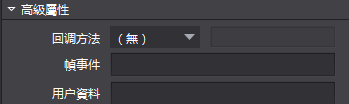
 
  &emsp;&emsp;[ 九宮格](../../UI/9Slice/tw.md)

  &emsp;&emsp; 高級屬性：

  &emsp;&emsp; 1，[幀事件](../../Animation/AddFrameEvents/tw.md)

  &emsp;&emsp; 2，[回檔特性](../../HowToCode/CallBack/tw.md)

  &emsp;&emsp; 3，[使用者資料](../../HowToCode/UserData/tw.md)
     
    
