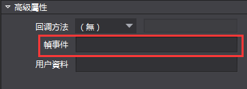
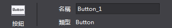

# **屬性擴展** #

**注意：**2.3.3.0版本對屬性區相關介面進行了調整，詳情請見 **2.介面變更**

&emsp;&emsp;1.屬性區擴展

&emsp;&emsp;Cocos Studio預置的控制項支援擴展，對於控制項的屬性區同樣支援擴展。一些基本類型的屬性，編輯器中已經包含對應的屬性控制項，只需要按照一定規則即可使用。如果使用者想要擴展自訂屬性，可以根據自己意願製作需要的功能(示例代碼中有詳細介紹)。

&emsp;&emsp;Cocos Studio預置控制項

&emsp;&emsp;string 類型

&emsp;&emsp;幀事件這個屬性是一個string類型，內容是一個可以輸入的文本，不限制文本的輸入格式，可以隨意輸入，可為空。

&emsp;&emsp;範例：

    string customString = string.Empty;
    [UndoPropertyAttribute] //允許撤銷回退，不允許則不添加
    [DisplayName("字串")]//Label顯示文本
    [Category("Custom_Plug")]//屬於哪個分組
    [PropertyOrder(0)]//在分組的排序，例如，1在0之後
    [Browsable(true)]//是否顯示當前屬性，不允許則設置為false 或者不添加這個屬性戳
    public string CustomString
    {
        get { return customString; }
        set
        {
            if (customString != value)
            {
                customString = value;
                //如果允許記錄撤銷記錄，則調用屬性通知，如果不需要記錄，則不添加
                this.RaisePropertyChanged(() => this.CustomString);
            }
        }
    }

&emsp;&emsp;名稱這個屬性是一個string類型，內容是一個可以輸入的文本，不限制文本的輸入格式，可以隨意輸入，但是不能為空，如果為空，恢復上一次保存的值，若要使用這類文字方塊，則要調用ValidTextEditor。

&emsp;&emsp;範例：

    [UndoPropertyAttribute]
    [DisplayName("ValidTextBox")]
    [Editor(typeof(ValidTextEditor), typeof(ValidTextEditor))] //這裡的Editor是制定特定的類型控制項，這些控制項屬於自己寫的，非系統原生
    [Category("Custom_Plug")]
    [PropertyOrder(0)]
    [Browsable(true)]
    public string ValidTextBoxString { get; set; }

&emsp;&emsp;int 類型

&emsp;&emsp;邏輯標籤這個屬性是一個int類型，內容是一個可以輸入數位的控制項，限制只能輸入數位，最大限制預設是正負9999999，在程式中可以通過SetMaxMin進行設置。

&emsp;&emsp;範例：

    int customInt = 0;
    [UndoPropertyAttribute]
    [DisplayName("整數")]
    [Category("Custom_Plug")]
    [PropertyOrder(1)]
    [Browsable(true)]
    public int CustomInt
    {
        get { return customInt; }
        set
        {
            if (customInt != value)
            {
                customInt = value;
                this.RaisePropertyChanged(() => this.CustomInt);
            }
        }
    }

&emsp;&emsp;bool 類型

&emsp;&emsp;可見性這個屬性是一個bool類型，類型是一個checkbox，可以進行選擇和不選擇。

&emsp;&emsp;範例：

    bool customBool = false;
    [UndoPropertyAttribute]
    [DisplayName("布林")]
    [Category("Custom_Extend")]
    [PropertyOrder(4)]
    [Browsable(true)]
    public bool CustomBool
    {
        get { return customBool; }
        set
        {
            if (customBool != value)
            {
                customBool = value;
                this.RaisePropertyChanged(() => this.CustomBool);
            }
        }
    }

&emsp;&emsp;enum 類型

&emsp;&emsp;水準對齊這個屬性是一個enum枚舉類型，類型是一個下拉combox，可以選擇不同的枚舉項。

&emsp;&emsp;範例：

    // 枚舉定義示例，實際使用時請將枚舉的定義放到 ViewModel 類外面，和 ViewModel 平級。
    // 參見示例工程中 WeekdayEnum 枚舉的定義。
    public enum CocosEnum
    {
        None,
        Fir,
        Sec,
        Thi
    }

    CocosEnum customEnum = CocosEnum.None;

    [UndoPropertyAttribute]
    [DisplayName("枚舉")]
    [Category("Custom_Plug")]
    [PropertyOrder(5)]
    [Browsable(true)]
    public CocosEnum CustomEnum
    {
        get { return customEnum; }
        set
        {
            if (customEnum != value)
            {
                customEnum = value;
                this.RaisePropertyChanged(() => this.CustomEnum);
            }
        }
    }

&emsp;&emsp;Color 類型

&emsp;&emsp;顏色混合這個屬性是一個Color類型，類型是一個群組控制項，可以選擇不同的顏色。

&emsp;&emsp;範例：
    
    System.Drawing.Color customColor = System.Drawing.Color.White;
    [UndoPropertyAttribute]
    [Editor(typeof(ColorEditor), typeof(ColorEditor))]
    [DisplayName("顏色")]
    [Category("Custom_Extend")]
    [PropertyOrder(6)]
    [Browsable(true)]
    public System.Drawing.Color CustomColor
    {
        get { return customColor; }
        set
        {
            if (customColor != value)
            {
                customColor = value;
                this.RaisePropertyChanged(() => this.CustomColor);
            }
        }
    }

&emsp;&emsp;ScaleValue 類型

&emsp;&emsp;傾斜這個屬性是一個ScaleValue類型，類型是一個群組控制項，可以分別設置X和Y的值，並且可以在屬性中設置最大值最小值和每次滑鼠滾輪幅度。

&emsp;&emsp;範例：

    ScaleValue customScaleValue = new ScaleValue(1, 1);
    [UndoPropertyAttribute]
    [Editor(typeof(CustomEditor), typeof(CustomEditor))] // CustomEditor 的原始程式碼可以在示例工程中找到。
    [ValueRange(int.MinValue, int.MaxValue, 1)]//ValueRange屬性是設置控制項最大值最小值和幅度
    [DisplayName("ScaleValue")]
    [Category("Custom_Extend")]
    [PropertyOrder(7)]
    [Browsable(true)]
    public ScaleValue CustomScaleValue
    {
        get { return customScaleValue; }
        set
        {
            if (customScaleValue != value)
            {
                customScaleValue = value;
                this.RaisePropertyChanged(() => this.CustomScaleValue);
            }
        }
    }

&emsp;&emsp;PointF 類型

&emsp;&emsp;錨點這個屬性是一個PointF類型，類型是一個群組控制項，可以分別設置XY的值。

&emsp;&emsp;範例：

    /*PointFEditor和ScaleValueEditor的內容一致，
    只是在其中需要類型的強制轉換，Point和ScaleValue兩種強類型，
    在控制項內做處理太繁雜，單一原則，把這兩個類型寫成了兩個控制項*/
    PointF customPointF = new PointF(1, 1);
    [UndoPropertyAttribute]
    [Editor(typeof(PointFEditor), typeof(PointFEditor))]
    [ValueRange(int.MinValue, int.MaxValue, 1)]//ValueRange屬性是設置控制項最大值最小值和幅度
    [DisplayName("ScaleValue")]
    [Category("Custom_Extend")]
    [PropertyOrder(7)]
    [Browsable(true)]
    public PointF CustomPointF
    {
        get { return customPointF; }
        set
        {
            if (customPointF != value)
            {
                customPointF = value;
                this.RaisePropertyChanged(() => this.CustomScaleValue);
            }
        }
    }

&emsp;&emsp;CustomObject這個範例檔中，一些已經提供的屬性，使用者添加了這些屬性後，需要在CustomObjectData 類中添加相應的屬性，這樣屬性才能在關閉編輯器後保存起來，下次打開檔讀取之前保存的屬性。
例如：

        [ItemProperty]
        [JsonProperty]
        public int CustomInt { get; set; }

&emsp;&emsp;具體的代碼在CustomObjectData已經添加。

&emsp;&emsp;編寫一個自訂控制項

&emsp;&emsp;CustomEditor是一個可以編輯ScaleValue類型的屬性編輯器，它繼承自BaseEditor，BaseEditor則繼承自IPropertyEditor介面。
BaseEditor中已對IPropertyEditor介面進行了實現，但子類在繼承BaseEditor時，依然需要重寫其中的一些方法，其中必須要重寫的方法如下：

            protected abstract Gtk.Widget OnCreateWidget();
            protected abstract void void OnSetControl();

&emsp;&emsp;Gtk.Widget OnCreateWidget()方法用於在屬性編輯器初始化的時候創建其對應的Gtk部件，例如CustomEditor就創建了一個包含了兩個輸入框的部件（NoUndoNumEntry是Gtk.Entry的子類，其中封裝了一些額外的邏輯）。

&emsp;&emsp;void OnSetControl()方法用於在屬性發生改變的時候同步刷新屬性面板上的Gtk部件。對於CustomEditor來說，這個方法的作用就是在屬性變更的時候，把最新的屬性值顯示在輸入框中。

&emsp;&emsp;CustomEditor中的兩個輸入框在其數值改為的時候會去更新對應屬性的值，這一賦值操作是通過BaseEditor中成員屬性PropertyItem來進行的。PropertyItem與當前屬性編輯器所對應的屬性綁定，通過它可以獲取或是設置屬性的數值。下面的代碼便是X值輸入框對其內容改變事件的回檔方法。

	private void XEntryValueChangedHandler(object sender, EntryIntEventArgs e)
    {
        using (GetLock())
        {
            for (int i = 0; i < PropertyItem.Objects.Count; i++)
            {
                ScaleValue value = PropertyItem.Values[i] as ScaleValue;
                value.ScaleX = e.Value;
                PropertyItem.Values[i] = value;
            }
        }
    }

&emsp;&emsp;2.介面變更

&emsp;&emsp;Cocos 2.3.3.0版本對屬性區進行了重構，同時對一些相關介面進行了調整。具體的調整包含以下內容：

&emsp;&emsp;1) CocoStudio.ToolKit專案中的內容被移動至Modules.Communal.PropertyGrid項目。目前屬性區的通用類均位於PropertyGrid專案，ToolKit專案已被刪除。原本使用CocoStudio.ToolKit命名空間的代碼需要將命名空間更改為Modules.Communal.PropertyGrid。

&emsp;&emsp;2) ITypeEditor介面被重命名為IPropertyEditor。新的介面已經由BaseEditor類統一實現，它的子類無需再聲明實現介面，且不需要再進行外掛程式匯出。ITypeEditor介面中的原方法與屬性均不再使用，新的使用方法以IPropertyEditor中公開的介面為准。

&emsp;&emsp;3) CatagoryAttribute類被重命名為ControlGroupAttribute，並被移動至CocoStudio.Model。

&emsp;&emsp;4) PropertyEditorTypeAttribute類已被刪除。屬性區對於預設類型的支援已內置於自身的框架代碼當中，外部無需再使用額外的特性進行標注。

&emsp;&emsp;3.其它

&emsp;&emsp;在後續的開發過程中文檔的內容會根據回饋持續更新。如有更新，請以新的版本為准。

&emsp;&emsp;如果您對於Cocos Studio擴展有任何的意見或者是建議，請在論壇或者是開發者群裡回饋給我們。感謝您對Cocos Studio的關注和支持，我們將回報您以更好用的產品。
