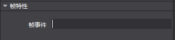

# **属性扩展** #

**注意：**2.3.3.0版本对属性区相关接口进行了调整，详情请见 **2.接口变更**

&emsp;&emsp;1.属性区扩展

&emsp;&emsp;Cocos Studio预置的控件支持扩展，对于控件的属性区同样支持扩展。一些基本类型的属性，编辑器中已经包含对应的属性控件，只需要按照一定规则即可使用。如果使用者想要扩展自定义属性，可以根据自己意愿制作需要的功能(示例代码中有详细介绍)。

&emsp;&emsp;Cocos Studio预置控件

&emsp;&emsp;string 类型

&emsp;&emsp;帧事件这个属性是一个string类型，内容是一个可以输入的文本，不限制文本的输入格式，可以随意输入，可为空。

&emsp;&emsp;范例：

    string customString = string.Empty;
    [UndoPropertyAttribute] //允许撤销回退，不允许则不添加
    [DisplayName("字符串")]//Label显示文本
    [Category("Custom_Plug")]//属于哪个分组
    [PropertyOrder(0)]//在分组的排序，例如，1在0之后
    [Browsable(true)]//是否显示当前属性，不允许则设置为false 或者不添加这个属性戳
    public string CustomString
    {
        get { return customString; }
        set
        {
            if (customString != value)
            {
                customString = value;
                //如果允许记录撤销记录，则调用属性通知，如果不需要记录，则不添加
                this.RaisePropertyChanged(() => this.CustomString);
            }
        }
    }

&emsp;&emsp;名称这个属性是一个string类型，内容是一个可以输入的文本，不限制文本的输入格式，可以随意输入，但是不能为空，如果为空，恢复上一次保存的值，若要使用这类文本框，则要调用ValidTextEditor。

&emsp;&emsp;范例：

    [UndoPropertyAttribute]
    [DisplayName("ValidTextBox")]
    [Editor(typeof(ValidTextEditor), typeof(ValidTextEditor))] //这里的Editor是制定特定的类型控件，这些控件属于自己写的，非系统原生
    [Category("Custom_Plug")]
    [PropertyOrder(0)]
    [Browsable(true)]
    public string ValidTextBoxString { get; set; }

&emsp;&emsp;int 类型

&emsp;&emsp;逻辑标签这个属性是一个int类型，内容是一个可以输入数字的控件，限制只能输入数字，最大限制默认是正负9999999，在程序中可以通过SetMaxMin进行设置。

&emsp;&emsp;范例：

    int customInt = 0;
    [UndoPropertyAttribute]
    [DisplayName("整数")]
    [Category("Custom_Plug")]
    [PropertyOrder(1)]
    [Browsable(true)]
    public int CustomInt
    {
        get { return customInt; }
        set
        {
            if (customInt != value)
            {
                customInt = value;
                this.RaisePropertyChanged(() => this.CustomInt);
            }
        }
    }

&emsp;&emsp;bool 类型

&emsp;&emsp;可见性这个属性是一个bool类型，类型是一个checkbox，可以进行选择和不选择。

&emsp;&emsp;范例：

    bool customBool = false;
    [UndoPropertyAttribute]
    [DisplayName("布尔")]
    [Category("Custom_Extend")]
    [PropertyOrder(4)]
    [Browsable(true)]
    public bool CustomBool
    {
        get { return customBool; }
        set
        {
            if (customBool != value)
            {
                customBool = value;
                this.RaisePropertyChanged(() => this.CustomBool);
            }
        }
    }

&emsp;&emsp;enum 类型

&emsp;&emsp;水平对齐这个属性是一个enum枚举类型，类型是一个下拉combox，可以选择不同的枚举项。

&emsp;&emsp;范例：

    // 枚举定义示例，实际使用时请将枚举的定义放到 ViewModel 类外面，和 ViewModel 平级。
    // 参见示例工程中 WeekdayEnum 枚举的定义。
    public enum CocosEnum
    {
        None,
        Fir,
        Sec,
        Thi
    }

    CocosEnum customEnum = CocosEnum.None;

    [UndoPropertyAttribute]
    [DisplayName("枚举")]
    [Category("Custom_Plug")]
    [PropertyOrder(5)]
    [Browsable(true)]
    public CocosEnum CustomEnum
    {
        get { return customEnum; }
        set
        {
            if (customEnum != value)
            {
                customEnum = value;
                this.RaisePropertyChanged(() => this.CustomEnum);
            }
        }
    }

&emsp;&emsp;Color 类型

&emsp;&emsp;颜色混合这个属性是一个Color类型，类型是一个组合控件，可以选择不同的颜色。

&emsp;&emsp;范例：
	
	System.Drawing.Color customColor = System.Drawing.Color.White;
	[UndoPropertyAttribute]
	[Editor(typeof(ColorEditor), typeof(ColorEditor))]
	[DisplayName("颜色")]
	[Category("Custom_Extend")]
	[PropertyOrder(6)]
	[Browsable(true)]
	public System.Drawing.Color CustomColor
	{
	    get { return customColor; }
	    set
	    {
	        if (customColor != value)
	        {
	            customColor = value;
	            this.RaisePropertyChanged(() => this.CustomColor);
	        }
	    }
	}

&emsp;&emsp;ScaleValue 类型

&emsp;&emsp;倾斜这个属性是一个ScaleValue类型，类型是一个组合控件，可以分别设置X和Y的值，并且可以在属性中设置最大值最小值和每次鼠标滚轮幅度。

&emsp;&emsp;范例：

	ScaleValue customScaleValue = new ScaleValue(1, 1);
	[UndoPropertyAttribute]
	[Editor(typeof(CustomEditor), typeof(CustomEditor))] // CustomEditor 的源代码可以在示例工程中找到。
	[ValueRange(int.MinValue, int.MaxValue, 1)]//ValueRange属性是设置控件最大值最小值和幅度
	[DisplayName("ScaleValue")]
	[Category("Custom_Extend")]
	[PropertyOrder(7)]
	[Browsable(true)]
	public ScaleValue CustomScaleValue
	{
	    get { return customScaleValue; }
	    set
	    {
	        if (customScaleValue != value)
	        {
	            customScaleValue = value;
	            this.RaisePropertyChanged(() => this.CustomScaleValue);
	        }
	    }
    }

&emsp;&emsp;PointF 类型

&emsp;&emsp;锚点这个属性是一个PointF类型，类型是一个组合控件，可以分别设置XY的值。

&emsp;&emsp;范例：

	/*PointFEditor和ScaleValueEditor的内容一致，
	只是在其中需要类型的强制转换，Point和ScaleValue两种强类型，
	在控件内做处理太繁杂，单一原则，把这两个类型写成了两个控件*/
	PointF customPointF = new PointF(1, 1);
	[UndoPropertyAttribute]
	[Editor(typeof(PointFEditor), typeof(PointFEditor))]
	[ValueRange(int.MinValue, int.MaxValue, 1)]//ValueRange属性是设置控件最大值最小值和幅度
	[DisplayName("ScaleValue")]
	[Category("Custom_Extend")]
	[PropertyOrder(7)]
	[Browsable(true)]
	public PointF CustomPointF
	{
	    get { return customPointF; }
	    set
	    {
	        if (customPointF != value)
	        {
	            customPointF = value;
	            this.RaisePropertyChanged(() => this.CustomScaleValue);
	        }
	    }
	}

&emsp;&emsp;CustomObject这个范例文件中，一些已经提供的属性，用户添加了这些属性后，需要在CustomObjectData 类中添加相应的属性，这样属性才能在关闭编辑器后保存起来，下次打开文件读取之前保存的属性。
例如：

        [ItemProperty]
        [JsonProperty]
        public int CustomInt { get; set; }

&emsp;&emsp;具体的代码在CustomObjectData已经添加。

&emsp;&emsp;编写一个自定义控件

&emsp;&emsp;CustomEditor是一个可以编辑ScaleValue类型的属性编辑器，它继承自BaseEditor，BaseEditor则继承自IPropertyEditor接口。
BaseEditor中已对IPropertyEditor接口进行了实现，但子类在继承BaseEditor时，依然需要重写其中的一些方法，其中必须要重写的方法如下：

            protected abstract Gtk.Widget OnCreateWidget();
            protected abstract void void OnSetControl();

&emsp;&emsp;Gtk.Widget OnCreateWidget()方法用于在属性编辑器初始化的时候创建其对应的Gtk部件，例如CustomEditor就创建了一个包含了两个输入框的部件（NoUndoNumEntry是Gtk.Entry的子类，其中封装了一些额外的逻辑）。

&emsp;&emsp;void OnSetControl()方法用于在属性发生改变的时候同步刷新属性面板上的Gtk部件。对于CustomEditor来说，这个方法的作用就是在属性变更的时候，把最新的属性值显示在输入框中。

&emsp;&emsp;CustomEditor中的两个输入框在其数值改为的时候会去更新对应属性的值，这一赋值操作是通过BaseEditor中成员属性PropertyItem来进行的。PropertyItem与当前属性编辑器所对应的属性绑定，通过它可以获取或是设置属性的数值。下面的代码便是X值输入框对其内容改变事件的回调方法。

	private void XEntryValueChangedHandler(object sender, EntryIntEventArgs e)
    {
        using (GetLock())
        {
            for (int i = 0; i < PropertyItem.Objects.Count; i++)
            {
                ScaleValue value = PropertyItem.Values[i] as ScaleValue;
                value.ScaleX = e.Value;
                PropertyItem.Values[i] = value;
            }
        }
    }

&emsp;&emsp;2.接口变更

&emsp;&emsp;Cocos 2.3.3.0版本对属性区进行了重构，同时对一些相关接口进行了调整。具体的调整包含以下内容：

&emsp;&emsp;1) CocoStudio.ToolKit项目中的内容被移动至Modules.Communal.PropertyGrid项目。目前属性区的通用类均位于PropertyGrid项目，ToolKit项目已被删除。原本使用CocoStudio.ToolKit命名空间的代码需要将命名空间更改为Modules.Communal.PropertyGrid。

&emsp;&emsp;2) ITypeEditor接口被重命名为IPropertyEditor。新的接口已经由BaseEditor类统一实现，它的子类无需再声明实现接口，且不需要再进行插件导出。ITypeEditor接口中的原方法与属性均不再使用，新的使用方法以IPropertyEditor中公开的接口为准。

&emsp;&emsp;3) CatagoryAttribute类被重命名为ControlGroupAttribute，并被移动至CocoStudio.Model。

&emsp;&emsp;4) PropertyEditorTypeAttribute类已被删除。属性区对于默认类型的支持已内置于自身的框架代码当中，外部无需再使用额外的特性进行标注。

&emsp;&emsp;3.其它

&emsp;&emsp;在后续的开发过程中文档的内容会根据反馈持续更新。如有更新，请以新的版本为准。

&emsp;&emsp;如果您对于Cocos Studio扩展有任何的意见或者是建议，请在论坛或者是开发者群里反馈给我们。感谢您对Cocos Studio的关注和支持，我们将回报您以更好用的产品。
