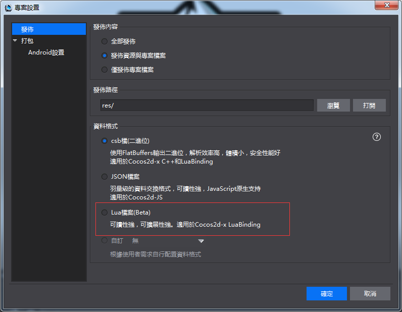
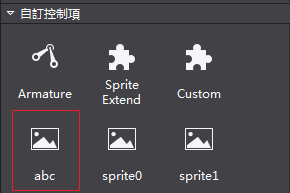
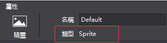
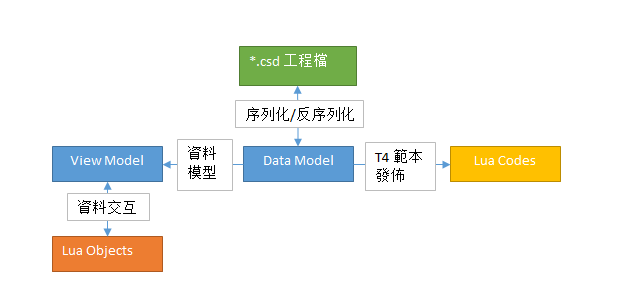
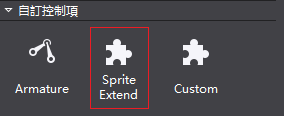
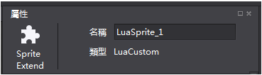
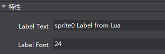
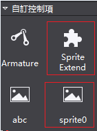

# **控制項擴展** #

1.文檔要點

&emsp;&emsp;自訂控制項相關部分的設計思路及技術細節。包括兩種自訂控制項的編寫方法： 

&emsp;&emsp;A.使用Lua腳本編寫供Cocos Studio使用的自訂控制項；（基礎篇內容）

&emsp;&emsp;B.使用C#+Lua來編寫供Cocos Studio使用的自訂控制項；（進階篇內容）

2.文檔的讀者

&emsp;&emsp;需要更進一步瞭解Cocos Studio，對Cocos Studio有自訂控制項需求的使用者。

&emsp;&emsp;在此，我們假定讀者有以下的知識技能：

&emsp;&emsp;熟悉Cocos Studio軟體的使用。

&emsp;&emsp;對Lua腳本有一定的瞭解。

&emsp;&emsp;對Cocos 2d-x匯出的Lua介面比較熟悉。

&emsp;&emsp;對C#語言程式設計有一定的瞭解。（非必需，不影響基礎篇的閱讀。進階篇有此要求）

3.背景知識

&emsp;&emsp;本文檔內容會涉及到下列相關的背景知識：

&emsp;&emsp;1)Lua語言。（詳情請參見：[http://www.lua.org/](http://www.lua.org/)）

&emsp;&emsp;2)Cocos2d-Lua綁定。

&emsp;&emsp;3)Mono.Addins。（詳情請參見：[http://monoaddins.codeplex.com/](http://monoaddins.codeplex.com/)）

4)T4 範本。

&emsp;&emsp;（詳情請參見：[https://msdn.microsoft.com/en-us/library/bb126445.aspx](https://msdn.microsoft.com/en-us/library/bb126445.aspx)）

&emsp;&emsp;通過閱讀本文檔，你將瞭解到以上和Cocos Studio擴展相關的內容。

4.目錄位置

&emsp;&emsp;為方便讀者查閱，在此把文檔中會用到的幾個目錄位置在此匯總一下。

&emsp;&emsp;Cocos Studio的外掛程式目錄

&emsp;&emsp;Windows作業系統上文檔位置預設安裝時，這個目錄是%userprofile%\Documents\Cocos\CocosStudio2\Addins。文檔位置自訂安裝時，則在Cocos Studio的文檔安裝目錄中的相應位置。例如：文檔的安裝目錄為 D:\CocosDocuments，則該路徑為D:\CocosDocuments\Cocos\CocosStudio2\Addins。在Mac上，這個目錄為使用者目錄 ~/Library/Application Support/Cocos/CocosStudio2/Addins 。

&emsp;&emsp;示例工程位置

&emsp;&emsp;Windows上文檔位置預設安裝時，這個目錄是%userprofile%\Documents\Cocos\CocosStudio2\Samples\Addins。文檔位置自訂安裝時，則在Cocos Studio的文檔安裝目錄中的相應位置。例如，文檔的安裝目錄為D:\CocosDocuments，則該路徑為D:\CocosDocuments\Cocos\CocosStudio2\Samples\Addins。在Mac上，這個目錄為系統目錄/Library/Application Support/Cocos/CocosStudio2/Samples/Addins。
在不引起混淆的情況的，以下的目錄位置都是以在Windows作業系統上Cocos Studio的預設安裝為例。

5.自訂控制項

&emsp;&emsp;目前Cocos Studio支援兩種編寫自訂控制項的方法：

&emsp;&emsp;1) 最基本的自訂控制項編寫，只寫Lua代碼。這部分適用於對現在的編輯器支援的控制項進行自訂渲染。

&emsp;&emsp;2) 更多的定制，需要同時寫C#代碼和Lua代碼。適用於需要更進一步的定制控制項的情況，可以通過添加屬性來動態的調整自訂擴展的控制項。

&emsp;&emsp;如果工程中含有用 Lua 實現的自訂控制項，在載入場景時就需要使用這些Lua檔。為更方便的使用Lua擴展來完成場景的構建，此次我們為Cocos Studio項目發佈添加了Lua檔案類型，如下圖所示：

&emsp;&emsp;在發佈帶有Lua自訂控制項的Cocos Studio工程時，選擇該選項。否則，自訂控制項不可展示出來。例如，工程發佈為csb檔時，相應的自訂Lua控制項會被跳過從而不可使用。（在Cocos Studio工程不包含Lua自訂控制項時也可以選擇該項來將工程匯出為Lua檔。）
如果有其它的特殊的發佈格式需求，請參考自訂資料匯出格式匯出一節。

&emsp;&emsp;下面針對這兩種情況分析介紹：

&emsp;&emsp;1) 基礎篇針對基本的自訂控制項的編寫，使用者只需要編寫Lua代碼即可完成操作。

&emsp;&emsp;2) 進階篇針對的是有更多控制需要的自訂控制項的編寫，使用者需要編寫部分輔助的C#代碼來完成操作。
下面我們來看下如何使用Lua腳本編寫供Cocos Studio使用的自訂控制項。

6.基礎篇

&emsp;&emsp;Cocos Studio啟動時，會掃描Cocos Studio外掛程式目錄下LuaScript目錄，其中的Lua檔（以尾碼名.lua作為判斷）會被認為是一個用Lua編寫的自訂擴展控制項。檔名作為控制項名字顯示在Cocos Studio控制項區（參見下面的示例）。

&emsp;&emsp;對於只需要修改或者擴展Cocos Studio控制項的渲染的情況或者給控制項屬性設置預設值，比如要定制一套控制項皮膚或者設置預設的文本字體，可以只編寫Lua代碼來完成操作。在這種情況下，使用者根據我們規定的格式來編寫Lua代碼，在Lua代碼中指定所擴展的Cocos Studio預定義控制項的類型（這也就是下面會提到的GetBaseType的作用。由於這裡是對Cocos Studio 預定義類型的擴展，所以除Lua所擴展的部分之外，其它控制項部分的初始化依然是由Cocos Studio來完成。這也是基礎篇裡對控制項的擴展可以只寫Lua代碼而不需要C#代碼來完成的原因。），完成所擴展的控制項的自訂構建，放在Cocos Studio外掛程式目錄下 LuaScript目錄內，Cocos Studio的啟動時便會載入它。要完成這個操作只需要以下兩步：

&emsp;&emsp;1） 編寫自訂控制項Lua腳本代碼。

&emsp;&emsp;2） 將上一步編寫好的Lua腳本代碼放置在Cocos Studio外掛程式目錄下LuaScript目錄內。 

&emsp;&emsp;下麵來看一個示例：一個自訂的帶文本的精靈控制項。
請在示例工程位置處找到Addins.sln，可以在Visual Studio 2013中打開它，下面的示例是位於LuaScript目錄裡的 abc.lua文件。

7.示例

&emsp;&emsp;一個自訂帶文本的精靈控制項：即在一個精靈上顯示一行文字。

&emsp;&emsp;abc.lua 代碼內容如下（其中的注釋部分包含了代碼的解釋和一些注意事項）。

&emsp;&emsp;片段如下：
--[[
一個簡單的示例，新建一個精靈，並在精靈上放置了一個文本。
當調用CreateCustomNode時，會生成這個精靈並返回。
]]

    -- 新建一個table，包含CreateCustomNode和GetBaseType方法。
    local container = {}

    -- 新建根節點Node，目前這個方法的名字為固定的，必須為CreateCustomNode。
    -- 方法的最後一句必須是一個return語句，把新建的結點返回。
    function container.CreateCustomNode()
        -- 新建一個精靈。
        local rootNode = cc.Sprite:create('temp.png') -- 圖片資源位於本檔所在目錄
    
        -- 新建一個 Label。
        local label = cc.Label:create()
        label:setString('abc Label From Lua') -- 設置 label 的文本內容。
        label:setSystemFontSize(24) -- 設置 label 字體大小。
        label:setPosition(140, 50) -- 設置 label 的位置。
        label:setName('labelName')  -- 設置 label 的名字。
        label:retain()              -- 保留，以回避垃圾回收。
    
        rootNode:addChild(label)
        return rootNode
    end

-- 返回該外掛程式所擴展的基礎類型。
function container.GetBaseType()
    return 'Sprite'
end

-- 返回這個包含CreateCustomNode和GetBaseType方法的表。
return container
-- 片段到這裡結束

&emsp;&emsp;分析：
上面的代碼是一個完整的Lua模組。載入它時會返回一個Lua Table，也就是代碼片段最後的那個container表。
方法GetBaseType用以返回這個Lua代碼所擴展的自訂控制項的根節點基礎類型，這裡返回一個字串 ‘Sprite’， 表示自訂擴展的控制項是一個精靈。GetBaseType的具體可用的返回值見下一節中關於GetBaseType方法的描述。
方法CreateCustomNode 用以返回一個結點，這裡就是一個擴展的精靈。
假設上面的Lua代碼檔abc.lua已經放置Cocos Studio外掛程式目錄下LuaScript目錄內，同時目錄中有圖片temp.png。
運行Cocos Studio，可以在控制項面板 “自訂控制項” 分組中看到這個自訂控制項，控制項的名字即Lua檔案名“abc”：

&emsp;&emsp;由於這個自訂控制項是擴展的精靈，所以它在控制項面板中顯示的圖示和精靈一樣。

&emsp;&emsp;拖動abc圖示到渲染可以看到如下內容（注：背景圖片為temp.png圖片。）：

&emsp;&emsp;在渲染區選中它，可以看到它的類型仍然為Sprite。

&emsp;&emsp;Lua代碼編寫中的常見問題和注意事項，請參考下節。

&emsp;&emsp;8.常見問題和注意事項

&emsp;&emsp;使用Lua代碼編寫自訂控制項的一些常見問題及注意事項：

&emsp;&emsp;1)在自訂控制項欄無法看到所擴展的控制項：代碼檔需要放置在Cocos Studio外掛程式目錄下LuaScript目錄內，同時目錄中有圖片temp.png。寫好的Lua代碼檔必須放置在這個目錄內，否則的話，Cocos Studio啟動時將找不到該Lua檔從而無法載入它。（例如，為了運行上面的示例，可以把示例工程位置中的 LuaScript 目錄拷貝到Cocos Studio外掛程式目錄下，啟動Cocos Studio以觀察效果。）。
如果要從另外的地方載入Lua檔，則需要修改C#代碼，這部分請參考進階篇。

&emsp;&emsp;2)在Lua代碼中需要用到的資源也應該放到這個目錄中去（例如上面示例中的temp.png圖片也是放置在 LuaScript目錄內），以相對路徑載入它LuaScript目錄是載入 Lua 代碼檔時的工作目錄。在發佈的時候，LuaScript目錄會被整個拷貝到Cocos Studio的工程發佈目錄。LuaScript 目錄只會被拷貝一次，如果工程發佈目錄裡已經存在同名的目錄，將不再拷貝。

&emsp;&emsp;3)一個Lua代碼檔是一個完整的自訂模組。Lua代碼最後會返回一個Lua Table。

&emsp;&emsp;4)Lua Table必須有一個名為CreateCustomNode的方法，調用它時可以生成自訂控制項並返回。

&emsp;&emsp;5)Lua Table必須有一個名為GetBaseType的方法，以返回該自訂控制項的根節點，這是一個字串。Cocos Studio所包含的控制項及其名字如下所示（控制項名一列的英文部分表示該控制項在引擎中的名字，即在渲染區選中相應的控制項時在屬性區中的類型顯示；括弧中的中文名字表示其在控制項面板中的中文名字。GetBaseType返回列表示在Lua代碼中應該返回的字串。）：

          控制項名               GetBaseType返回
       Sprite（精靈）              Sprite
    ParticleSystemQuad（粒子）    Particle
     TMXTiledMap（地圖）          GameMap
       ComAudio（聲音）            SimpleAudio
        Node（節點）                Node
       Button（按鈕）               Button
      CheckBox（核取方塊）             CheckBox
      ImageView（圖片）              ImageView
      TextBMFont（FNT 字體）      TextBMFont
      LoadingBar（進度條）         LoadingBar
      Slider（滑動條）              Slider
      Text（文本）                    Text
      TextField（輸入框）           TextField
      ScrollView（滾動容器）         ScrollView
      ListView（列表容器）         ListView
      PageView（翻頁容器）         PageView
     Particle3D（3D 粒子）         Particle3D
       Sprite3D（模型）              Sprite3D                                        
     UserCamera（攝像機）         UserCamera

&emsp;&emsp;6) 如何在自訂控制項的Lua腳本中調用協力廠商Lua代碼庫? 

&emsp;&emsp;目前Cocos Studio的Lua運行時只支持從Cocos 2d-x匯出的介面，預設沒有載入其它介面。如果需要，請在Lua 代碼中自行載入。例如，如果需要用到Quick-cocos2d-x提供的Lua擴展介面，請在代碼中自行載入相關的庫。

&emsp;&emsp;7) 只寫Lua代碼的話，可以自訂渲染，對相應的控制項定制渲染。如果需要更深入的控制項（例如需要擴展屬性區），需要寫配對的C#代碼。

&emsp;&emsp;8) 一個自訂控制項應該只有一個Lua檔來定義。同時，一個Lua檔只應該生成一個自訂控制項。目前Cocos Studio會載入所有的位於LuaScript目錄中的Lua檔。每個Lua檔對應於控制項區的一個控制項圖示，圖示顯示的名字就是檔案名（不帶尾碼的部分）。

&emsp;&emsp;9) 對於打開一個已經保存的有Lua擴展控制項的工程，如果在打開工程前修改過相應的Lua指令檔的內容，則載入的為新的腳本內容。如果載入過程出錯，則不顯示相應的自訂控制項。

&emsp;&emsp;最佳實踐：在Cocos Studio中編輯所需控制項，編輯結束後，把工程發佈為Lua檔。基於相應的代碼片段進行修改，可以減少手動編寫代碼的工作量。

&emsp;&emsp;基礎篇到此結束，對於只使用Lua代碼目前只能完成一個簡單的自訂控制項（即擴展Cocos Studio預定義控制項），如果需要更進一步的擴展，請參見以下幾節。

&emsp;&emsp;9.進階篇

&emsp;&emsp;對於需要更多定制的情況，比如要添加屬性的修改，就需要用到Cocos Studio所提供的擴展功能，編寫相應的C#代碼來完成。這裡先簡單的介紹下這個過程（更詳細的細節請參見下麵各節），Cocos Studio是基於Mono.Addins來構建的外掛程式系統，在需要對擴展更進一步的定制時，我們就需要使用這個外掛程式系統（配置程式集）。為了擴展屬性，需要對所擴展類型時行 C#擴展（視圖模型的擴展，即從ViewModel派生一個子類，並添加屬性。由於ViewModel的擴展，從而DataModel也需要相應的擴展。）。擴展的C#屬性需要和Lua腳本進行資料交互（通過運行時從Lua代碼讀寫資料，所以要修改相應的Lua腳本，並在C#裡調用Cocos Studio提供的介面來與Lua腳本時行資料交互）。擴展的控制項需要匯出到Lua檔（通過添加Lua代碼生成範本），相應的Lua代碼生成範本雖然被添加到Cocos Studio的外掛程式系統從而在工程發佈可被應用（添加Lua代碼生成範本的匯出）。在此過程中的幾個概念的關係如下圖所示：

&emsp;&emsp;（說明：Lua Objects為自訂控制項的Lua腳本代碼。Lua Codes從DataModel生成的Lua檔代碼。）
一般來說，完成這個操作需要以下幾步：

&emsp;&emsp;1） 編寫自訂控制項Lua腳本代碼。

&emsp;&emsp;2） 將上一步編寫好的Lua腳本代碼放置在Cocos Studio的外掛程式目錄。 

&emsp;&emsp;3） 配置外掛程式AddinConfig.cs。 

&emsp;&emsp;4） 添加ViewModel和DataModels。 

&emsp;&emsp;5） 添加Lua代碼生成範本。

&emsp;&emsp;下麵來看一個示例：一個自訂的帶文本的精靈控制項，該自訂控制項在渲染區選中時，可以通過屬性區修改文本的內容和字體大小。
這裡我們已經提供了一個配置好的Visual Studio 2013專案工程，請在示例工程位置處找到Addins.sln，可以在Visual Studio 2013中打開它，下面的內容都是基於該示例工程（示例工程的其它介紹請參見示例工程一節）。

&emsp;&emsp;自訂控制項部分主要位元於Lua目錄下的LuaScript子目錄內。

&emsp;&emsp;10.示例

&emsp;&emsp;因為要控制項精靈上文本的內容和字體大小，先在Lua代碼中添加處理文本內容和字體大小的方法。如下所示：

&emsp;&emsp;Lua代碼

&emsp;&emsp;LuaScript目錄中一個可用的sprite0.lua代碼如下所示（其中的注釋部分包含了代碼的解釋和一些注意事項）。

&emsp;&emsp;片段如下：
--[[
一個簡單的示例，新建一個精靈，並在精靈上放置了一個文本。
當調用CreateCustomNode時，會生成這個精靈並返回。
]]
        
    -- 新建一個精靈。
    -- 新建精靈時傳入了一個圖片路徑作為參數。
    local function CreateSprite()
        return cc.Sprite:create('temp.png') --圖片資源請放在本檔所在目錄 (LuaScript 目錄)
    end
    
    -- 新建一個Label，用以顯示文字
    local function CreateLabel()
        local label = cc.Label:create()
        label:setString('sprite0 Label from Lua')
        label:setSystemFontSize(24)
        label:setPosition(140, 50)
        label:setName('labelName') --設置 label 的名字，這個 label 的名字在下面會用到。
        label:retain()
        return label
    end

	-- make sure ccslog is not empty
	local ccslog = ccslog
	if not ccslog then
		ccslog = function(...) end
	end

    -- 新建一個table，避免全域變數污染。用以包括腳本中所定義的所有的全域方法。
    local container = {}
    -- 新建根節點 Node，目前這個方法的名字為固定的，必須為CreateCustomNode。
    -- 方法的最後一句必須是一個return語句，把新建的結點返回。
    function container.CreateCustomNode()
        local rootNode = CreateSprite()
        rootNode:addChild(CreateLabel())
        return rootNode
    end

    -- 返回該外掛程式所擴展的基礎類型。
    function container.GetBaseType()
        return 'Sprite'
    end

    -- 取得精靈上文本的內容。
    -- root 參數即為調用CreateCustomNode時返回的根結點。
    function container.GetLabelText(root)
        -- 在父控制項中查找名字為 'labelName' 的子控制項。
        local child = root:getChildByName('labelName')
        return child:getString()
    end

    -- 設置精靈上文本的內容。
    -- root 參數即為調用CreateCustomNode時返回的根結點。
    -- value 所賦的字串的值。
    function container.SetLabelText(root, value)
        -- 在父控制項中查找名字為 'labelName' 的子控制項。
        local child = root:getChildByName('labelName')
        child:setString(value)
    end

    -- 取得精靈上文本的字體大小。
    function container.GetLabelFont(root)
        local child = root:getChildByName('labelName')
        return child:getSystemFontSize()
    end
    
    -- 設置精靈上文本的字體大小。
    function container.SetLabelFont(root, value)
        local child = root:getChildByName('labelName')
        child:setSystemFontSize(value)
    end
    
    -- 返回這個包含所有全域方法的表
    return container

-- 片段到這裡結束

&emsp;&emsp;分析：
新建精靈部分在上一個示例中已經描述。這裡看下它新添加的兩對Set/Get方法：
GetLabelText/SetLabelText（獲取/設置精靈上文本的內容），GetLabelFont/SetLabelFont（獲取/設置精靈上文本字體的大小）。注意這裡的方法名，在下面的C#代碼中會用到。
這裡可以看到，在方法內部，是通過Cocos 2d-x匯出的Lua介面完成相應的操作。 

&emsp;&emsp;在 Cocos Studio 3.10 版本中，新添加了 `ccslog` 用於向 Cocos Studio 的輸出區輸出資訊。`ccslog` 的使用方法同 lua 中的 `print` ，在 3.10 版本的示例工程 sprite0.lua 代碼中可以看到它的使用。

&emsp;&emsp;為了在Cocos Studio中可以生成它，使它可以展示在渲染區，為它添加ViewModel。如下所示：

&emsp;&emsp;視圖模型

&emsp;&emsp;LuaCustomObject視圖模型的代碼片段如下：

    [DisplayName("Sprite Extend")]
    [ModelExtension(2)]
    [ControlGroup(ViewObjectCategory.CustomGroupKey, 2)]
    [EngineClassName("LuaCustom")]
    public class LuaCustomObject : SpriteObject
    {
        public LuaCustomObject()
            : base(GetScriptFileData())
        {
            if (System.IO.File.Exists(luaFile))
                luaValueConverter = new LuaValueConverter(luaFile, this);
            else
                throw new System.IO.FileNotFoundException(luaFile + " not found!");
        }

        private LuaValueConverter luaValueConverter;

        private static string luaFile = GetLuaFilePath();

        private static ScriptFileData GetScriptFileData()
        {
            if (System.IO.File.Exists(luaFile))
            {
                CSCocosHelp.AddSearchPath(Path.GetDirectoryName(luaFile));
                return new ScriptFileData(luaFile, ScriptType.Lua);
            }

            LogConfig.Output.Info(luaFile + " not exist!");
            return null;
        }

        /// 

        /// get lua file path according to current running assembly.
        /// lua script file should in a folder "LuaScript" which is in current running assembly parent folder.
        /// e.g. current running assembly is in "Addins", lua file path is "Addins/LuaScript/sprite0.lua"
        ///
        ///      Addins
        ///      ├─Addins.Sample.dll (current running assembly)
        ///      └─LuaScript
        ///          ├─ sprite0.lua
        ///
        /// you can modify "LuaScript" or lua file name "sprite0.lua" to other name as you like.
        /// NOTICE: only Addins/LuaScript folder will be copied to target folder. if lua script is in other
        /// folder, user should write extra codes to copy it to target folder, e.g. use CustomSerializer to do the job.
        /// 

        /// <returns>lua file path</returns>
        private static string GetLuaFilePath()
        {
            string assemblyFolder = Path.GetDirectoryName(Assembly.GetExecutingAssembly().Location);
            string luaScriptFolder = Path.Combine(assemblyFolder, "LuaScript");

            // make sure luaFile exists, if not, please copy it from source folder to target.
            // you can find the lua script file in "../LuaScript/" folder as "."(current folder) is the one
            // who contains current file LuaCustomObject.cs.(here "." is "Addins.Sample/Lua/ViewModel")
            //  
            //  ├─LuaScript
            //  │   ├─ sprite0.lua
            //  │
            //  └─ViewModel
            //      ├─ LuaCustomObject.cs (current file)
            //
            string luaFilePath = Path.Combine(luaScriptFolder, "sprite0.lua");

            return luaFilePath;
        }

        protected override string GetNamePrefix()
        {
            return "LuaSprite_";
        }

        [UndoProperty]
        [DefaultValue("abc")]
        [DisplayName("Label Text")]
        [Category("Group_Feature")]
        [Browsable(true)]
        [PropertyOrder(0)]
        public string LabelText
        {
            get
            {
                return luaValueConverter.GetStringValue("GetLabelText");
            }
            set
            {
                luaValueConverter.SetStringValue("SetLabelText", value);
                this.RaisePropertyChanged(() => this.LabelText);
            }
        }

        [UndoProperty]
        [DisplayName("Label Font")]
        [Category("Group_Feature")]
        [Description("Int value description")]
        [PropertyOrder(1)]
        [Browsable(true)]
        public int LabelFont
        {
            get
            {
                return luaValueConverter.GetIntValue("GetLabelFont");
            }
            set
            {
                luaValueConverter.SetIntValue("SetLabelFont", value);
                this.RaisePropertyChanged(() => this.LabelFont);
            }
        }

        #region methods for clone

        // set value to the object, used in clone.
        protected override void SetValue(object cObject)
        {
            base.SetValue(cObject);

            LuaCustomObject nObject = cObject as LuaCustomObject;
            if (nObject == null)
                return;
            nObject.LabelText = this.LabelText;
            nObject.LabelFont = this.LabelFont;
        }

        #endregion methods for clone
    }

&emsp;&emsp;分析：
由於該自訂控制項擴展的是精靈，所以，它繼承自SpriteObject。
DisplayName特性：在Cocos Studio控制項欄裡顯示的自訂控制項的名字，這裡顯示為"Sprite Extend"。
ModelExtension特性：匯出這個自訂的ViewModel類型，其參數為類型匯出順序，由於添加了這個特性，這個控制項就在 Cocos Studio的自訂控制群組中顯示出來，如下所示：

&emsp;&emsp;（這個自訂控制項的名字即為DisplayName所指定的"Sprite Extend"。）

&emsp;&emsp;如果所擴展的為3D控制項，這裡使用ModelExtension裡需要多一個表示3D的參數，如下所示（詳見示例工程中的 3D擴展）：

    [ModelExtension(2, EnumModelType.ThreeDimensional)]

&emsp;&emsp;Category特性：
分組，以及控制項在分組中的順序。這裡因為給它指定的是名字是 "Control_Custom"， 所示該控制項在控制項區顯示在“自訂控制項”分組中，（注意：這裡用欄位"Control_Custom" 而實際顯示為“自訂控制項”是因為Cocos Studio裡有特殊的處理，如果使用其它的欄位，則會顯示會欄位的名字。）

&emsp;&emsp;EngineClassName：控制項名，其名字會顯示在屬性面板的類型處。Cocos Studio的控制項此處顯示的是是它在 Cocos 2d-x中類型。自訂控制項沒有對應的引擎類型，所以此處以自己能清晰的分辨所選擇類型為准。

&emsp;&emsp;由於其中添加了LabelText和LabelFont擴展屬性，所以它們在屬性區展示如下：

&emsp;&emsp;（注意屬性的名字和ViewModel屬性上的DisplayName的對應關係。）
屬性區擴展及屬性區編輯控制項的擴展，請參考屬性區擴展一節。

&emsp;&emsp;ViewModel的其它細節請參見DataModel和ViewModel一節。

&emsp;&emsp;在Cocos Studio中，每個ViewModel對應一個資料模型DataModel用來作數據的持久化，例如保存工程時會將 DataModel進行序列化保存到Cocos Studio的工程檔.csd文件中。所以，為這個ViewModel建立一個對應的DataModel。

&emsp;&emsp;資料模型

&emsp;&emsp;LuaCustomObjectData資料模型的代碼片段如下：

    [DataModelExtension(typeof(LuaCustomObject))]
    public class LuaCustomObjectData : SpriteObjectData
    {
        [ItemProperty]
        [JsonProperty]
        public string LabelText { get; set; }
    
        [ItemProperty]
        [JsonProperty]
        public int LabelFont { get; set; }
    }

&emsp;&emsp;分析：

&emsp;&emsp;由於該自訂控制項擴展的是精靈，所以，它繼承自SpriteObjectData。
添加DataModelExtension 特性，其值為相對應的ViewModel的類型LuaCustomObject。
DataModel中屬性為需要進行保存的所對應的ViewModel中的欄位。
注意，DataModel中的屬性名字需要和ViewModel相應的屬性名字保持一致，比如上面的LabelText，就是對應於ViewModel中的LabelText。
DataModel的其它細節請參見DataModel和ViewModel一節。

&emsp;&emsp;接著，實現ViewModel中所擴展的屬性和Lua代碼的交互。相關的C#代碼如下所示：

&emsp;&emsp;資料交互
&emsp;&emsp;與上面的Lua代碼相對應的C#代碼片段如下所示：

    [UndoPropertyAttribute]
    [DefaultValue("abc")]
    [DisplayName("Label Text")]
    [Category("Group_Feature")]
    [Browsable(true)]
    [PropertyOrder(0)]
    public string LabelText
    {
        get
        {
            return luaValueConverter.GetStringValue("GetLabelText");
        }
        set
        {
            luaValueConverter.SetStringValue("SetLabelText", value);
            this.RaisePropertyChanged(() => this.LabelText);
        }
    }

    [UndoPropertyAttribute]
    [DisplayName("Label Font")]
    [Category("Group_Feature")]
    [Description("Int value description")]
    [PropertyOrder(1)]
    [Browsable(true)]
    public int LabelFont
    {
        get
        {
            return luaValueConverter.GetIntValue("GetLabelFont");
        }
        set
        {
            luaValueConverter.SetIntValue("SetLabelFont", value);
            this.RaisePropertyChanged(() => this.LabelFont);
        }
    }

&emsp;&emsp;分析：

&emsp;&emsp;其中luaValueConverter.GetStringValue即為從Lua代碼中取得一個字串值，這裡由於傳入的參數為"GetLabelFont" ，從上面的Lua代碼示例中取得精靈上的文本內容。注意這裡的傳入方法名和Lua代碼的對應關係。其它幾個資料交互調用與之類似。
屬性的set最後調用this.RaisePropertyChanged是通知這裡的屬性值發生了改變，實現屬性區介面刷新。
資料交互部分的其它細節請參見資料交互一節。

&emsp;&emsp;接著，為了讓這個擴展能被Cocos Studio載入起來。將工程所編譯生成的Addins.Sample.dll拷貝到Cocos Studio外掛程式目錄裡。由於Cocos Studio所使用的外掛程式方案的約定，需要給生成的程式集添加以特性：

&emsp;&emsp;添加AddinConfig.cs

&emsp;&emsp;給工程添加AddinConfig.cs檔，內容如下：

    // "3.10" is version of the this Addin. Addin should match its dependency with the same version.
    [assembly: Addin("Addins.Sample", "3.10", Namespace = Option.AddinNamespace)]
    
    // "3.10" is the version of Addin dependency.
    [assembly: AddinDependency("CocoStudio.Core", "3.10")]
    [assembly: AddinDependency("CocoStudio.Projects", "3.10")]
    [assembly: AddinDependency("CocoStudio.Model", "3.10")]
    [assembly: AddinDependency("CocoStudio.Model.Lua", "3.10")]
    [assembly: AddinDependency("CocoStudio.Model3D", "3.10")]
    [assembly: AddinDependency("CocoStudio.Model3D.Lua", "3.10")]
    [assembly: AddinDependency("Addins.LuaExtend", "3.10")]

&emsp;&emsp;分析：

&emsp;&emsp;設置外掛程式匯出以及外掛程式的依賴。
具體的細節請參見外掛程式技術方案一節。

&emsp;&emsp;自訂控制項是由Lua生成，我們為了將自訂的擴展屬性匯出到Lua，需要把DataModel轉化為Lua代碼，如下所示。

&emsp;&emsp;Lua代碼生成範本

&emsp;&emsp;在Cocos Studio工程中，使用T4範本技術來從DataModel生成Lua代碼。

&emsp;&emsp;T4範本的代碼如下所示：

    <#@ template debug="false" inherits="LuaSpriteObject" language="C#" linePragmas="false"#>
    <#@ assembly name="System.Core" #>
    <#@ import namespace="System.Linq" #>
    <#@ import namespace="System.Text" #>
    <#@ import namespace="System.Collections.Generic" #>
    <#@ import namespace="CocoStudio.Model.DataModel" #>
    <#@ import namespace="Addins.Sample.Lua.DataModel"#>
    <#@ import namespace="CocoStudio.Model.Lua.Templates" #>
    <#@ import namespace="Mono.Addins" #>
    
    <#+
    public override bool CanSerialize(BaseObjectData objectData)
    {
        bool isOK = typeof(LuaCustomObjectData) == objectData.GetType();
        return isOK;
    }
    
    public override void CreateObject(BaseObjectData objectData)
    {
        LuaCustomObjectData data = objectData as LuaCustomObjectData;
    #>
    local luaScript = require("<#= CocoStudio.Basic.Option.luaScriptFolderName #>/<#= System.IO.Path.GetFileName(data.ScriptData.RelativeScriptFile) #>")
    <#= GetNameDeclaration(objectData.Name) #> = luaScript.CreateCustomNode()
    <#+
    }
    
    public override void InitializeObject(BaseObjectData objectData)
    {
        LuaCustomObjectData data = objectData as LuaCustomObjectData;
        base.InitializeObject(data);
    #>
    luaScript.SetLabelText(<#= data.Name #>, "<#= data.LabelText #>")
    luaScript.SetLabelFont(<#= data.Name #>, <#=data.LabelFont#>)
    luaScript.GetLabelVisible(<#= data.Name #>, <#=data.LabelVisible.ToString().ToLower()#>)
    luaScript.SetMixedColor(<#= data.Name #>, <#=data.MixedColor.ToLuaString()#>)
    <#+
    }
    #>

&emsp;&emsp;分析：

&emsp;&emsp;inherits="LuaSpriteObject"，設置T4範本生成類繼承自LuaSpriteObject，也就是精靈的Lua T4範本生成類。

&emsp;&emsp;CanSerialize：確定該T4範本生成類所操作的DataModel為LuaCustomObjectData。

&emsp;&emsp;CreateObject：生成該自訂控制項的Lua代碼。

&emsp;&emsp;InitializeObject：生成該自訂控制項的設置屬性代碼。

&emsp;&emsp;AddChild : 由於該自訂控制項擴展的是精靈，添加子控制項不需要特殊操作，所以不用重寫AddChild方法。

&emsp;&emsp;通過上面的繼承關係我們可以看出，每一個DataModel會對應到一個Lua代碼生成範本。在對某個控制項進行擴展時，Lua代碼生成範本類需要繼承自控制項的代碼生成範本類。控制項的代碼生成範本類請參見相關類一覽。

&emsp;&emsp;T4範本的其它細節請參見T4範本一節。

&emsp;&emsp;Lua代碼生成的T4範本這裡使用的是Monodevelop的外掛程式機制，所以需要為其添加一個Xml匯出檔。Cocos Studio專案在匯出Lua檔時會由其外掛程式機制掃描 "/CocoStudio/Model/Lua/Templates" 擴展點下的所有LuaBaseObject 類（這個類是所有的代碼生成範本類的基類。），所以這裡添加代碼生成範本的匯出類。在進行 Lua 代碼生成的時候，Cocos Studio會以每個要生成的DataModel類為參數來調用CanSerialize來查找該DataModel所對應的代碼範本生成類。

&emsp;&emsp;Lua代碼生成範本匯出

&emsp;&emsp;T4範本的關聯檔為ExtensionModel目錄中的LuaObjects.addin.xml。其在 VS2013 中的屬性：“生成操作”為“嵌入的資源”，“複製到輸出目錄”為“不複製”。 

&emsp;&emsp;這個檔的作用是在"/CocoStudio/Model/Lua/Templates"擴展點添加由T4範本生成的類的全路徑，即："Addins.Sample.Lua.Lua.LuaCustomObject"，其內容如下所示：

    <?xml version="1.0" encoding="utf-8" ?>
    <ExtensionModel>
    <Extension path = "/CocoStudio/Model/Lua/Templates">
        <Class class = "Addins.Sample.Lua.Lua.LuaCustomObject"/>
    </Extension>
    </ExtensionModel>

&emsp;&emsp;T4範本的其它細節請參見T4範本一節。

&emsp;&emsp;C#代碼編寫中的常見問題和注意事項，請參考下節。

&emsp;&emsp;11.常見問題和注意事項

&emsp;&emsp;利用C#寫擴展的一些常見問題和注意事項。

&emsp;&emsp;外掛程式技術方案

&emsp;&emsp;Cocos Studio是基於Mono.Addins來構建的外掛程式系統，具體到代碼上的表現是：在C#工程中添加 AddinConfig.cs檔，給程式集設置Addin特性，及使用AddinDependency給程式集設置相應的依賴。生成的DLL需要放置在%userprofile%\Documents\Cocos\CocosStudio2\Addins目錄下（路徑以在Windows作業系統上的位置為示例）。
Mono.Addins的具體細節請參考：[http://monoaddins.codeplex.com/](http://monoaddins.codeplex.com/)

&emsp;&emsp;DataModel和ViewModel 

&emsp;&emsp;在Cocos Studio中，渲染區所展示的每一個控制項都是一個ViewModel，每一個ViewModel都對應一個 DataModel來管理其資料。

&emsp;&emsp;根據要擴展的控制項的不同，ViewModel需要繼承自NodeObject或者NodeObject的某個子類。DataModel需要相應的繼承自和ViewModel的基類所配對的NodeObjectData或者NodeObjectData某個子類。
DataModel和ViewModel的關聯通過DataModelExtension特性來實現。

&emsp;&emsp;DataModel和ViewModel中對應的屬性名應該保持一致。

&emsp;&emsp;序列化方案

&emsp;&emsp;DataModel中的需要序列化的屬性需要添加[ItemProperty]和[JsonProperty]特性，分別對應於xml和json 的序列化。

&emsp;&emsp;資料模型的xml序列化採用的是MonoDevelop的解決方案，具體的細節請參考[http://www.monodevelop.com/developers/articles/using-the-data-serializer/](http://www.monodevelop.com/developers/articles/using-the-data-serializer/)

&emsp;&emsp;資料模型的json序列化採用的是Newtonsoft.Json庫，具體的細節請參考
[http://www.newtonsoft.com/json](http://www.newtonsoft.com/json)

&emsp;&emsp;資料交互

&emsp;&emsp;C#和Lua的資料交互，提供了LuaValueConverter用以在C#層和Lua層來交換資料。LuaValueConverter所提供的方法如下所示：
方法簽名說明
    
    bool GetBoolValue(string funcName)                                從指定的函數名 funcName 返回一個 bool 值。
    void SetBoolValue(string funcName, bool val)                    使用指定的函數名 funcName 設置一個 bool 值。
    int GetIntValue(string funcName)                                從指定的函數名 funcName 返回一個整數。
    void SetIntValue(string funcName, int val)                        使用指定的函數名 funcName 設置一個整數。
    string GetStringValue(string funcName)                            從指定的函數名 funcName 返回一個字串。
    void SetStringValue(string funcName, string val)                使用指定的函數名 funcName 設置一個字串。
    double GetDoubleValue(string funcName)                            從指定的函數名 funcName 返回一個雙精度浮點值。
    void SetDoubleValue(string funcName, double val)                使用指定的函數名 funcName 設置一個雙精度浮點值。
    float GetFloatValue(string funcName)                            從指定的函數名 funcName 返回一個浮點值。
    void SetFloatValue(string funcName, float val)                    使用指定的函數名 funcName 設置一個浮點值。
    System.Drawing.Color GetColorValue(string funcName)                從指定的函數名 funcName 返回一個顏色值。
    void SetColorValue(string funcName, System.Drawing.Color val)    使用指定的函數名 funcName 設置一個顏色值。
    void SetResourceDataValue(string funcName, ResourceData val)    使用指定的函數名 funcName 設置一個資源值。
&emsp;&emsp;注：

&emsp;&emsp;上面的函數簽名為C#中的方法名。其中的類型均為C#語言定義中的類型。

&emsp;&emsp;調用時funcName應該傳為方法在Lua中的方法名。

&emsp;&emsp;資源類型只有Set沒有Get，對於需要取得資源的地方，可以調用GetStringValue方法返回資源的路徑，在C#層進行後續處理。
C#和Lua之間資料的交互，目前只支援這幾種預定義的類型，如果有需要其它的複合類型，可通過方法組合和類型轉換來實現。在後續的開發中我們會逐漸豐富所支持的類型。

&emsp;&emsp;T4範本

&emsp;&emsp;為資料模型DataModel生成T4範本，以便在匯出Cocos Studio工程時把DataModel內容匯出到Lua檔。

&emsp;&emsp;T4範本具體實現時的規則：

&emsp;&emsp;每個要匯出到Lua代碼的控制項都會對應一個T4範本。

&emsp;&emsp;T4 範本生成的C#檔需要繼承自相應的擴展的控制項類，同時需要重載以下的幾個方法：

&emsp;&emsp;CanSerialier，用以判斷將要處理的類型是自己的DataModel。

&emsp;&emsp;CreateObject，根據傳入的DataModel，載入相應的Lua擴展檔。生成Lua代碼，用以新建一個所擴展的控制項。

&emsp;&emsp;InitializeObject，相應的擴展屬性匯出到Lua代碼。

&emsp;&emsp;AddChild，如果擴展控制項添加子控制項使用的不是來自NodeObject的AddChild，則需要在此重寫這個方法。例如，容器控制項PageView添加子控制項時使用addPage 。

&emsp;&emsp;T4範本請參考：[https://msdn.microsoft.com/en-us/library/bb126445.aspx ](https://msdn.microsoft.com/en-us/library/bb126445.aspx )

&emsp;&emsp;添加T4範本關聯，以便Cocos Studio工程匯出到Lua時找到該範本。(示例工程ExtensionModel目錄中的 LuaObjects.addin.xml就是這個作用。)

&emsp;&emsp;相關類一覽

&emsp;&emsp;Cocos Studio中的ViewModel，DataModel，及T4範本生成的相關類名一覽：

&emsp;&emsp;ViewModel類DataModel類T4範本類
    
    SpriteObject             SpriteObjectData           LuaSpriteObject
    ParticleObject             ParticleObjectData           LuaParticleObject
    GameMapObject             GameMapObjectData           LuaGameMapObject
    SimpleAudioObject         SimpleAudioObjectData       LuaSimpleAudioObject
    NodeObject                 NodeObjectData               LuaNodeObject
    ButtonObject             ButtonObjectData           LuaButtonObject
    CheckBoxObject             CheckBoxObjectData           LuaCheckBoxObject
    ImageViewObject             ImageViewObjectData       LuaImageViewObject
    TextBMFontObject         TextBMFontObjectData       LuaTextBMFontObject
    LoadingBarObject         LoadingBarObjecDatat       LuaLoadingBarObject
    SliderObject             SliderObjectData           LuaSliderObject
    TextObject                 TextObjectData               LuaTextObject
    TextFieldObject             TextFieldObjectData       LuaTextFieldObject
    PanelObject                 PanelObjectData           LuaPanelObject
    ScrollViewObject         ScrollViewObjectData       LuaScrollViewObject
    ListViewObject             ListViewObjectData           LuaListViewObject
    PageViewObject             PageViewObjectData           LuaPageViewObject
    Node3DObject             Node3DObjectData           LuaNode3DObject
    Particle3DObject          Particle3DObjectData       LuaParticle3DObject
    Sprite3DObject             Sprite3DObjectData           LuaSprite3DObject
    UserCameraObject         UserCameraObjectData       LuaUserCameraObject

&emsp;&emsp;其它

&emsp;&emsp;1) Lua代碼或者資源在其它地方（即：不是上面提到的LuaScript目錄 ），Cocos Studio將不再負相應的拷貝，使用者需要自行處理代碼及資源路徑的引用問題。

&emsp;&emsp;2) 在這裡用到的Lua檔如果也是放置在Cocos Studio外掛程式目錄的LuaScript目錄裡的話。其本身的Lua檔也會以基礎篇裡所定義的基本的自訂控制項形式出現。此時其只表現為基本的自訂控制項而不再包括屬性擴展。如下圖示：

&emsp;&emsp;Sprite Extend控制項是進階篇中提到的帶屬性區擴展的自訂控制項，而sprite0則是基礎篇中的基本的自訂控制項（其表現出來的形式只和abc這個基本的自訂控制項一樣。）。雖然它們所對應的是同一個Lua檔。

&emsp;&emsp;3)如果自己要新建工程的話，請參照示例。目標框架為.Net Framework4.5，輸出類型為類庫。

&emsp;&emsp;12.示例工程

&emsp;&emsp;本節將介紹一些示例工程Addins.Sample的其它細節。

&emsp;&emsp;1) 示例工程的位置：Windows上文檔位置預設安裝時，這個目錄會是%userprofile%\Documents\Cocos\CocosStudio2\Samples\Addins。文檔位置非默認安裝時，則在Cocos Studio的文檔安裝目錄中的相應位置。例如，如果文檔的安裝目錄為D:\CocosDocuments，則該路徑為D:\CocosDocuments\Cocos\CocosStudio2\Samples\Addins。在Mac 上，這個目錄為系統目錄/Library/Application Support/Cocos/CocosStudio2/Samples/Addins。

&emsp;&emsp;2) 示例工程的編譯：示例工程是一個Visual Studio 2013的解決方案。在 Windows上直接打開Addins.sln 即可編譯。如果沒有安裝Mono庫及GTK#請自行安裝。在Mac上由於許可權的關係，請把示例工程拷貝到一個使用者有許可權讀寫的目錄時行編譯。在Mac上可以使用Xamarin Studio進行編譯。請自行安裝MonoFramework。

&emsp;&emsp;3) 編譯後DLL的拷貝。編譯成功後，會得到一個Addins.Sample.dll，請將其拷貝到Addins目錄裡。（Windows 上文檔位置預設安裝時，這個目錄會是%userprofile%\Documents\Cocos\CocosStudio2\Addins。文檔位置非默認安裝時，則在Cocos Studio的文檔安裝目錄中的相應位置。以在Windows上為例，如果文檔的安裝目錄為D:\CocosDocuments，則該路徑為D:\CocosDocuments\Cocos\CocosStudio2\Addins。在Mac上，這個目錄為使用者目錄~/Library/Application Support/Cocos/CocosStudio2/Addins）。

&emsp;&emsp;4) 示例工程後續如有更新，請參考新版本示例工程。示例工程的修改記錄請參見示例工程Lua目錄內的 修改記錄.txt 文件。

&emsp;&emsp;13.其它

&emsp;&emsp;1) 文檔所描述的內容適用於Cocos Studio 2.2.5及其以上的版本 所附帶的示例工程。

&emsp;&emsp;2)Cocos Studio工程中控制項的名字應為合法的Lua變數，否則發佈到Lua檔後程式Lua程式不可以正常執行。這個可以Cocos Studio的工程設定檔中開啟命名規則檢查（注：工程設定檔即是Cocos Studio工程檔同目錄的以.cfg為尾碼的檔，將其中的欄位IsNameStandardized置為“True”即可）。另外，不合法的變數名在發佈Lua檔時會在Cocos Studio輸出區列印相應的提示。

&emsp;&emsp;3)這是編輯器第一階段的開放，上面只是針對控制項擴展部分，給出了幾個必要的類。在編輯器後續的開發過程中，我們會逐步開放編輯器擴展相關的介面和類。並給出相關的文檔說明，敬請期待。

&emsp;&emsp;在後續的開發過程中文檔的內容會根據回饋持續更新。如有更新，請以新的版本為准。
如果您對於Cocos Studio擴展有任何的意見或者是建議，請在論壇或者是開發者群裡回饋給我們。感謝您對Cocos Studio的關注和支持，我們將回報您以更好用的產品。
