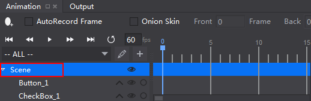
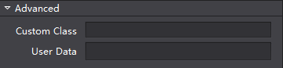
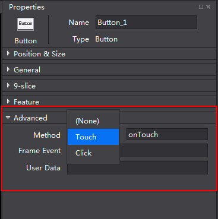

#Callback Feature#

The section is an introduction to callback functions in C++ and Lua.

### C++ ###

1   Click the root node as illustrated. 

   
  
2 In the Properties panel, choose Advanced -> CallBack Feature -> Custom Class, name the Custom class, for example, MyClass. 

   

3 Select the widget that needs to add callback feature, then select Properties -> Advanced -> Callback method, and name the method. For example: select Touch, and name it as onTouch. 

   

4 Create a customized class in C++. The class must conform the following requirements. 

- Inherit WidgetCallBackHandlerProtocol & Node (or other classes inherited from node ).

- Overwrite the following interfaces:

	  onLocateTouchCallback 

	  onLocateClickCallback 

	  onLocateEventCallback 

  Go back to the handlers of Touch, Click and Event (You can choose to edit the callback property that has been used). For example, 
 
        //.h file 
 
	#ifndef __TestCpp__MyClass__ 
	#define __TestCpp__MyClass__ 
	#include "cocos2d.h" 
	#include "cocostudio/CocoStudio.h" 
	#include "cocostudio/WidgetCallBackHandlerProtocol.h" 
	class MyClass : public cocos2d::Node, public cocostudio::WidgetCallBackHandlerProtocol 
	{ 
	public: 
		CREATE_FUNC(MyClass) 
		MyClass(); 
		virtual cocos2d::ui::Widget::ccWidgetTouchCallback 
		onLocateTouchCallback(const std::string &callBackName); 
		virtual cocos2d::ui::Widget::ccWidgetClickCallback 
		onLocateClickCallback(const std::string &callBackName); 
		virtual cocos2d::ui::Widget::ccWidgetEventCallback 
		onLocateEventCallback(const std::string &callBackName); 
		void onTouch(cocos2d::Ref* sender, cocos2d::ui::Widget::TouchEventType type); 
		void onClick(cocos2d::Ref* sender); 
		void onEvent(cocos2d::Ref* sender, int eventType); 
	 private: 
		std::vector<std::string> _touchTypes; 
		std::string _click; 
		std::vector<std::string> _eventTypes; 
	}; 
	//.cpp file 
	#include "MyClass.h" 
	#include "ui/UIText.h" 
	
	USING_NS_CC; 
	using namespace std; 
	using namespace cocos2d::ui; 
	
	MyClass::MyClass() 
	{} 
	
	Widget::ccWidgetTouchCallback MyClass::onLocateTouchCallback(const string &callBackName) 
	{ 
		if (callBackName == "onTouch")
		{ 
			return CC_CALLBACK_2(MyClass::onTouch, this); 
		} 
		return nullptr; 
	} 
	
	Widget::ccWidgetClickCallback MyClass::onLocateClickCallback(const string &callBackName) 
	{ 
		if (callBackName == "onClick") 
		{ 
			return CC_CALLBACK_1(MyClass::onClick, this); 
		} 
		return nullptr; 
	} 
	
	Widget::ccWidgetEventCallback MyClass::onLocateEventCallback(const string &callBackName) 
	{ 
		if (callBackName == "onEvent") 
		{ 
			return CC_CALLBACK_2(MyClass::onEvent, this); 
		} 
		return nullptr; 
	} 
	
	void MyClass::onTouch(cocos2d::Ref* object, cocos2d::ui::Widget::TouchEventType type) 
	{ 
		CCLOG("onTouch"); 
	} 
	
	void MyClass::onClick(cocos2d::Ref* sender) 
	{ 
		CCLOG("onClick"); 
	} 
	
	void MyClass::onEvent(cocos2d::Ref* sender, int eventType) 
	{ 
		CCLOG("onEvent"); 
	} 

- Create a factory class for the class created in step 3.

This class mush inherit cocostudio::NodeReader, and then overwrite the following three interfaces.

Getlnstance--- return to factory class example

Purge—delete factory class

createNodeWithFlatBuffers—create the class edited in step 4, and invoke setPropsWithFlatBuffers, as following, 

     purge
     createNodeWithFlatBuffers

For example, 
   
   //.h file 
   
	#ifndef __cocos2d_libs__MyClassReader__
	#define __cocos2d_libs__MyClassReader__

	#include "cocos2d.h"
	#include "cocostudio/CocosStudioExport.h"
	#include "cocostudio/WidgetReader/NodeReader/NodeReader.h"

	class MyClassReader : public cocostudio::NodeReader
	{       
	public:
		MyClassReader() {};
		~MyClassReader() {};   
		static MyClassReader* getInstance();
		static void purge();
		cocos2d::Node* createNodeWithFlatBuffers(const flatbuffers::Table* nodeOptions);
	};

	#endif /*defined(__cocos2d_libs__MyClassReader__) */ 

	//.cpp file
	#include "MyClassReader.h"
	#include "MyClass.h"

	USING_NS_CC;
	
    static MyClassReader* _instanceMyClassReader = nullptr;
	MyClassReader* MyClassReader::getInstance()
	{
		if (!_instanceMyClassReader)
		{
			_instanceMyClassReader = new MyClassReader();
		}
		return _instanceMyClassReader;
	}

	void MyClassReader::purge()
	{
		CC_SAFE_DELETE(_instanceMyClassReader);
	}

	Node* MyClassReader::createNodeWithFlatBuffers(const flatbuffers::Table *nodeOptions)
	{
		MyClass* node = MyClass::create();
		setPropsWithFlatBuffers(node, nodeOptions);
		return node;
	} 

5 Register this interface to CSLoader before using createNode.
  
	CSLoader* instance = CSLoader::getInstance();
	instance->registReaderObject("MyClassReader",(ObjectFactory::Instance)MyClassReader::getInstance);

6 Load your node.

Load your node with CreateNode. Because your custom class has been entrusted to the factory class, which will create your custom class in CreateNode and call `onLocateTouchCallback`，`onLocateClickCallback` and `onLocateEventCallback` to implement code correction and editor binding. 

### Lua ###

For Lua, see the tutorial **Binding Custom Class to Lua Runtime in cocos**.
