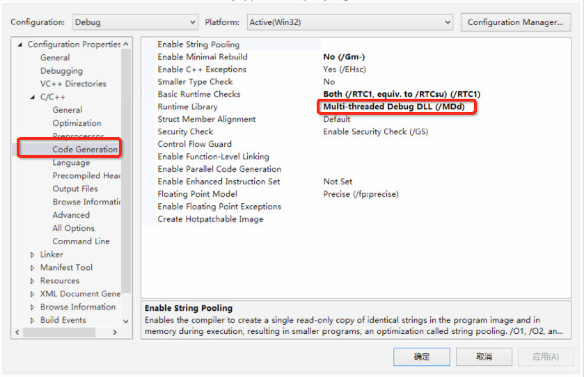

# Customize Cocos Precompiled Library

### Overview

The following section provides guidance on how to custom Cocos2d-x precompiled library for your games. 

### Version Requirement

Customizing cocos2d-x precompiled library requires Cocos v3.10 or higher. This document is used for version v3.10 or higher.

The directories below are based on v3.10 and the installation of Cocos v3.10. 

### How to customize Cocos2d-x precompiled library

Customizing cocos2d-x precompiled library is actually modifying its source codes. After the installation of Cocos 3.10, you can customize the cocos2d-x with IDE or code editors. 

* On Mac, you can open projects `/Applications/Cocos/Cocos2d-x/cocos2d-x-v3.10/build/cocos2d_libs.xcodeproj` with XCode. Then you need to modify and debug codes. 
* On Windows, you can open projects ` [installation directory]/Cocos/cocos2d-x-v3.10/build/cocos2d-win32.sln` with Visual Studio. Then you need to modify and debug codes.

### How to publish the custom Cocos2d-x

#### Build a new precompiled library

There is a scripting tool in Cocos2d-x-3.10 to compile source codes to precompiled library: `cocos gen-libs`. 

The following is a detailed description of how to use this scripting tool: 

```
usage: cocos gen-libs [-h] [-c] [-e ENGINE_PATH] [-p {ios,mac,android,win32}]
                      [-m {debug,release}] [--dis-strip] [--vs VS_VERSION]
                      [--app-abi APP_ABI]

Generate prebuilt libs of engine. The libs will be placed in 'prebuilt' folder
of the engine root path.

optional arguments:
  -h, --help            show this help message and exit
  -c                    Remove the 'prebuilt' folder at first.
  -e ENGINE_PATH        Specify the engine path. Default is the engine root
                        path of current tools.
  -p {ios,mac,android,win32}
                        Specify the target platform. Can specify multi
                        platform by using '-p' multi times. Default generate
                        all available platforms.
  -m {debug,release}, --mode {debug,release}
                        Generate cocos libs for debug or release. Default is
                        release.
  --dis-strip           Disable the strip of the generated libs.

Windows Options:
  --vs VS_VERSION       Specify the Visual Studio version, such as 2013.
                        Default find available version automatically.

Android Options:
  --app-abi APP_ABI     Set the APP_ABI of ndk-build. Can be multi value
                        separated with ':'. Sample : --app-aib
                        armeabi:x86:mips. Default value is 'armeabi'.

```

For example: 

1. `cocos gen-libs -c` : Clear previous precompiled library and compile all platforms.
2. `cocos gen-libs -p win32 --vs 2013` : Compile Win32 platform with Visual Studio 2013.

Precompiled library will be created in the following directory `Cocos2d-x/cocos2d-x-v3.10/prebuilt`. Include the new precompiled library to game projects.  

**Note** 

* To customize Cocos2d-x precompiled library, you need to modify source codes and maintain project files. Any problem in the custom codes or projects will lead to a failure in implementing compiling tools.
* When you're genrating prebuilt libs with `-m debug`, you should modify the Visual Studio configuration of your game project like this:  
Change the value of `C/C++ -> Code Generation -> Runtime Library` from `/MD` to `/MDd`. Take a look at the image:

