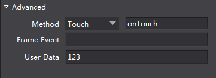

# Create Custom Data #

Select Button-> Properties -> Advanced -> User Data. For example, type 123, as the following picture shows. 

      
### C++ ###
   
**The previous version cocos2d-x 3.8:**

	    #include "cocostudio/CCObjectExtensionData.h"
        .....
        auto button = _rootNode->getChildByTag("XXX");

        auto userdata = ((cocostudio::ObjectExtensionData*)(rootNode->getUserObject()))->getCustomProperty();
		CCLOG("%s", userdata.c_str());	

**cocos2d-x 3.8 and later version:**
    
	    #include "cocostudio/CCComExtensionData.h"
        .....
        auto button = _rootNode->getChildByTag("XXX");

        ComExtensionData* data = dynamic_cast<ComExtensionData*>(child->getComponent("ComExtensionData"));
        auto userdata = data->getCustomProperty();
        CCLOG("%s", userdata.c_str());

### JS ###
   
        var button = mainscene.node.getChildByTag(XXXXX);
        var userdata = button.getUserData();
		cc.log(userdata);	

### Lua ###

Currently not supported. 		

