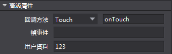

# **設置自訂數據** #

1，先在編輯器Button控制項高級屬性，使用者資料填寫資料：比如123，如下圖：

      
C++：
   
**cocos2d-x 3.8之前的版本：**

        //包含標頭檔
        #include "cocostudio/CCObjectExtensionData.h"
        .....
        //根據控制項的Tag獲取button控制項
        auto button = _rootNode->getChildByTag("XXX");
        //在代碼裡面先獲取到button，然後調用getUserObject()，並把獲取的物件強轉為cocostudio::ObjectExtensionData* 指標，再調用getCustomProperty()
        auto userdata = ((cocostudio::ObjectExtensionData*)(rootNode->getUserObject()))->getCustomProperty();
        CCLOG("%s", userdata.c_str());    

**cocos2d-x 3.8及其以后的版本:**

		//包含標頭檔
	    #include "cocostudio/CCComExtensionData.h"
        .....
		//根據控制項的Tag獲取button控制項
        auto button = _rootNode->getChildByTag("XXX");
        //在代碼裡面先獲取到button，getComponent()，並把獲取的物件強轉為cocostudio::ComExtensionData* 指標，再調用getCustomProperty()
        ComExtensionData* data = dynamic_cast<ComExtensionData*>(child->getComponent("ComExtensionData"));
        auto userdata = data->getCustomProperty();
        CCLOG("%s", userdata.c_str());

JS：
   
        //根據控制項的Tag獲取button控制項
        var button = mainscene.node.getChildByTag(XXXXX);
        //獲取userData
        var userdata = button.getUserData();
        cc.log(userdata);    

Lua(目前暫不支持)：
        
