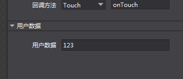

# **设置自定义数据** #

1，先在编辑器Button控件高级属性，用户数据填写数据：比如123，如下图：

      
C++：
   
**cocos2d-x 3.8之前的版本：**

        //包含头文件
	    #include "cocostudio/CCObjectExtensionData.h"
        .....
		//根据控件的Tag获取button控件
        auto button = _rootNode->getChildByTag("XXX");
        //在代码里面先获取到button，然后调用getUserObject()，并把获取的对象强转为cocostudio::ObjectExtensionData* 指针，再调用getCustomProperty()
        auto userdata = ((cocostudio::ObjectExtensionData*)(rootNode->getUserObject()))->getCustomProperty();
        CCLOG("%s", userdata.c_str());	

**cocos2d-x 3.8及其以后的版本:**

        //包含头文件
	    #include "cocostudio/CCComExtensionData.h"
        .....
		//根据控件的Tag获取button控件
        auto button = _rootNode->getChildByTag("XXX");
        //在代码里面先获取到button，getComponent()，并把获取的对象强转为cocostudio::ComExtensionData* 指针，再调用getCustomProperty()
        ComExtensionData* data = dynamic_cast<ComExtensionData*>(child->getComponent("ComExtensionData"));
        auto userdata = data->getCustomProperty();
        CCLOG("%s", userdata.c_str());

JS：
		//根据控件的Tag获取button控件
        var button = mainscene.node.getChildByTag(XXXXX);
        //获取userData
        var userdata = button.getUserData();
		cc.log(userdata);	

Lua(目前暂不支持)：
		

