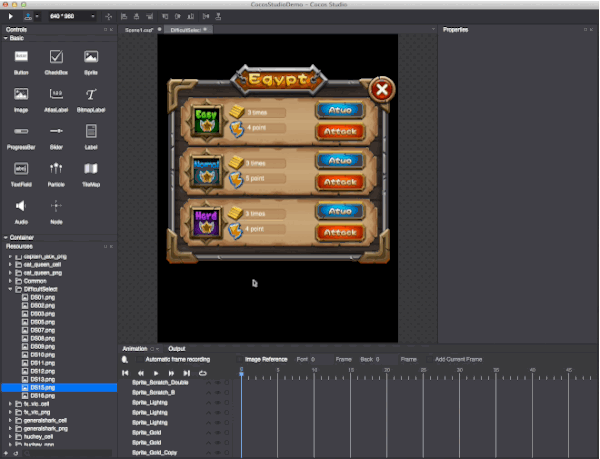
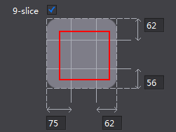
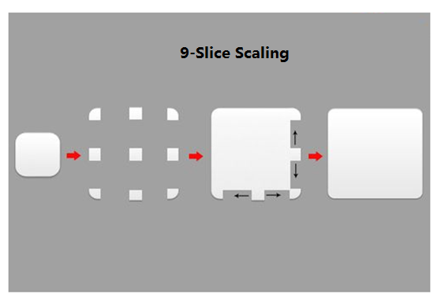

#9-Slice

9-slice can be used to reduce projects' size. Among official examples, 9-slice is used frequently. 
 
 

The yellow background is created by a picture of 482 byte size.

 
 
**How to use 9-Slice Scaling** 

1. In the Properties panel, select 9-slice checkbox (9-slice scaling cannot be applied to some widgets). 

2. By default the 9-slice. You can also set 9-slice based on the widgets' size. For example, 10 pixels to the left means that contents within 10 pixels from the left side will not be distorted when scaling. 

**Do one of the following to set 9-slice preferences**

- Type a number in the box;

- Click on the value box, and then use the mouse wheel's scroll to change the value; 
	
- Drag the four guides within 9-slice to change the value. 

     
 
- Modify the widget's size as needed. 

**How 9-Slice scaling works**

9-Slice scaling can keep a picture from distorting even though it is resized. When scaling, the slices in the center row will scale vertically, the slices in the middle column scale horizontally, the center slice scales horizontally and vertically, the four corner regions consistent with the original shape. 

 

In Cocos Studio, you can specify the 9-slice margins to make sure some sections will not be distorted. 9-slice scaling is available by enabling it when you use a widget supporting 9-slice function. 
