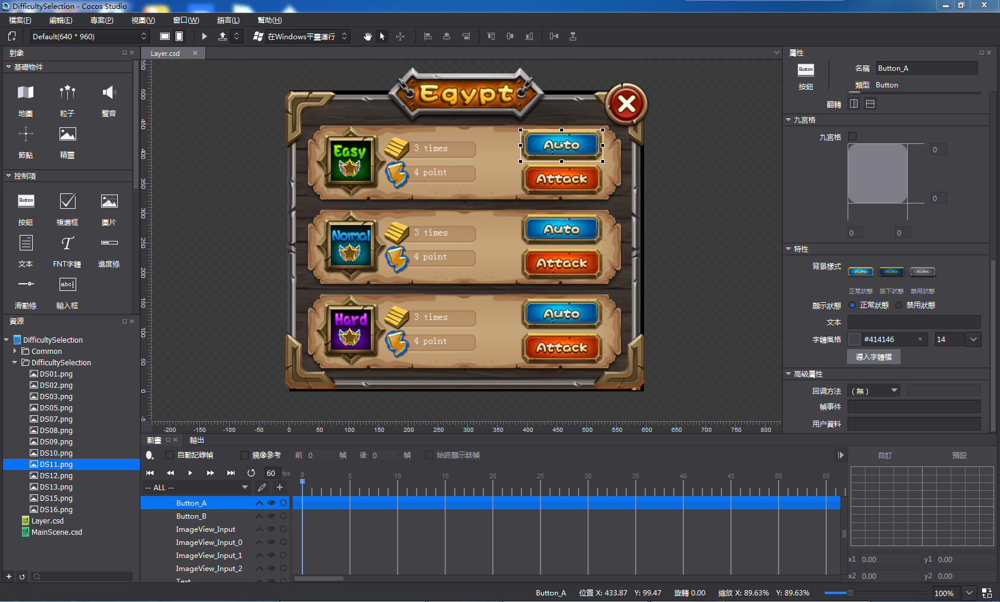
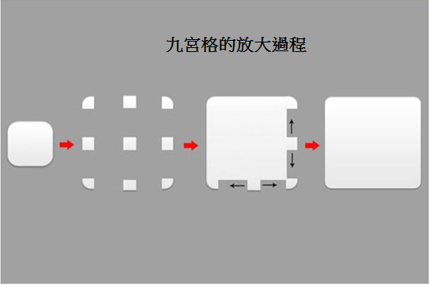

#九宮格使用

&emsp;&emsp;使用九宮格能夠幫助您節約大量資源空間，在官方示例中，很多地方使用了九宮格，如下面這張難度選擇介面：
 
 

&emsp;&emsp;其深黃色背景就是使用一張僅有482位元組大小的圖片製作而成，製作方式如下：

 
 
九宮格用法

(1) 在屬性面板勾選開啟使用九宮格功能（部分控制項不具備該屬性）

(2) 編輯器默認將九宮格的數值設置為資源的1/3，您也可以根據資源的尺寸屬性，設置九宮格數值（如距左10圖元，就是指控件從最左側開始10圖元內的圖像不失真，若同時設置上下左右均為10圖元，則不失真圖像呈“回”字形）。

#####設置九宮格的方法有三種：

①直接在輸入框內輸入數值

②在輸入框中通過滑鼠滾輪滾動改變
    
③通過拖拽九宮格內部的四條線改變

 
 
(3) 修改控制項尺寸至您需要的大小即可。

#####九宮格原理

&emsp;&emsp;九宮格是一種能夠使本來拉伸後會變形的圖片，經過一定的處理後，拉伸後不變形的技術。
九宮格放大時四個角的四個切片向四個方向延伸，到達新的位置，然後上下兩邊的切片水準拉伸，左右兩側的切片垂直拉伸，中間的點陣圖放大鋪滿剩餘區域。
 
 

&emsp;&emsp;在Cocos Studio中可以定義需要確保不失真的上下左右邊距，將剩餘部分拉伸。需要注意的是，只有當用戶選擇包含九宮格功能的控制項，並啟用九宮格時資源圖片才能實現九宮格效果。
