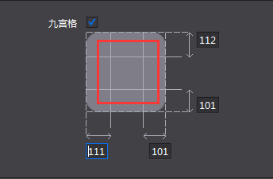
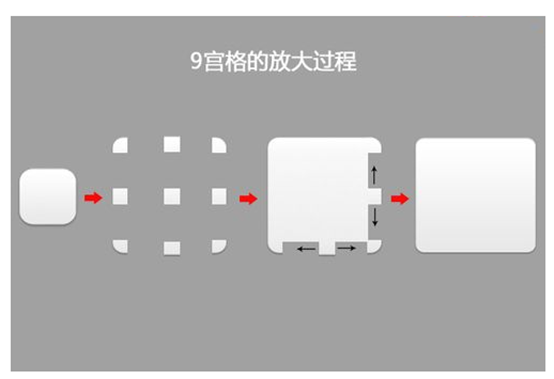

#九宫格使用

&emsp;&emsp;使用九宫格能够帮助您节约大量资源空间，在官方示例中，很多地方使用了九宫格，如下面这张难度选择界面：
 
 

&emsp;&emsp;其深黄色背景就是使用一张仅有482字节大小的图片制作而成，制作方式如下：

 
 
九宫格用法

(1) 在属性面板勾选开启使用九宫格功能（部分控件不具备该属性）

(2) 编辑器默认将九宫格的数值设置为资源的1/3，您也可以根据资源的尺寸属性，设置九宫格数值（如距左10像素，就是指控件从最左侧开始10像素内的图像不失真，若同时设置上下左右均为10像素，则不失真图像呈“回”字形）。

#####设置九宫格的方法有三种：

①直接在输入框内输入数值

②在输入框中通过鼠标滚轮滚动改变
	
③通过拖拽九宫格内部的四条线改变

 
 
(3) 修改控件尺寸至您需要的大小即可。

#####九宫格原理

&emsp;&emsp;九宫格是一种能够使本来拉伸后会变形的图片，经过一定的处理后，拉伸后不变形的技术。
九宫格放大时四个角的四个切片向四个方向延伸，到达新的位置，然后上下两边的切片水平拉伸，左右两侧的切片垂直拉伸，中间的位图放大铺满剩余区域。
 
 

&emsp;&emsp;在Cocos Studio中可以定义需要确保不失真的上下左右边距，将剩余部分拉伸。需要注意的是，只有当用户选择包含九宫格功能的控件，并启用九宫格时资源图片才能实现九宫格效果。

