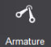
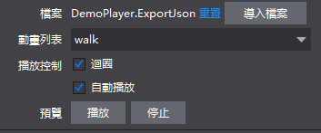

#自訂控制項

 
 
&emsp;&emsp;Armature控制項可支援導入1.x版本的Cocos Studio動畫編輯器所製作的動畫控制項。 您可以使用Armature控制項實現在Cocos Studio v2.x中添加動畫內容的功能，並控制當前的動畫清單以及播放狀態。並在編輯器中預覽動畫。

使用場景：

 
 
&emsp;&emsp;場景1：導入並使用1.x版本的動畫匯出檔。

&emsp;&emsp;您可以為Armature控制項導入製作好的動畫匯出檔(ExportJson檔)：

&emsp;&emsp;.    從資源面板拖動檔至Armature控制項的檔案屬性，鬆開滑鼠即實現檔導入；

&emsp;&emsp;.    在屬性面板的“特性”中，點擊“導入檔”按鈕，選擇檔導入；

&emsp;&emsp;.    在畫布中選中Armature控制項右鍵選擇“設置Armature檔”，選擇檔導入。
 
 

&emsp;&emsp;場景2：控制動畫的播放狀態：

&emsp;&emsp;您可以為Armature控制項設置當前的動畫清單，可以指定Armature控制項迴圈播放動畫或指定Armature控制項是否在創建遊戲時自動播放。
