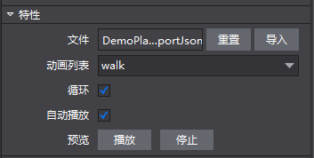

#自定义控件

 
 
&emsp;&emsp;Armature控件可支持导入1.x版本的Cocos Studio动画编辑器所制作的动画控件。 您可以使用Armature控件实现在Cocos Studio v2.x中添加动画内容的功能，并控制当前的动画列表以及播放状态。并在编辑器中预览动画。

使用场景：

 
 
&emsp;&emsp;场景1：导入并使用1.x版本的动画导出文件。

&emsp;&emsp;您可以为Armature控件导入制作好的动画导出文件(ExportJson文件)：

&emsp;&emsp;.	从资源面板拖动文件至Armature控件的文件属性，松开鼠标即实现文件导入；

&emsp;&emsp;.	在属性面板的“特性”中，点击“导入文件”按钮，选择文件导入；

&emsp;&emsp;.	在画布中选中Armature控件右键选择“设置Armature文件”，选择文件导入。
 
 

&emsp;&emsp;场景2：控制动画的播放状态：

&emsp;&emsp;您可以为Armature控件设置当前的动画列表，可以指定Armature控件循环播放动画或指定Armature控件是否在创建游戏时自动播放。

