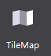
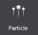
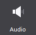
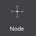

#Basic Objects

###1 Map
 

Map widget supports importing TMX format files exported from Tiled. Maps and topographic maps are widely used in games, in order to make a smooth switch the game screen players often use maps that bigger than the screen. 

If we use image, it will be a big hit to performance. Map is a good solution to this problem: the use of tile map. A large background image is represented by several small image, each corresponding to a small picture, namely tiles, mosaic tiles put these together, they form a complete map. When a number of different terrain for scene change, just load the tiles, greatly enhance efficiency.

In the official example, there are battle scenes. We use Map as a background to save resources and enhance efficiency.  

**Scenario: Import and use the map file**

To import a specific effect of map control file (TMX files), do one of the following: 

- Drag a TMX file from the resource panel to Map, and then release the mouse;

- In the Properties panel **Feature**, click **Import Map File**, select the file to import;

- Right-click the Map on Canvas, select **Set Map File**.  select the file to import.
    
###2 Particle

Particles are widgets with random effects. They are used to achieve a particular phenomenon: such as explosions, fireworks, water and other effects. For games, artists create cool particle effects to make the scene richer.

Particle widget supports importing `plist` format files exported from Particle Designer. 

In order to have a nice effect, the game will use a lot of particle effects. In an official example, particle effects are used to highlight gold and diamonds.  
 

**Scenario: Import and use particle**

To import a specific effect of particle files (plist file), do the following: 

- Drag the file from the Resources panel to particle properties;

- In the Properties panel **Feature**, click **Import particles file**, select the file to import;

- Select the right choice particle controls on the canvas **Setting particle File** and select the file to import.

###3 Audio

 
Audio is a widget for music and sound effects, which is very important for user experience of games. Audio widget supports mp3, wav audio file formats.

In the official example of a victory scene, we apply Audio for victory sound effects. 

 

**Scenario 1: Import File**

To import a specific effect of a sound file (mp3 / wav file), do the following: 

- Drag the file from the Resources panel to voice control, release the mouse that implementation file import;

- In the Properties panel **Feature**, click **Import sound files**, select the file to import;

- Select the right choice particle controls on the canvas **Setting sound file** and select the file to import.

**Scenario 2: Make sound loop**

 This icon means that the sound file will loop. 

 This icon means the sound file play once.
 
###4 Node 

Node is the basic element of the scene graph, during game production, often need to create parent node to group other widgets. Node has three main features: the object can contain other nodes; You can set up a scheduled callback; can perform action.

In both 2D and 3D examples, we use many Nodes to manage the linkage effect between multiple widgets. 
 
###5 Sprite

To add a Sprite, you need to import pictures resources. Compared with Image widgets , the Sprite has the following features:

- Sprite does not have 9-slice's properties, but it has higher performance. It is often used to load images in games. 

- Sprites are used to create spritesheet animation in Cocos Studio. 

Sprite is used very frequently. Can you point out which are made with sprite in the following example?
 

After you get the official examples, open the file to see how we use Sprite in `DifficultSelect.csd`. It will be helpful for your games. 

**Scenario 1: When to use the sprite widget?** 

In the above picture, all window borders are created with Sprite. We choose Sprite for two reasons:

1. Reduce game resources. 

2. Reuse resources. Border stitching on the map, we only use the following resources.

 
After adding a sprite to the canvas, select the sprite, and the property panel will show the current resource thumbnail. You can modify the resources by double-clicking a thumbnail picture, or drag pictures onto this property. You can also replace image resources through the properties panel or right-click menu.

