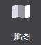
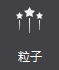
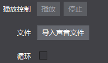
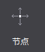
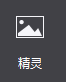

#基础对象：
###1.地图控件：
 

&emsp;&emsp;地图控件可支持导入Tiled地图编辑器导出的tmx格式文件，地图是制作游戏关卡地形图的控件，对于即时战略类型游戏的制作，为了使玩家流畅的切换游戏画面，经常会使用超过屏幕尺寸的地图。如果选择使用不用的背景图片切换场景，不仅造成资源浪费，加载速度也会变的很慢。

&emsp;&emsp;地图控件很好的解决了这一问题：采用瓦片地图的形式。一张大的背景图由几种地形表示，每种地形对应一张小图片，即瓦片，把这些瓦片拼接起来，就组成了一个完成的地图。对一些不同地形的场景切换时，只需加载瓦片，大大提升效率。

&emsp;&emsp;使用场景

&emsp;&emsp;在官方示例的战斗场景中，我们使用了地图控件作为背景，即节约了资源，又提升了效率：

 
&emsp;&emsp;场景1：导入并使用地图文件。

&emsp;&emsp;您可以为地图控件导入特定效果的文件(TMX文件)：

&emsp;&emsp;从资源面板拖动tmx文件至地图控件 特性-〉文件，松开鼠标即实现文件导入；

&emsp;&emsp;在属性面板的“特性”中，点击“导入地图文件”按钮，选择文件导入；

&emsp;&emsp;在画布中选中地图控件右键选择“设置地图文件”，选择文件导入。
    
###2.粒子

&emsp;&emsp;粒子是带有随机性特效的控件，是计算机图形学中模拟特定现象的技术实现：如爆炸,烟花,水流等效果。在游戏制作时，粒子可以制造酷炫的效果，使场景表现更丰富。

&emsp;&emsp;粒子控件可支持导入Particle Designer导出的plist文件。

&emsp;&emsp;使用场景。

&emsp;&emsp;为了增加显示效果，游戏中很多细节都会使用粒子效果，在官方示例中，我们就在显示金币和钻石的位置，使用了粒子效果，以突出它们：
 

&emsp;&emsp;场景1：导入并使用粒子。

&emsp;&emsp;您可以为粒子导入特定效果的文件(plist文件)：

&emsp;&emsp;(1) 从资源面板拖动文件至粒子控件 特性-〉文件，松开鼠标即实现文件导入； 

&emsp;&emsp;(2) 在属性面板的“特性”中，点击“导入粒子文件”按钮，选择文件导入；

&emsp;&emsp;(3) 在画布中选中粒子控件右键选择“设置粒子文件”，选择文件导入。

###3.声音

 
&emsp;&emsp;声音是控制音乐与音效的控件。在游戏制作时，声音对表现效果有至关重要的作用。Cocos Studio声音控件支持mp3,wav两种格式的音效文件。

使用场景：

&emsp;&emsp;在官方示例的胜利界面中，我们使用了声音控件来作为胜利的音效，您可以获取官方示例进行查看
 

&emsp;&emsp;场景1：导入文件

&emsp;&emsp;您可以为声音导入特定效果的文件(mp3/wav文件)：

&emsp;&emsp;.	从资源面板拖动文件至声音控件 特性-〉文件，松开鼠标即实现文件导入；

&emsp;&emsp;.	在属性面板的“特性”中，点击“导入声音文件”按钮，选择文件导入；

&emsp;&emsp;.	在画布中选中粒子控件右键选择“设置声音文件”，选择文件导入。

&emsp;&emsp;场景2：能否让音效循环播放。

&emsp;&emsp;勾选特性-循环播放“支持”项时，在实际游戏项目中声音文件将会循环播放，未勾选时，声音文件只播放一遍即停止。

 
###4.节点

&emsp;&emsp;节点是场景图的基本元素，在游戏制作时，经常需要用节点标记或创建父子关系。节点有三个主要特点：可以包含其他节点对象；可以执行一些操作。

&emsp;&emsp;使用场景：

&emsp;&emsp;在2D，3D制作中，我们大量应用了节点控件用于管理多个控件间的联动效果。

 
###5.精灵

 
&emsp;&emsp;添加一张精灵控件，可导入图片资源。精灵控件和图片控件比，具有以下特性：

&emsp;&emsp;.不具备九宫格属性，但其性能开销低，经常被用来设置游戏中大部分图片资源。

&emsp;&emsp;.在Cocos Studio中精灵也常被用来做序列帧动画。

&emsp;&emsp;使用场景：

&emsp;&emsp;精灵控件使用十分频繁，我们给出一张官方示例中的界面图，您能想到哪些是由精灵控件组成的么？
 

&emsp;&emsp;您可以获取官方示例后，打开DifficultSelect.csd文件查看我们是如何使用精灵控件的，也许会对您的项目有所启发。

&emsp;&emsp;场景1：何时使用精灵控件？

&emsp;&emsp;上图中，窗口的边框都是由精灵控件组成的，为什么要这样做？有以下两个原因：1．节约资源浪费，减少资源大小。2．从复用做起，游戏中不同大小的窗口，均可使用同一套资源拼接。 拼接上图的边框，我们只使用了如下资源：

 
&emsp;&emsp;在画布上添加一个图片后，选择该图片控件，在属性面板的特性部分会展示控件当前的图片资源缩略图，您可以通过双击缩略图修改控件的图片资源，也可以将图片资源拖动到当前的样式资源上以替换为新的资源。 除此之外也能通过图片控件的右键菜单添加新的资源。

