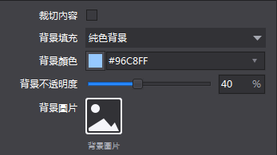
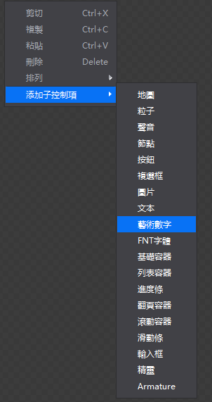
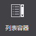
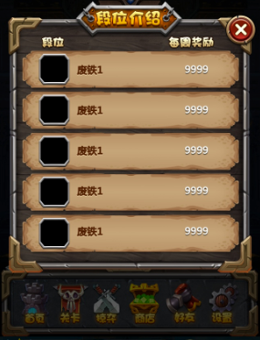
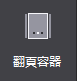
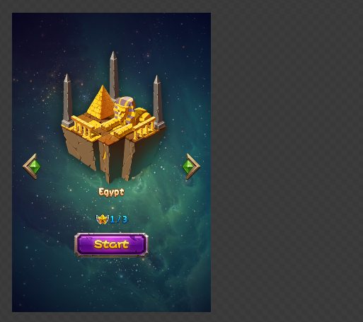
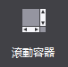
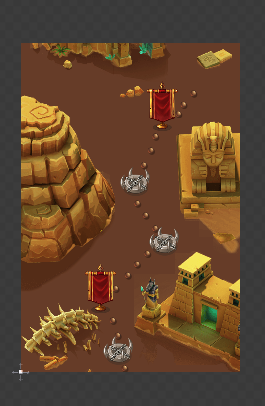
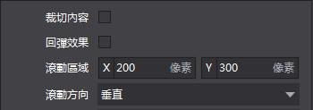

#容器:

###1.基礎容器

 
&emsp;&emsp;基礎容器可以設置子容器佈局,是否裁切子元素,填充顏色,背景圖片資源等屬性。

&emsp;&emsp;使用場景。

&emsp;&emsp;在官方示例中，大量使用了基礎容器作佈局管理，如下面的主介面中，用戶名稱，鑽石和金幣就使用了基礎容器，以保證相對佈局的統一：

 
場景1：如果不顯示容器外的內容。

&emsp;&emsp;當容器上的控制項有超出容器的部分時，可以通過屬性“裁切內容”使超出部分將被隱藏，不予顯示。

&emsp;&emsp;場景2：設置容器的背景填充和填充效果。

&emsp;&emsp;您可以為基礎容器填充兩種類型的背景色：純色背景,漸變背景。您可以選擇單色並設置背景的不透明度；當您選擇漸變背景時，需要設置起始顏色和結束顏色，並且可以為這兩個顏色分別設置不透明度。

 
&emsp;&emsp;場景3：快速添加子控制項。

&emsp;&emsp;在畫布中選中控制項後右鍵，您可以添加所有類型控制項作為他的子控制項。

  
###2.列表容器

 
&emsp;&emsp;清單容器是一個能夠自動排列控制項的容器。

&emsp;&emsp;注意：當一個控制項被添加到清單容器後，它的座標將無法修改。

&emsp;&emsp;使用場景。

&emsp;&emsp;列表容器常被用於遊戲中關卡列表等具有列表效果的場景中。

 
&emsp;&emsp;場景1：如果不顯示容器外的內容。

&emsp;&emsp;當容器上的控制項有超出容器的部分時，可以通過屬性“裁切內容”使超出部分將被隱藏，不予顯示。

&emsp;&emsp;場景2：自訂清單容器顯示方式。

&emsp;&emsp;列表容器實現列表效果只需要為清單容器添加子控制項，通過設置清單滾動方向,子控制項對齊方式,子控制項間隔等屬性可以決定清單容器對子控制項佈局的影響從而實現橫向或縱向滾動的列表。

###3.翻頁容器

 
&emsp;&emsp;翻頁容器是一個具有翻頁效果的容器，只能添加基礎容器。

&emsp;&emsp;使用場景。

&emsp;&emsp;翻頁容器常被用於遊戲中背包等具有翻頁效果的場景中，在官方示例中，我們就在選擇關卡介面，應用了翻頁容器，來切換不同的關卡。
 

&emsp;&emsp;場景1：如果不顯示容器外的內容。

&emsp;&emsp;當容器上的控制項有超出容器的部分時，可以通過屬性“裁切內容”使超出部分將被隱藏，不予顯示。如上圖，我們勾選屬性後，效果如下：

&emsp;&emsp;場景2：如何添加翻頁效果。

&emsp;&emsp;翻頁容器實現翻頁效果實際上是為其添加基礎容器子控制項，然後在子控制項中設置內容，最後在實際運行中，翻頁容器會自動將自己與子控制項統一使用。要添加子控制項，你在畫布中選中控制項後右鍵進行添加，或者手動將基礎容器作為翻頁容器的子控制項，值得注意的是您只能添加基礎容器作為他的子控制項。

&emsp;&emsp;當一個控制項被添加到滾動容器後，它的座標,縮放,旋轉,錨點,尺寸都會恢復預設並無法修改，也無法修改這個控制項的佈局方式。
 
###4.滾動容器

 
&emsp;&emsp;滾動容器可以實現觸屏上的滾動效果，能夠設置滾動區域,滾動方向等屬性。

&emsp;&emsp;使用場景。

&emsp;&emsp;在官方示例中，我們特意在任務選擇介面（MissionSelect.csd）中，設置了滾動層容易，用來表示關卡的地圖背景。我們將關卡背景設置為3個螢幕高度大小，實際運行中，使用者可以上下滑動螢幕來查看整張地圖。

 
&emsp;&emsp;場景1：如果不顯示容器外的內容。

&emsp;&emsp;當容器上的控制項有超出容器的部分時，可以通過屬性“裁切內容”使超出部分將被隱藏，不予顯示。如上圖，我們勾選屬性後，效果如下：

 
&emsp;&emsp;場景2：如何設置滾動容器的可滾動尺寸。

 
&emsp;&emsp;在使用滾動容器時A為滾動容器的尺寸，當設置滾動容器為裁切時，A以外的區域即B區域將不予顯示，但B區域的內容可以通過滾動到A區域展示出來，內容尺寸是指所有通過滾動展示的內容，即B與A的範圍，圖中的文本有一部分在滾動內容外這部分即使通過滾動也無法展示。滾動內容尺寸不能比容器尺寸小。

&emsp;&emsp;您可以在這裡選擇需要的容器滾動方向：水準,垂直,水準與垂直。

 
&emsp;&emsp;場景3：如何設置回彈效果。

&emsp;&emsp;當滾動容器滑至螢幕邊界時，繼續滑動，介面會有一個反彈效果。為達到這一效果，您只需要勾選滾動容器控制項的屬性“回彈效果”，系統就會為您在遊戲中實現這個效果。

