#容器:

###1.基础容器

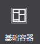
 
&emsp;&emsp;基础容器可以设置子容器布局,是否裁切子元素,填充颜色,背景图片资源等属性。

&emsp;&emsp;使用场景。

&emsp;&emsp;在官方示例中，大量使用了基础容器作布局管理，如下面的主界面中，用户名称，钻石和金币就使用了基础容器，以保证相对布局的统一：

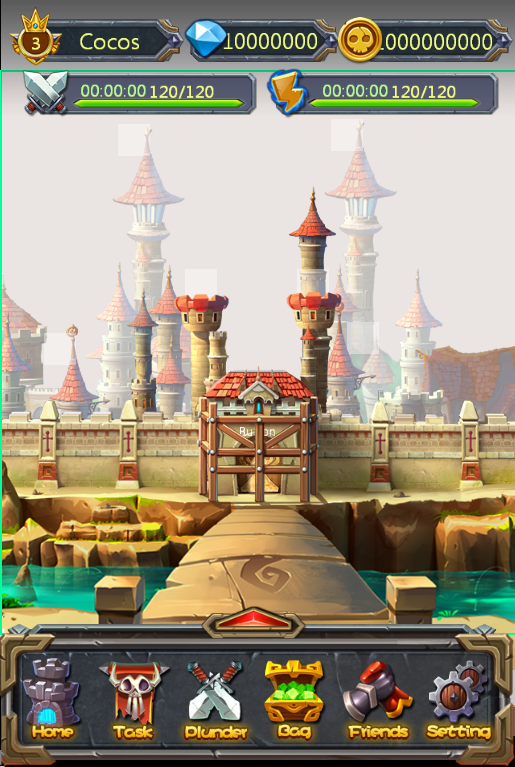
 
场景1：如果不显示容器外的内容。

&emsp;&emsp;当容器上的控件有超出容器的部分时，可以通过属性“裁切内容”使超出部分将被隐藏，不予显示。

&emsp;&emsp;场景2：设置容器的背景填充和填充效果。

&emsp;&emsp;您可以为基础容器填充两种类型的背景色：纯色背景,渐变背景。您可以选择单色并设置背景的不透明度；当您选择渐变背景时，需要设置起始颜色和结束颜色，并且可以为这两个颜色分别设置不透明度。

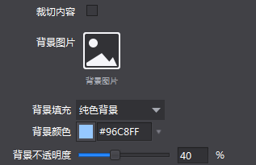
 
&emsp;&emsp;场景3：快速添加子控件。

&emsp;&emsp;在画布中选中控件后右键，您可以添加所有类型控件作为他的子控件。

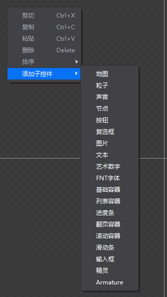
  
###2.列表容器

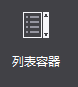
 
&emsp;&emsp;列表容器是一个能够自动排列控件的容器。

&emsp;&emsp;注意：当一个控件被添加到列表容器后，它的坐标将无法修改。

&emsp;&emsp;使用场景。

&emsp;&emsp;列表容器常被用于游戏中关卡列表等具有列表效果的场景中。

 
&emsp;&emsp;场景1：如果不显示容器外的内容。

&emsp;&emsp;当容器上的控件有超出容器的部分时，可以通过属性“裁切内容”使超出部分将被隐藏，不予显示。

&emsp;&emsp;场景2：自定义列表容器显示方式。

&emsp;&emsp;列表容器实现列表效果只需要为列表容器添加子控件，通过设置列表滚动方向,子控件对齐方式,子控件间隔等属性可以决定列表容器对子控件布局的影响从而实现横向或纵向滚动的列表。

###3.翻页容器

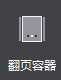
 
&emsp;&emsp;翻页容器是一个具有翻页效果的容器，只能添加基础容器。

&emsp;&emsp;使用场景。

&emsp;&emsp;翻页容器常被用于游戏中背包等具有翻页效果的场景中，在官方示例中，我们就在选择关卡界面，应用了翻页容器，来切换不同的关卡。
 
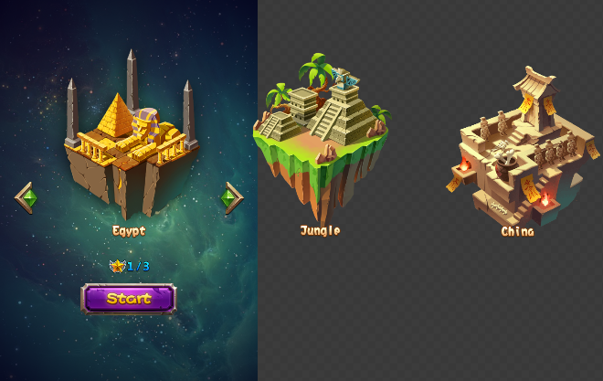

&emsp;&emsp;场景1：如果不显示容器外的内容。

&emsp;&emsp;当容器上的控件有超出容器的部分时，可以通过属性“裁切内容”使超出部分将被隐藏，不予显示。如上图，我们勾选属性后，效果如下：

&emsp;&emsp;场景2：如何添加翻页效果。

&emsp;&emsp;翻页容器实现翻页效果实际上是为其添加基础容器子控件，然后在子控件中设置内容，最后在实际运行中，翻页容器会自动将自己与子控件统一使用。要添加子控件，你在画布中选中控件后右键进行添加，或者手动将基础容器作为翻页容器的子控件，值得注意的是您只能添加基础容器作为他的子控件。

&emsp;&emsp;当一个控件被添加到滚动容器后，它的坐标,缩放,旋转,锚点,尺寸都会恢复默认并无法修改，也无法修改这个控件的布局方式。
 
###4.滚动容器

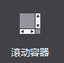
 
&emsp;&emsp;滚动容器可以实现触屏上的滚动效果，能够设置滚动区域,滚动方向等属性。

&emsp;&emsp;使用场景。

&emsp;&emsp;在官方示例中，我们特意在任务选择界面（MissionSelect.csd）中，设置了滚动层容易，用来表示关卡的地图背景。我们将关卡背景设置为3个屏幕高度大小，实际运行中，用户可以上下滑动屏幕来查看整张地图。

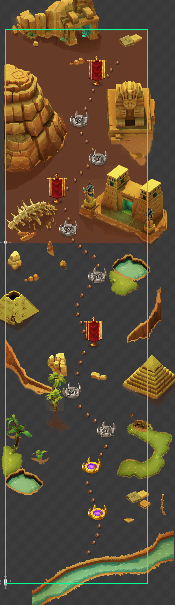
 
&emsp;&emsp;场景1：如果不显示容器外的内容。

&emsp;&emsp;当容器上的控件有超出容器的部分时，可以通过属性“裁切内容”使超出部分将被隐藏，不予显示。如上图，我们勾选属性后，效果如下：

 
&emsp;&emsp;场景2：如何设置滚动容器的可滚动尺寸。

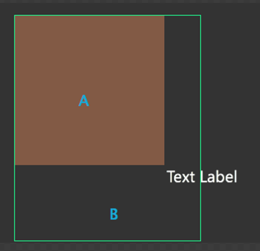
 
&emsp;&emsp;在使用滚动容器时A为滚动容器的尺寸，当设置滚动容器为裁切时，A以外的区域即B区域将不予显示，但B区域的内容可以通过滚动到A区域展示出来，内容尺寸是指所有通过滚动展示的内容，即B与A的范围，图中的文本有一部分在滚动内容外这部分即使通过滚动也无法展示。滚动内容尺寸不能比容器尺寸小。

&emsp;&emsp;您可以在这里选择需要的容器滚动方向：水平,垂直,水平与垂直。

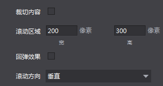
 
&emsp;&emsp;场景3：如何设置回弹效果。

&emsp;&emsp;当滚动容器滑至屏幕边界时，继续滑动，界面会有一个反弹效果。为达到这一效果，您只需要勾选滚动容器控件的属性“回弹效果”，系统就会为您在游戏中实现这个效果。

