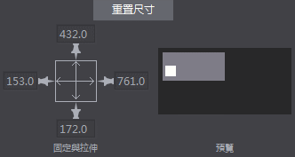
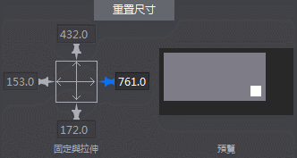
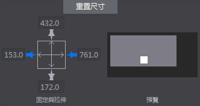
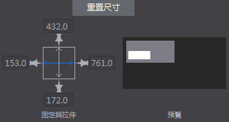
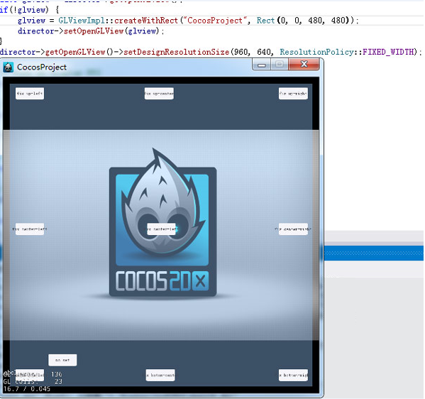
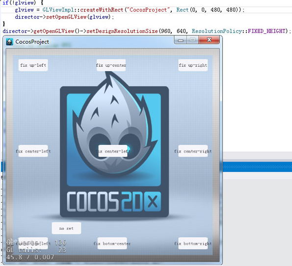

#UI佈局與多解析度適配

#####一,Cocos編輯器

自動佈局系統主要涉及固定與拉伸屬性：
 
 

&emsp;&emsp;如圖，總共可以修改控制項的上下左右四個圖釘和中間的兩個拉伸條六個屬性。

#####效果

&emsp;&emsp;1.當打開其中的任意一個圖釘時，當前節點與父節點的對應邊的距離即被固定。當父節點的大小修改時，當前節點與父節點對應邊的距離總是不變。

 
 
&emsp;&emsp;2.當打開其中的任意兩個相對的圖釘時，當前節點與父節點對應的兩邊的距離成固定比例。即當修改父節點的大小時，當前節點到父節點對應兩條邊的距離之比總是不變的。

 
 
&emsp;&emsp;3.當開啟中間任意一條拉伸條，如橫向拉伸條，節點的寬度與父節點的寬度之比固定不變。

 
 
#####其他
&emsp;&emsp;1. 不開啟上述任意屬性時，物件預設相對左下角位置不變。

&emsp;&emsp;2. 當前僅控制項物件（文本,FNT字體也沒有）和容器兩種類型有拉伸條屬性。

#####二,Cocos 2d-x(Cocos Framework)中的相關概念及代碼設置

設計解析度和螢幕解析度： 

&emsp;&emsp;首先我們需要瞭解兩個概念：在Cocos2d-x中有兩種解析度：設備解析度,螢幕解析度。設備解析度即當前遊戲所運行平臺的實際解析度；設計解析度就是我們設計的遊戲的解析度。 

&emsp;&emsp;設計解析度是可設置的，是我們的遊戲程式能夠“感知到”的解析度大小，我們的介面超過這個區域的部分都不會顯示。

&emsp;&emsp;設計解析度一般在啟動時進行設置

&emsp;&emsp;&emsp;&emsp;AppDelegate::applicationDidFinishLaunching

&emsp;&emsp;中進行，代碼如下：

&emsp;&emsp;&emsp;&emsp;director->getOpenGLView()->setDesignResolutionSize(960,640,ResolutionPolicy::FIXED_HEIGHT);

&emsp;&emsp;(這句代碼上邊還有一句createWithRect這個是在桌面系統上，創建遊戲模擬器用的。可以修改裡邊的Rect的後邊兩個值來修改設備解析度，但這個值在移動設備上是無效的。)

&emsp;&emsp;這句代碼什麼意思呢？

&emsp;&emsp;這裡把設計解析度設置為960，640，並把遊戲介面調整方案設置為固定寬度。但這麼設置之後，我們後邊再獲取設計解析度時得到的大小卻不一定是960，640。這又是為什麼呢？

&emsp;&emsp;看看源碼：

&emsp;&emsp;轉到setDesignResolutionSize的定義看看。裡邊做了一些判斷和賦值，最終調用了updateDesignResolutionSize，繼續轉到updateDesignResolutionSize裡邊，這個函數的部分代碼如下：

    //1.計算遊戲介面在縮放至充滿螢幕的情況下X,Y軸的縮放率:
    _scaleX= (float)_screenSize.width/ _designResolutionSize.width;
    _scaleY= (float)_screenSize.height/ _designResolutionSize.height;
  
    //2.根據設配策略，調整縮放率和設計解析度:
    if(_resolutionPolicy== ResolutionPolicy::NO_BORDER)
    {//將X,Y軸縮放值設置為其中的最大者
        _scaleX = _scaleY = MAX(_scaleX,_scaleY);
    }
    else if(_resolutionPolicy== ResolutionPolicy::SHOW_ALL)
    {//將X,Y軸縮放值設置為其中的最小者
        _scaleX = _scaleY = MIN(_scaleX,_scaleY);
    }
    else if( _resolutionPolicy == ResolutionPolicy::FIXED_HEIGHT) {
        _scaleX = _scaleY;//將X,Y軸縮放值固定為Y軸縮放值，調整設計解析度的寬度，使設計解析度的寬度在縮放後依然能夠充滿螢幕。
        _designResolutionSize.width= ceilf(_screenSize.width/_scaleX);
    }
    else if( _resolutionPolicy == ResolutionPolicy::FIXED_WIDTH) {
        _scaleY= _scaleX;//將X,Y軸縮放值固定為X軸縮放值，調整設計解析度的高度，使設計解析度的高度在縮放後依然能夠充滿螢幕。
        _designResolutionSize.height= ceilf(_screenSize.height/_scaleY);
    }
    //其他縮放策略：EXACT_FIT不作調整
&emsp;&emsp;這段代碼主要做了兩件事：

&emsp;&emsp;1.根據設備解析度和設計解析度計算遊戲介面的縮放率；

&emsp;&emsp;2.調整設計解析度。

&emsp;&emsp;根據以上源碼我們應該很容易就能夠理解幾種縮放策略的意義：

&emsp;&emsp;·NO_BORDER就是在保持設計解析度大小不變的情況下，將遊戲介面按比例縮放至充滿螢幕。遊戲的上下或者左右兩邊可能會被裁剪。

&emsp;&emsp;·SHOW_ALL(Cocos 2d-x默認方案)就是在保持設計解析度大小不變的情況下，將遊戲介面按比例縮放至設計解析度的其中一邊頂住螢幕。遊戲上下或者左右兩邊可能會有黑邊。

&emsp;&emsp;·FIXED_HEIGHT就是固定設計解析度的高度，調整設計解析度的寬度，使設計解析度的長寬比與設備解析度的長寬比相同，然後縮放遊戲介面至充滿螢幕。

&emsp;&emsp;·FIXED_WIDTH同上，不同的是保持寬度不變。

&emsp;&emsp;·EXACT_FIT是最粗暴的方式，直接將遊戲介面縮放到充滿整個螢幕，X軸Y軸縮放比率不一定一致。

&emsp;&emsp;那麼，我們應該選擇哪個方案呢？必然的我們應該選擇FIXED_HEIGHT或者FIXED_WIDTH。因為只有這兩個方案下，介面是會自動根據設備解析度調整設計解析度的大小並且充滿螢幕。

接下來載入介面。

&emsp;&emsp;載入介面在HelloWorld::init中進行：

    auto rootNode= CSLoader::createNode("MainScene.csb");
    auto size= Director::getInstance()->getVisibleSize();
    rootNode->setContentSize(size);
    ui::Helper::doLayout(rootNode);
    addChild(rootNode);

&emsp;&emsp;這裡除了用createNode把介面載入出來，並添加到HelloWorld之外，還做了兩件事情：

&emsp;&emsp;•    設置載入出來的介面的ContentSize，調用對rootNode調用了ui::Helper::doLayout對載入出來的介面進行處理。

&emsp;&emsp;•    為什麼要這麼設計呢，做成自動的多好啊？

&emsp;&emsp; 第一個理由：跟編輯器不一致；第二個理由是：自動調整介面被設計為是被動的，如果是主動進行的話，可能會造成大量的性能損失——如果每次設置大小都要重新遍歷計算所有的子節點的位置，那得浪費多少CPU時間啊。

#####效果：

1. 設備解析度X/Y相對設計解析度X/Y較大，設配策略為固定高度

 
 
2. 設備解析度X/Y相對設計解析度X/Y較大，設配策略為固定寬度

 
 
3. 設備解析度X/Y相對設計解析度X/Y較小，設配策略為固定高度

 
 
4. 設備解析度X/Y相對設計解析度X/Y較小，設配策略為固定高度

 

&emsp;&emsp;PS：枚舉類型ResolutionPolicy是框架提供給我們的方便的默認方案。其實我們在設置設計解析度之前可以獲取設備解析度，然後自己根據設備解析度調整設計解析度。
