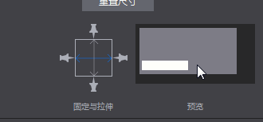
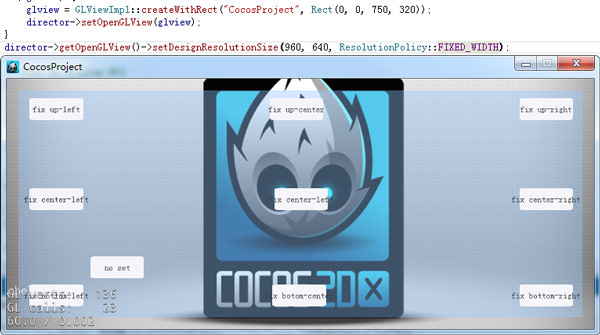
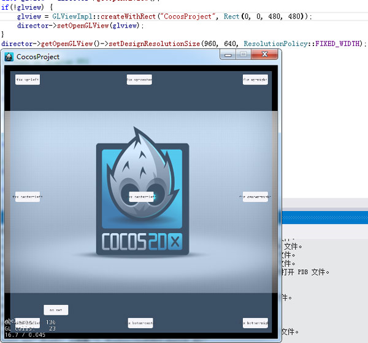

#UI布局与多分辨率适配

#####一,Cocos编辑器

自动布局系统主要涉及固定与拉伸属性：
 
 

&emsp;&emsp;如图，总共可以修改控件的上下左右四个图钉和中间的两个拉伸条六个属性。

#####效果

&emsp;&emsp;1.当打开其中的任意一个图钉时，当前节点与父节点的对应边的距离即被固定。当父节点的大小修改时，当前节点与父节点对应边的距离总是不变。

 
 
&emsp;&emsp;2.当打开其中的任意两个相对的图钉时，当前节点与父节点对应的两边的距离成固定比例。即当修改父节点的大小时，当前节点到父节点对应两条边的距离之比总是不变的。

 
 
&emsp;&emsp;3.当开启中间任意一条拉伸条，如横向拉伸条，节点的宽度与父节点的宽度之比固定不变。

 
 
#####其他
&emsp;&emsp;1. 不开启上述任意属性时，对象默认相对左下角位置不变。

&emsp;&emsp;2. 当前仅控件对象（文本,FNT字体也没有）和容器两种类型有拉伸条属性。

#####二,Cocos 2d-x(Cocos Framework)中的相关概念及代码设置

设计分辨率和屏幕分辨率： 

&emsp;&emsp;首先我们需要了解两个概念：在Cocos2d-x中有两种分辨率：设备分辨率,屏幕分辨率。设备分辨率即当前游戏所运行平台的实际分辨率；设计分辨率就是我们设计的游戏的分辨率。 

&emsp;&emsp;设计分辨率是可设置的，是我们的游戏程序能够“感知到”的分辨率大小，我们的界面超过这个区域的部分都不会显示。

&emsp;&emsp;设计分辨率一般在启动时进行设置

&emsp;&emsp;&emsp;&emsp;AppDelegate::applicationDidFinishLaunching

&emsp;&emsp;中进行，代码如下：

&emsp;&emsp;&emsp;&emsp;director->getOpenGLView()->setDesignResolutionSize(960,640,ResolutionPolicy::FIXED_HEIGHT);

&emsp;&emsp;(这句代码上边还有一句createWithRect这个是在桌面系统上，创建游戏模拟器用的。可以修改里边的Rect的后边两个值来修改设备分辨率，但这个值在移动设备上是无效的。)

&emsp;&emsp;这句代码什么意思呢？

&emsp;&emsp;这里把设计分辨率设置为960，640，并把游戏界面调整方案设置为固定宽度。但这么设置之后，我们后边再获取设计分辨率时得到的大小却不一定是960，640。这又是为什么呢？

&emsp;&emsp;看看源码：

&emsp;&emsp;转到setDesignResolutionSize的定义看看。里边做了一些判断和赋值，最终调用了updateDesignResolutionSize，继续转到updateDesignResolutionSize里边，这个函数的部分代码如下：

	//1.计算游戏界面在缩放至充满屏幕的情况下X,Y轴的缩放率:
    _scaleX= (float)_screenSize.width/ _designResolutionSize.width;
    _scaleY= (float)_screenSize.height/ _designResolutionSize.height;
  
    //2.根据设配策略，调整缩放率和设计分辨率:
    if(_resolutionPolicy== ResolutionPolicy::NO_BORDER)
    {//将X,Y轴缩放值设置为其中的最大者
        _scaleX = _scaleY = MAX(_scaleX,_scaleY);
    }
    else if(_resolutionPolicy== ResolutionPolicy::SHOW_ALL)
    {//将X,Y轴缩放值设置为其中的最小者
        _scaleX = _scaleY = MIN(_scaleX,_scaleY);
    }
    else if( _resolutionPolicy == ResolutionPolicy::FIXED_HEIGHT) {
        _scaleX = _scaleY;//将X,Y轴缩放值固定为Y轴缩放值，调整设计分辨率的宽度，使设计分辨率的宽度在缩放后依然能够充满屏幕。
        _designResolutionSize.width= ceilf(_screenSize.width/_scaleX);
    }
    else if( _resolutionPolicy == ResolutionPolicy::FIXED_WIDTH) {
        _scaleY= _scaleX;//将X,Y轴缩放值固定为X轴缩放值，调整设计分辨率的高度，使设计分辨率的高度在缩放后依然能够充满屏幕。
        _designResolutionSize.height= ceilf(_screenSize.height/_scaleY);
    }
    //其他缩放策略：EXACT_FIT不作调整
&emsp;&emsp;这段代码主要做了两件事：

&emsp;&emsp;1.根据设备分辨率和设计分辨率计算游戏界面的缩放率；

&emsp;&emsp;2.调整设计分辨率。

&emsp;&emsp;根据以上源码我们应该很容易就能够理解几种缩放策略的意义：

&emsp;&emsp;·NO_BORDER就是在保持设计分辨率大小不变的情况下，将游戏界面按比例缩放至充满屏幕。游戏的上下或者左右两边可能会被裁剪。

&emsp;&emsp;·SHOW_ALL(Cocos 2d-x默认方案)就是在保持设计分辨率大小不变的情况下，将游戏界面按比例缩放至设计分辨率的其中一边顶住屏幕。游戏上下或者左右两边可能会有黑边。

&emsp;&emsp;·FIXED_HEIGHT就是固定设计分辨率的高度，调整设计分辨率的宽度，使设计分辨率的长宽比与设备分辨率的长宽比相同，然后缩放游戏界面至充满屏幕。

&emsp;&emsp;·FIXED_WIDTH同上，不同的是保持宽度不变。

&emsp;&emsp;·EXACT_FIT是最粗暴的方式，直接将游戏界面缩放到充满整个屏幕，X轴Y轴缩放比率不一定一致。

&emsp;&emsp;那么，我们应该选择哪个方案呢？必然的我们应该选择FIXED_HEIGHT或者FIXED_WIDTH。因为只有这两个方案下，界面是会自动根据设备分辨率调整设计分辨率的大小并且充满屏幕。

接下来加载界面。

&emsp;&emsp;加载界面在HelloWorld::init中进行：

	auto rootNode= CSLoader::createNode("MainScene.csb");
    auto size= Director::getInstance()->getVisibleSize();
    rootNode->setContentSize(size);
    ui::Helper::doLayout(rootNode);
    addChild(rootNode);

&emsp;&emsp;这里除了用createNode把界面加载出来，并添加到HelloWorld之外，还做了两件事情：

&emsp;&emsp;•	设置加载出来的界面的ContentSize，调用对rootNode调用了ui::Helper::doLayout对加载出来的界面进行处理。

&emsp;&emsp;•	为什么要这么设计呢，做成自动的多好啊？

&emsp;&emsp; 第一个理由：跟编辑器不一致；第二个理由是：自动调整界面被设计为是被动的，如果是主动进行的话，可能会造成大量的性能损失——如果每次设置大小都要重新遍历计算所有的子节点的位置，那得浪费多少CPU时间啊。

#####效果：

1. 设备分辨率X/Y相对设计分辨率X/Y较大，设配策略为固定高度

 
 
2. 设备分辨率X/Y相对设计分辨率X/Y较大，设配策略为固定宽度

 
 
3. 设备分辨率X/Y相对设计分辨率X/Y较小，设配策略为固定高度

 
 
4. 设备分辨率X/Y相对设计分辨率X/Y较小，设配策略为固定高度

 

&emsp;&emsp;PS：枚举类型ResolutionPolicy是框架提供给我们的方便的默认方案。其实我们在设置设计分辨率之前可以获取设备分辨率，然后自己根据设备分辨率调整设计分辨率。

