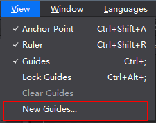
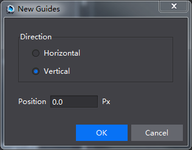
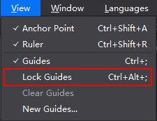
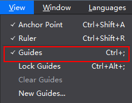
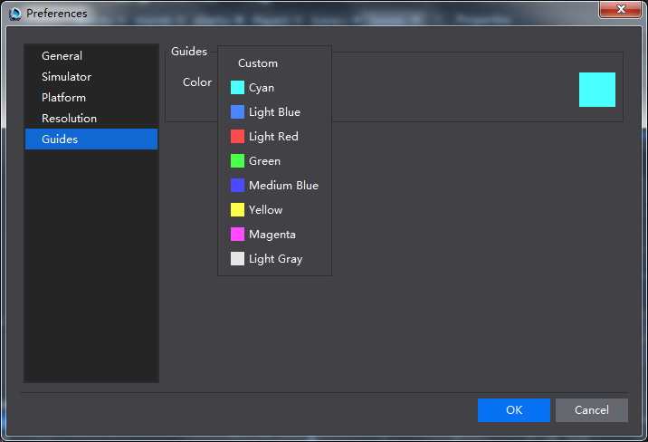

#Rulers and Guides

Cocos v2.3.0 has introduced Rulers and Guides functions for developers to easily position widgets when organize them. 

#### Rulers ####

When you open a project, you will see rulers along the left and bottom side of the Scene. The corner of Canvas is known as its origin (0,0). By default Rulers are visible, to show or hide rulers, you can choose Menu -> View -> select or deselect Ruler. Keyboard shortcuts are Ctrl+Shift+R(Win), Command+Shift+R(Mac). Rulers visibility setting is avaiblable to all projects once it is set. 

Basic functions of guides: Create guides, Move Guides, Lock Guides, Hide Guides and Clear Guides, etc. 

#### Work with Guides

**Create Guides**

To create Guides, please do one of the following: 

- Drag from the horizontal ruler to create a horizontal guide to a position. Drag from the vertical ruler to create a vertical guide. 

- Menu -> View -> select "New Guides" -> select Direction and Position -> click "OK". The position is the location of the line, being displayed parallel to the X coordinate  (Horizontal Direction) or Y coordinate (Vertical Direction) of rulers. Press Alt (Windows) or Option (Mac OS), and drag from the vertical ruler to created a horizontal guide and vice versa. When draging the ruler, you can see the position of the guide. 

&emsp;&emsp;&emsp; 

&emsp;&emsp;&emsp; 
          
**Move Guides**

Position the pointer over the guide until the pointer turns into a double-headed arrow, and then drag the guide to move it. Holding down Alt, drag the vertical guide to make it a horizontal one, and vice versa. When moving guides, the position of the guide is shown. 

**Lock Guides**

To lock all guides, choose Menu -> View -> select Lock Guides. Keyboard shortcut is Ctrl+Alt+; (Windows), Command+Alt+;(Mac). 

&emsp;&emsp; 

**Hide Guides** 

By default, the guides are visible. To hide all guides , choose Menu -> View -> deselect Guides. Keyboard shortcut is Ctrl+; (Windows), Command+;(Mac).  
        
&emsp;&emsp; 

**Clear Guides**

Remove a single guide: to drag the guide outside the Scene. 

Remove all guides: choose Menu -> View -> Clear Guides. 

**Set guide preferences** 

By default the Guide'd color is cyan. To customize its color, select Menu -> Edit -> Preferences -> Guides -> select a color and click OK.  

 
  
**Save Guides** 

Guides settings are saved with files (.csd). Guides will disappear when a project is closed. 
 
