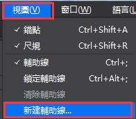
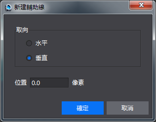
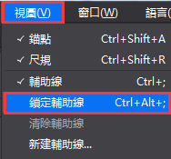
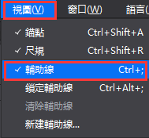
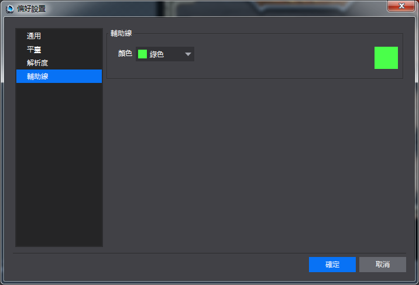

#尺規與輔助線功能
&emsp;&emsp;為了方便使用者進行佈局定位等圖片編輯操作，Cocos在2.3.0版本及以上增加了尺規與輔助線的功能。下面介紹尺規與輔助線的使用方法

尺規

&emsp;&emsp;尺規有橫向尺規和縱向尺規，橫向尺規位於畫布面板底端，縱向尺規位於畫布左側。其中橫,縱尺規以畫布的左下角為零點，分別向左向右和向上向下增加。尺規預設顯示，功能表列-視圖-尺規為勾選狀態，您可以通過點擊取消或勾選來控制尺規的顯示與隱藏。快速鍵為Ctrl+Shift+R（Win）,Command+Shift+R（Mac）。尺規顯示狀態適用於所有專案，即當顯示尺規時，打開其他專案也都顯示尺規，當隱藏時，後續打開項目也都隱藏。

輔助線

&emsp;&emsp;輔助線：包括新建,移動,鎖定,隱藏,清除輔助線,輔助線設置及保存輔助線等功能。

&emsp;&emsp;以下是輔助線的使用介紹：

&emsp;&emsp;新建輔助線

&emsp;&emsp;方式一：從尺規處點擊拖動滑鼠，拖動過程中出現灰色預覽輔助線和位置標籤，拖動至畫布區域您想要的位置，鬆開滑鼠後輔助線位置落定。從橫向尺規拖出的是橫向輔助線，縱向尺規拖出的是縱向輔助線（拖出輔助線後，滑鼠不放鬆，同時按住Alt鍵，輔助線將切換為另一方向，釋放滑鼠，輔助線落定）。拖動過程中可以看到輔助線的位置資料，位置資料與當前單位對應。

&emsp;&emsp;方式二：在功能表列-視圖，點擊“新建輔助線”快顯視窗，選擇方向和位置，其中位置與當前尺規單位對應。內容如下圖。確定後，出現相應位置的輔助線，如下圖：

&emsp;&emsp;&emsp; 

&emsp;&emsp;&emsp; 
          
&emsp;&emsp;移動輔助線

&emsp;&emsp;當滑鼠指向輔助線，變成兩邊延伸的箭頭時，拖動滑鼠，可以改變輔助線位置，鬆開滑鼠，輔助線位置落定（拖動輔助線時，滑鼠不放鬆，同時按住Alt鍵，輔助線將切換為另一方向，釋放滑鼠，輔助線落定）。移動過程中可以看到輔助線的位置資料，位置資料與當前單位對應。

&emsp;&emsp;鎖定輔助線

&emsp;&emsp;在功能表列-視圖，勾選“鎖定輔助線”，所有輔助線被鎖定，不能被拖動，只能消除；取消勾選“鎖定輔助線”，則恢復可選中並能拖動狀態。快速鍵為：Ctrl+Alt+; （Win）,Command+Alt+;（Mac），如下圖：

&emsp;&emsp; 
        
&emsp;&emsp;隱藏輔助線

&emsp;&emsp;輔助線預設是顯示的。在功能表列-視圖，當取消勾選“輔助線”時，則所有輔助線隱藏。當勾選“輔助線”，顯示之前的輔助線。快速鍵為：Ctrl+;（Win）,Command+;（Mac） 。
        
&emsp;&emsp; 

&emsp;&emsp;消除輔助線

 &emsp;&emsp;消除單個輔助線：拖動單個輔助線至尺規區域，鬆開滑鼠，輔助線消失。

 &emsp;&emsp;消除全部輔助線：在功能表列-視窗，點擊消除輔助線，所有輔助線消失。

&emsp;&emsp;輔助線設置

&emsp;&emsp;輔助線的默認顏色為青色，您可以通過功能表列-編輯-偏好設置-輔助線處，選擇下拉清單中的顏色選項後點擊確定，改變輔助線的顏色，如下圖：

 
  
&emsp;&emsp;保存輔助線

&emsp;&emsp;輔助線隨文件（.csd）保存，即保存檔（.csd）則輔助線隨之保存。當切換到其他檔時，將顯示切換後的檔中的輔助線。關閉項目後輔助線消失。
