#Widgets

###1 Button

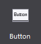
    
Button is a frequently used widget. It can be pressed or clicked to perform an action, containing three states, normal, pressed and disabled. You can set style and texts for it. In the following example, the contents of the scene are composed of Buttons.
 

Mostly game levels, diamonds, and coins are composed of Buttons. Touching these buttons, you will see popup windows.

Button has a lot of features. The following section will introduce you the button widget through several scenes.

**Scenario 1: Modify button background, and set the button pressed style and disabled style.**

Button has three states. Each state can be defined by an image. See the official Main Scene Demo.

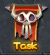
 
First, you need to add a Button to the canvas. After selecting the Button, the Properties panel will show the current button style, you can modify the properties by double-clicking the Button, you can also drag an image to the property. We set up a normal state and a pressed state. When touch the button in the game, the button will automatically switch to the state picture. If necessary, you can also set the disabled state of the button. 

Replace resource by right-click the button.

**Scenario 2: When using the buttons, you need to add texts for the button.** 
 

Customize the text of the button, font, and size, Properties -> Feature -> Text. When you modify the button text, select the button -> modify text attributes in the Properties area. You can also use right mouse or double-click the node to modify the text popups.

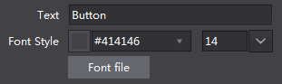
 
**Scenario 3: Set a Button not to respond to a click event.** 

Set the button as Disable. When the button is disabled, it will not respond to touch events in the game.

###2  Checkbox

 
Checkbox is a basic widget that can be checked or unchecked, and multiple selection is available. Checkbox is mostly used on a login screen as "Remember User Name" or "Remember Password".

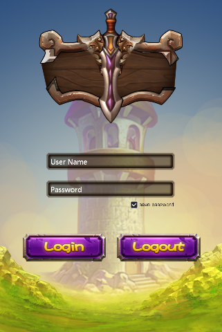
 
It is also used in the setting interface in some games to switch the music or sound effects. Checkbox widget has many properties, in addition to general properties, it includes some features properties, we will introduce you the checkbox widget by several scenarios that checkbox features are used.

**Scenario 1: Modify checkbox style**

Checkbox has five states: normal background style, background pressed style, background disabled styles, selected check style, selected disabled check style, each state can be defined with image. If you want to implement conventional style check box, as shown below:

 
You can set the images of each of the five states to reach your requirements. Below is an example of turning on/off music by using a checkbox:

 

You only need to set the background normal style, background pressed style, background disabled style. You can also replace resource by right-clicking the button.

**Scenario 2: Checkbox is checked (or not checked) by default.**

When you set a checkbox selected, the checkbox’s initial state is selected. You can modify it through the properties panel or right-click menu.

###3 Image
 
          

 
Add an image with 9-slice property. 9-Slice is a way to stretch the image without making it look too distorted. About 9-slice usage, please refer to **How to Use the 9-Slice**. 

Image has the following characteristics with respect to the Sprite: 

- Change the original size without image distortion.

- Use one resource to achieve different effects by setting various 9-slice values. 

- Cost more performance than sprite widgets; it is recommended not to overuse image widget.

Can you point out which are made with Image in the following example?

 
Get the official example, and open **DifficultSelect.csd** to see how we  use image widget.One of the background is made by a size of 16x32 image.  Here we show you how to use the image widgets make this background.

**Scenario 1: Use an Image**
 

Modify a widget by double-clicking the thumbnail, or drag the image onto the properties panel to replace the current style. You can also replace an image through the properties panel or right-click menu. Modify margins of the "9-slice" to 0,0,10,0, and then modify the widget size to 70,32. These margins will affect the 9-slice effect. For more information about 9-slice, please see **How to Use the 9-Slice**. 

###4 Label

Label is also one of the most commonly used widgets in the game. You can set fonts, size, alignment, etc. for a label widget. 

Usage: In the example there are many Labels, such as the main menu. 

 
**Scenario 1: modify the text using different font styles**

If you need a special font you need to import a TTF font, the font will be packaged and exported when you publish a game. Default font in users' mobile phone will be used if you do not specify a font. 

###5 FNT Font

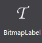

You can achieve a variety of artistic fonts by setting FNT font. Compared to Atlas Label, FNT font has the following features: 

- Support all kinds of text. Following is an example of FNT fonts, which support various characters. 

- Hard to create. It requires professional software to create FNT font.

 
**Scenario 1: Use FNT Font**

Add a FNT font to Canvas, and then select the FNT. In the Properties panel, you can modify its values. You can also replace resource by right-clicking the button. To change the text, you can either double click, right click, or modify the properties. When you enter characters that's not in the fnt file, these missing characters will be displayed as spaces. When you enter characters which are not in the FNT file, the missing characters will be displayed as spaces.

 
###6 Progress Bar

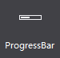
 
A progress bar is used to represent progression. In the official example, the HP bar is an example of progress bar. 
 

**Scenario 1: Modify the progress bar style**

Create a progress bar on canvas, select the progress bar, then double click or drag 'n' drop to change the resources for the progress bar. You can also use right-click menu to add new resources. Here is an example of setting the background:

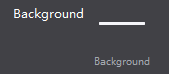
 
**Scenario 2: Set the progress bar direction**

 
See HP bar shown above (one left, one right). Set the "type" property of the progress bar, choosing from "left to right" and "right to left" to change the direction of the progress bar.

###7 Slider

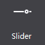

Move the slider to display status of a task. Slider is great for observing degrees of changes, such as setting volume, etc. In the official example, we use Slider in the setting screen. 
 

**Scenario 1: Modify the slider style**

To create a slider, you need 5 images. We didn’t set the disabled state in this example. Add a slider on the canvas, select the slider, double click or drag and drop to replace the images. You can also use right-click menu to add new resources. 
 

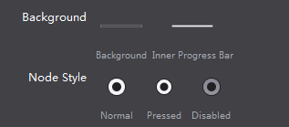

###8 Atlas Label 

 
Atlas Label can be realized by a PNG image including "./0123456789". Each character has the same height as the image, the width of 1/12 of the image, atlas label can be used to display numbers in game. It is a very simple visual effect. Compared to FNT fonts, atlas label has the following features. In the official example, atlas label is used in selecting level. 

- Easy to make. 

- Limited functionality, supporting ".", "/", and number 0-9.

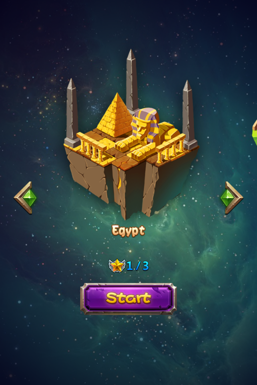
 
**Scenario 1: Modify the image resources for Atlas label**

Adding an atlas label on canvas, select the atlas label, properties will display the current resource thumbnail, you can modify it by double-clicking a thumbnail, as well as drag image to it. In addition you can also use right mouse. When you modify the button text simply select the button, modify text attributes in the Properties, same can be done though right mouse. 
 

***Note** To create atlas label, designers need to provide an image containing ".", "/", or number 0-9. Make sure the order is ./0123456789 and spaces between numbers need to be equal.*

A typical atlas label image. 

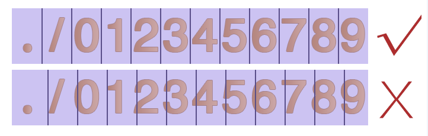
 

