#控制項

###1.按鈕：

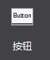
    
&emsp;&emsp;按鈕是遊戲中最常用的控制項類型之一，控制使用者點擊事件的開關，有正常,按下,禁用三種狀態，您可以為他們設置樣式及文本。

&emsp;&emsp;使用場景

&emsp;&emsp;按鈕的使用十分普遍，以官方示例中的主場景示例為例，畫框的內容均是由按鈕控制群組成 
 

&emsp;&emsp;在您的專案中，介面上方的等級,鑽石,錢幣也可以由按鈕控制群組成，當使用者觸摸時，跳轉至相應的介面。

&emsp;&emsp;按鈕控制項屬性眾多，除了常規屬性外，還包含尺寸屬性和一些特性屬性，我們從經常使用按鈕控制項的幾種場景為您介紹如何更好的使用這種控制項

&emsp;&emsp;場景1：修改按鈕背景，設置按鈕按下後效果和禁用效果

&emsp;&emsp;按鈕具有三種狀態，每一種狀態都可以通過圖片來定義。例如實現下圖的按鈕

 
&emsp;&emsp;您只需要在畫布上添加一個按鈕後，選擇該按鈕控制項，在屬性面板的特性部分會展示按鈕控制項當前的樣式資源，您可以通過按兩下修改按鈕控制項的屬性，也可以將圖片資源拖動到當前的樣式資源上以替換為新的資源。我們為按鈕設置了正常和按下狀態，這樣在遊戲中觸摸該按鈕時，按鈕就會自動切換為按下狀態的圖片。如果有需要，您也可以為按鈕設置禁用狀態。

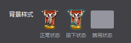
 
&emsp;&emsp;除此之外也能通過按鈕控制項的右鍵功能表添加新的資源。

&emsp;&emsp;場景2：使用按鈕時，需要在按鈕上設置文字
 

&emsp;&emsp;有時我們在設置按鈕樣式後，還希望給按鈕設置文字，您可以使用修改按鈕文本特性來實現這個需求。您可以自訂按鈕文本的顏色,字體,大小。
&emsp;&emsp;修改按鈕文本時只需選中按鈕，在屬性區修改文字屬性，也可以通過“功能表-編輯文本”或按兩下喚出修改文本彈窗。

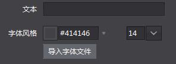
 
&emsp;&emsp;場景3：在遊戲中，不希望該按鈕回應使用者的觸摸事件

&emsp;&emsp;能夠在屬性面板或右鍵功能表設置按鈕是否啟用，按鈕禁用後在最終的遊戲裡將不能回應觸摸事件。

###2.核取方塊：

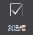
 
&emsp;&emsp;核取方塊是一種可同時選中多項的基礎控制項，您可設置他的各種樣式，以及選中狀態。

&emsp;&emsp;使用場景

&emsp;&emsp;核取方塊最常用的地方莫過於遊戲登錄介面上的“記住用戶名”和“記住密碼”，相信您一定經常見到。

 
&emsp;&emsp;還有就是一些遊戲的設置介面，控制是否啟用音樂的開關，通常也是核取方塊控制項。核取方塊控制項屬性眾多，除了常規屬性外，還包含尺寸屬性和一些特性屬性，我們從經常使用核取方塊控制項的幾種場景為您介紹如何更好的使用這種控制項。

&emsp;&emsp;場景1：修改核取方塊樣式

&emsp;&emsp;核取方塊具有五種狀態：背景正常樣式,背景按下樣式,背景禁用樣式,選中標識樣式,選中標識禁用樣式，每一種狀態都可以通過圖片來定義。如果您要實現常規核取方塊的樣式，如下圖：

 
&emsp;&emsp;您可以分別設置五個狀態的圖片，以達到您的預期效果，如果您要實現設置介面的音樂開（關）樣式，如下圖：
 

&emsp;&emsp;您僅需要設置背景正常樣式,背景按下樣式,背景禁用樣式，而將另外兩個狀態設置為不啟用狀態。除此之外也能通過按鈕控制項的右鍵功能表添加新的資源。

&emsp;&emsp;場景2：遊戲中默認核取方塊是勾選（不勾選）的。

&emsp;&emsp;當您設置一個核取方塊為選中時，這個核取方塊在遊戲中的初始狀態就為選中的狀態。通過屬性面板或右鍵功能表能夠修改核取方塊的選中狀態。

###3.圖片控制項
 
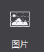

 
&emsp;&emsp;添加一張可以設置九宮格的圖片，九宮格是一種能夠使本來拉伸後會失真的圖片，經過一定的處理後，拉伸後不失真的技術。關於九宮格的用法請參考4,九宮格使用.docx

&emsp;&emsp;圖片控制項相對于精靈控制項，具有以下特性：

&emsp;&emsp;可改變原圖尺寸，而不出現圖片失真效果。

&emsp;&emsp;可使用同一資源，通過設定九宮格的參數，達到不同的最終效果。

&emsp;&emsp;系統開銷比精靈控制項大，建議不要過度使用圖片控制項。

&emsp;&emsp;使用場景

&emsp;&emsp;同樣還是官方示例中的這個介面，您能想像到哪些地方是由圖片控制群組成的麼？

 
&emsp;&emsp;您可以獲取官方示例後，打開DifficultSelect.csd檔查看我們是如何使用圖片控制項的，也許會對您的項目有所啟發。其中的背景由一張尺寸為16x32的圖片製作而成的。下面我們為您說明如何使用圖片控制項製作這一背景。

&emsp;&emsp;場景1：如何使用圖片控制項
 

&emsp;&emsp;在畫布上添加一個圖片控制項後，設置其“圖片資源”屬性為上圖所示資源，設置方式為在屬性面板的特性部分會展示控制項當前的圖片資源縮略圖，您可以通過按兩下縮略圖修改控制項的圖片資源，也可以將圖片資源拖動到當前的樣式資源上以替換為新的資源。除此之外也能通過九宮格圖片控制項的右鍵功能表添加新的資源。然後開啟“九宮格”屬性，並修改九宮格控制項的上下左右邊距分別為0，0，10，0，而後修改控制項尺寸為70，32，定義的這些邊距會影響九宮格拉伸的效果，並達到預期的效果。關於九宮格的原理和詳細說明，參考4,九宮格使用.docx

###4.文本

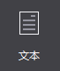

&emsp;&emsp;文本也是遊戲中最為常用的控制項之一。添加一個文本，可以設置字體,字型大小,對齊等樣式或屬性。

&emsp;&emsp;使用場景

&emsp;&emsp;在示例中很多地方使用了文本控制項，如主介面：

 
&emsp;&emsp;場景1：使用不同的字體修改文本樣式

&emsp;&emsp;如果您需要特殊的字體則需要點擊導入字體按鈕導入一個TTF格式的字體，這個字體將在您發佈遊戲時一起打包。 在修改文本的字體時需要注意，當您沒有指定使用的字體時，使用的字體是所運行設備的預設字體，對於您所製作的遊戲來說就是玩家設備的字體。

###5.FNT字體

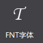

&emsp;&emsp;可以通過設置FNT字體檔實現各種藝術字體。和藝術數位比，FNT字體具有以下特性：

&emsp;&emsp;.    可用資源豐富，支援各類文字，下圖就是一張製作好的FNT字體，不難發現，字體中包含中文，英文，數位以及某些特殊字元。

&emsp;&emsp;.    製作複雜，需要使用專業軟體進行製作。

&emsp;&emsp;使用場景

 
&emsp;&emsp;場景1：使用FNT字體

&emsp;&emsp;在畫布上添加一個FNT後，選擇該FNT字體控制項，在屬性面板的特性部分會展示該控制項當前的樣式資源，您可以通過按兩下修改按FNT字體的屬性，也可以將FNT資源拖動到當前的樣式資源上以替換為新的資源。除此之外也能通過按鈕控制項的右鍵功能表添加新的資源。修改FNT字體文本時只需選中控制項，在屬性區修改文字屬性，也可以通過“功能表-編輯文本”或按兩下喚出修改文本彈窗。

 
&emsp;&emsp;當您在輸入框中輸入了FNT中缺少的字元時，這些缺少的字元會被顯示為空格。

###6.進度條

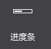
 
&emsp;&emsp;通過進度條可以顯示處理任務的速度,完成度，您可以設置進度條的樣式。

&emsp;&emsp;使用場景

&emsp;&emsp;官方示例中，體力恢復功能就使用了進度條控制項，如下圖所示綠色條
 

&emsp;&emsp;場景1：修改進度條樣式

&emsp;&emsp;在畫布上添加一個進度條後，選擇該進度條控制項，在屬性面板的特性部分會展示進度條控制項當前的樣式資源，您可以通過按兩下修改進度條控制項的資源圖，也可以將圖片資源拖動到當前的樣式資源上以替換為新的資源。除此之外也能通過進度條控制項的右鍵功能表添加新的資源。如示例中，我們就為其設置了如下背景：

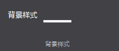
 
&emsp;&emsp;場景2：設置進度條方向

 
&emsp;&emsp;實現如上圖所示血條（一個向左，一個向右），只需要設置進度條的屬性“類型”，分別設定為從左至右,從右至左，通過修改進度條方向可以在遊戲中實現對戰時生命值的展示。

###7.滑動條

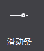

&emsp;&emsp;滑動條可以設置滑動進度，滑塊樣式式等，使用者可通過移動滑動滑動條在相應的控制項中顯示對應的值

&emsp;&emsp;使用場景

&emsp;&emsp;滑動條多用於設置某些連貫屬性上，如在很多程式中的設置介面設置音量等，在官方示例中，我們也在設置介面做了滑動條的展示：
 
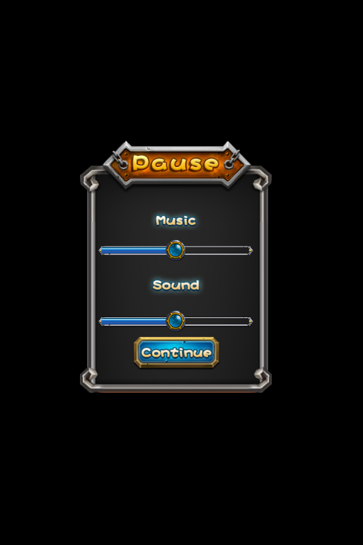

&emsp;&emsp;場景1：修改滑動條樣式

&emsp;&emsp;如上圖，要設置上圖中的進度條，您需要以下五個資源，他們分別用於設置滑動條的背景樣式,內部進度條樣式,滑塊正常樣式,滑塊按下樣式,滑塊禁用樣式，每一種狀態都可以通過圖片來定義。在我們的示例中，禁用狀態沒有設置。
 

&emsp;&emsp;在畫布上添加一個滑動條後，選擇該滑動條控制項，在屬性面板的特性部分會展示滑動條控制項當前的樣式資源，您可以通過按兩下修改滑動條控制項的屬性，也可以將圖片資源拖動到當前的樣式資源上以替換為新的資源。
 
&emsp;&emsp;除此之外也能通過滑動條控制項的右鍵功能表添加新的資源。

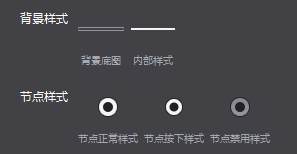

###8.藝術數字

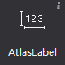
 
&emsp;&emsp;可以通過一張包含“./0123456789”的PNG圖片實現藝術數位的效果，每個字元的高為圖片的高，寬為圖片的1/12，通過藝術數位可以實現藝術化效果的數位，能夠簡單有效的豐富遊戲的視覺效果。和FNT字體相比，藝術數位具有以下特性：

&emsp;&emsp;.    製作方便，FNT字體製作複雜，而藝術數字較簡單

&emsp;&emsp;.    可用資源少，藝術數字僅支援“.”,“/”,“0-9的數字”

&emsp;&emsp;使用場景

&emsp;&emsp;我們的官方示例中，選擇關卡這裡就使用了藝術數位

 
&emsp;&emsp;場景1：修改藝術數位圖片資源

&emsp;&emsp;在畫布上添加一個藝術數字後，選擇該藝術數位控制項，在屬性面板的特性部分會展示控制項當前的圖片資源縮略圖，您可以通過按兩下縮略圖修改控制項的圖片資源，也可以將圖片資源拖動到當前的樣式資源上以替換為新的資源。除此之外也能通過藝術數位控制項的右鍵功能表添加新的資源。修改按鈕文本時只需選中按鈕，在屬性區修改文字屬性，也可以通過“功能表-編輯文本”或按兩下喚出修改文本彈窗。
 

&emsp;&emsp;特別說明

&emsp;&emsp;製作藝術數位時需要遊戲美術設計人員提供一張包含了“.”,“/”,“0-9的數位”的圖片，確保順序為./0123456789，且按照圖片寬度進行12等分能夠分割出各個獨立的數位。
 

&emsp;&emsp;一張典型的藝術數位圖片資源

 

