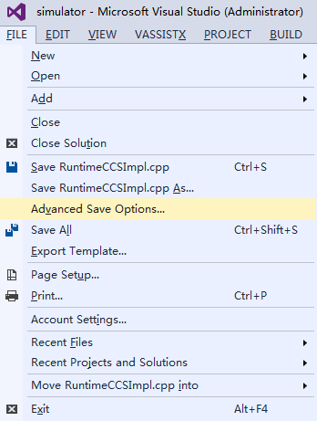
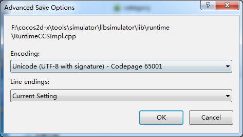
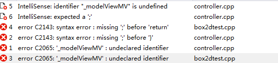

# How to: Fix Packaging and Running Issues #

1 Install JDK, SDK, NDK, Framework and cocos projects in a directory supporting English language. Installation in a directory supporting non-English languages may cause errors when packaging. 

2 After the successful installation of JDK, in Java directory there will be two folders with the name starting with jdk and jre respectively. Add bin directory of the two folders to Environment Variables. New variable name is JAVA_HOME, and variable value is the folder path where JDK is installed. 

&emsp;&emsp;
 
Set variable Path, and append the location of the bin folder where the JRE is installed. You need to use a semicolon in English half-angle state, and then add bin directory. For example, C:\Program Files\Java\jre1.8.0_45\bin.

&emsp;&emsp;

3 Add cpp files to Visual Studio and XCode projects. Meanwhile modify android.mk, which is located at proj.android/jni/Android.mk. 

4 Use UTF-8 to code Cpp. It is convenient to view the file encoding format with Visual Studio. 

&emsp;&emsp;

&emsp;&emsp;

5 Currently it is not supported to access files on a USB disk, for on Windows the path support in Python is flawed. Copy project files from the USB disk to your computer and run the project. 

6  Cannot find the header files (No such file of directory), for example: 

    WARNING [Project: :app] Current NDK support is deprecated.  Alternative will be provided in the future.
	:app:preBuild UP-TO-DATE
	:app:preDebugBuild UP-TO-DATE
	:app:compileDebugNdk
	/Users/zhongcs/Documents/CocosProjects/CocosProjecttest/testandroid2/app/src/main/jni/hellocpp/main.cpp:1:25: fatal error: AppDelegate.h: No such file or directory
	 #include "AppDelegate.h"
	                         ^
	compilation terminated.

Solution: Check Android.mk file, and include "AppDelegate.h" into LOCAL_C_INCLUDES. 

7 Undefined reference to …, for example: 
 
	./obj/local/armeabi/objs-debug/cocos2dcpp_shared/__/__/Classes/Gem.o:Gem.cpp:vtable for Gem: error: undefined reference to 'cocos2d::Sprite::setDisplayFrameWithAnimationName(std::string const&, int)'
	collect2.exe: error: ld returned 1 exit status
	make.exe: *** [obj/local/armeabi/libcocos2dcpp.so] Error 1

Solution: Add source files to Android.mk.

8 “was declared deprecated”, for example: 

	1>d:\cocos2d-x\project\xiaochuxinxin\classes\xmlparser.cpp(15): warning C4996: 'cocos2d::CCString': 被声明为已否决
	1>          d:\cocos\frameworks\cocos2d-x-3.6\cocos\deprecated\ccdeprecated.h(1050) : 参见“cocos2d::CCString”的声明
	1>d:\cocos2d-x\project\xiaochuxinxin\classes\xmlparser.cpp(15): warning C4996: 'cocos2d::CCDictionary': 被声明为已否决

Cause: When updating the engine, there will be some deprecated functions, which are available but with this error message. 

Solution:  use the F12 tools to debug on a statement level, and find the codes to update. 

9 The system cannot find the path specified, for example: 

	Based on: cocos2d-x-3.6
	Updated project.properties
	Updated local.properties
	Updated file d:\cocosSample\Cocos\CocosProjects\CocosProject1\proj.android\proguard-project.txt
	It seems that there are sub-projects. If you want to update them
	please use the --subprojects parameter.
	Running command: compile
	Building mode: debug
	Android platform not specified, searching a default one...
	running: '"D:\Android\sdk\android-sdk\tools\android" update project -t android-21 -p d:\cocosSample\Cocos\CocosProjects\CocosProject1\proj.android'
	building native
	NDK build mode: release
	NDK_TOOLCHAIN_VERSION: 4.8
	running: '"D:\Android\ndk\ndk-build" -C d:\cocosSample\Cocos\CocosProjects\CocosProject1\proj.android -j3 NDK_MODULE_PATHd:\Cocos\frameworks/cocos2d-x-3.6;d:\Cocos\frameworks/cocos2d-x-3.6/cocos;d:\Cocos\frameworks/cocos2d-x-3.6/external NDK_TOOLCHAIN_VERSION4.8'
	Ndk build failed!

Solution: Find the Framework that creates the current project. Select the console within that Framework to compile. The console is located in tools/cocos2d-console/bin. 

10 A compilation error of JSB binding, for example: 

	AppDelegate.cpp  register_all_autogentestbindings ns' was not declared in this scope

Solution: [http://www.cocos2d-x.org/docs/manual/framework/native/v2/scripting-and-translating-between-programming-languages/javascript-binding/how-to-bind-c++-to-Javascript/zh](http://www.cocos2d-x.org/docs/manual/framework/native/v2/scripting-and-translating-between-programming-languages/javascript-binding/how-to-bind-c++-to-Javascript/zh) 

Follow the instruction of above document, which is editted based on v3.6.1. Skip the step "modify 'autogentestbindings.cpp' in the registration function". See the test cases in /tools/bindings-generator/test. 

11 Transplantation compilation error, for example: 

    07-04 12:58:01.362: E/linker(7506): soinfo_relocate(linker.cpp:992): cannot locate symbol "atof" referenced by "libcocos2djs.so"...

Solution: create a project, and then copy res,src, project.json,config.json to the project files. 

12 Transplantation compilation error:

Cause: .vxproject configuration unchanged. 

Solution: update .vxproject configuration. 

13 Missing type specifier (grammar error), for example: 

&emsp;&emsp;

Cause 

- Undeclared identifier, which must be specified in a declaration before using. 
- Missing ":", grammar error, please check carefully if there is ":" in the code. 
- Missing type specifier, function type was not declared. 

Solution: 

    CC_ENABLE_CHIPMUNK_INTEGRATION=1 change to CC_ENABLE_BOX2D_INTEGRATION=1

If you have added references to project, please see [http://www.bkjia.com/Androidjc/889857.html](http://www.bkjia.com/Androidjc/889857.html).

P.S. there is bug in v3.6 BOX2D- TEST. Solution: [https://github.com/cocos2d/cocos2d-x/issues/12104](https://github.com/cocos2d/cocos2d-x/issues/12104). 

14 sh: cocos: command not found, for example: 

	**** Build of configuration Release for project CocosProjectTest ****
	python /Users/zhongcs/dev/cocosworkspace/CocosProjectTest/proj.android/build_native.py -b release all 
	sh: cocos: command not found
	Please use cocos console instead.
	Traceback (most recent call last):
	  File "/Users/zhongcs/dev/cocosworkspace/CocosProjectTest/proj.android/build_native.py", line 43, in 
	    build(opts.build_mode)
	  File "/Users/zhongcs/dev/cocosworkspace/CocosProjectTest/proj.android/build_native.py", line 28, in build
	
	    raise Exception("Build dynamic library for project [ "   app_android_root   " ] fails!")
	Exception: Build dynamic library for project [ /Users/zhongcs/dev/cocosworkspace/CocosProjectTest/proj.android/../ ] fails!
	**** Build Finished ****

Solution: [http://www.cocoachina.com/bbs/read.php?tid-296022.html](http://www.cocoachina.com/bbs/read.php?tid-296022.html)

15 Black screen on mobile device when runing cocos2d-x 2.X + R9d with c++11 regular expressoins and APK packaged correctly. 

Cause: Successful compilation on PC means that there is IDE libraries support C++ features (new library files from C++11). On mobile device, GCC 4.9+ supports the C++  `regex`, but GCC 4.9 is available for NDK 10+. 

Solution: Look for 3rd-party regular expression parsing library, for example, C++ regular expression library. Or compile with ndk-r10c or higher versions.  

***Note** Remember to check log files, which are the points to debug most issues.* 

