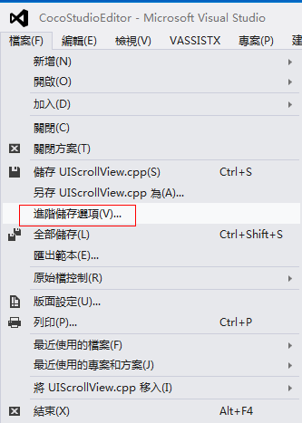
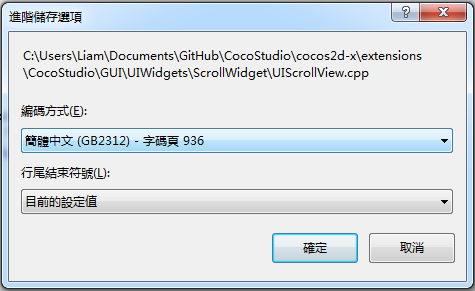
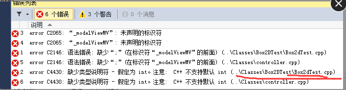

#如何修復打包以及運行失敗？#

&emsp;&emsp;1，JDK，SDK，NDK，Framework，Cocos專案都必須放到英文目錄，非英文目錄可能會導致打包出現異常問題。

&emsp;&emsp;2，JDK安裝成功後，Java目錄下會生成2個資料夾，分別以jdk和jre開頭。需要將這2個資料夾下的bin路徑配置到系統變數裡面。添加系統變數JAVA_HOME，變數值是jdk資料夾路徑。如下截圖：

&emsp;&emsp;
 
&emsp;&emsp;編輯系統變數Path，在後面追加jre資料夾下的bin路徑，注意，需要先輸入一個半形分號，再輸入bin路徑，例如： C:\Program Files\Java\jre1.8.0_45\bin，如下截圖：

&emsp;&emsp;

&emsp;&emsp;3，增加cpp檔，需要添加到VS工程,XCode工程，同時必須需要修改android.mk檔，位置在proj.android/jni/Android.mk。

&emsp;&emsp;4，Cpp代碼編碼格式一定要是UTF-8，使用Visual Studio可以方便的查看檔編碼格式，如下圖：

&emsp;&emsp;

&emsp;&emsp;

&emsp;&emsp;5，由於 python 對 windows 系統中路徑的支援存在缺陷，目前暫不支持直接運行 U 盤中的項目。請將專案拷貝到硬碟中然後運行。

&emsp;&emsp;6，未找到標頭檔（No such file of directory），案例：

    WARNING [Project: :app] Current NDK support is deprecated.  Alternative will be provided in the future.
    :app:preBuild UP-TO-DATE
    :app:preDebugBuild UP-TO-DATE
    :app:compileDebugNdk
    /Users/zhongcs/Documents/CocosProjects/CocosProjecttest/testandroid2/app/src/main/jni/hellocpp/main.cpp:1:25: fatal error: AppDelegate.h: No such file or directory
     #include "AppDelegate.h"
                             ^
    compilation terminated.

&emsp;&emsp;解決方法：查下Android.mk中LOCAL_C_INCLUDES裡面有無添加AppDelegate所在的目錄。

&emsp;&emsp;7，未定義引用（undefined reference to …..），案例：
 
    ./obj/local/armeabi/objs-debug/cocos2dcpp_shared/__/__/Classes/Gem.o:Gem.cpp:vtable for Gem: error: undefined reference to 'cocos2d::Sprite::setDisplayFrameWithAnimationName(std::string const&, int)'
    collect2.exe: error: ld returned 1 exit status
    make.exe: *** [obj/local/armeabi/libcocos2dcpp.so] Error 1

&emsp;&emsp;解決方法：Android.mk文件中加入原始檔案。

&emsp;&emsp;8，被聲明已否決，案例：

    1>d:\cocos2d-x\project\xiaochuxinxin\classes\xmlparser.cpp(15): warning C4996: 'cocos2d::CCString': 被聲明為已否決
    1>          d:\cocos\frameworks\cocos2d-x-3.6\cocos\deprecated\ccdeprecated.h(1050) : 參見“cocos2d::CCString”的聲明
    1>d:\cocos2d-x\project\xiaochuxinxin\classes\xmlparser.cpp(15): warning C4996: 'cocos2d::CCDictionary': 被聲明為已否決

&emsp;&emsp;原因：低版本引擎升級高版本引擎，會有一些過時的函數，而這些函數依舊可以使用，但是會提示這個錯誤。

&emsp;&emsp;解決辦法：F12進入提示錯誤的函數的聲明處，即可找到替換的代碼。

&emsp;&emsp;9，系統找不到指定路徑，案例：

    Based on: cocos2d-x-3.6
    Updated project.properties
    Updated local.properties
    Updated file d:\cocosSample\Cocos\CocosProjects\CocosProject1\proj.android\proguard-project.txt
    It seems that there are sub-projects. If you want to update them
    please use the --subprojects parameter.
    系統找不到指定的路徑。
    Running command: compile
    Building mode: debug
    Android platform not specified, searching a default one...
    running: '"D:\Android\sdk\android-sdk\tools\android" update project -t android-21 -p d:\cocosSample\Cocos\CocosProjects\CocosProject1\proj.android'
    building native
    NDK build mode: release
    NDK_TOOLCHAIN_VERSION: 4.8
    running: '"D:\Android\ndk\ndk-build" -C d:\cocosSample\Cocos\CocosProjects\CocosProject1\proj.android -j3 NDK_MODULE_PATHd:\Cocos\frameworks/cocos2d-x-3.6;d:\Cocos\frameworks/cocos2d-x-3.6/cocos;d:\Cocos\frameworks/cocos2d-x-3.6/external NDK_TOOLCHAIN_VERSION4.8'
    Ndk build failed!

&emsp;&emsp;解決辦法：cocos命令，是否是你當時創建這個項目時的同一個cocos.py。如果系統裡裝有多個引擎版本，注意不要混用它們的cocos console
如果你用Cocos裡帶的framework創建的專案，而用引擎裡的console去編譯，那就很可能出現問題。所以你要注意一個原則：如果你電腦裡有多個引擎版本,framework等，那麼你用哪個創建的，就要用哪個下面的tools/cocos2d-console/bin下面的去編譯它。

&emsp;&emsp;10，JSB綁定導致編譯錯誤，案例：

    AppDelegate.cpp  register_all_autogentestbindings ns' was not declared in this scope

&emsp;&emsp;解決辦法：[http://www.cocos2d-x.org/docs/manual/framework/native/v2/scripting-and-translating-between-programming-languages/javascript-binding/how-to-bind-c++-to-Javascript/zh](http://www.cocos2d-x.org/docs/manual/framework/native/v2/scripting-and-translating-between-programming-languages/javascript-binding/how-to-bind-c++-to-Javascript/zh)
請按這篇文檔操作即可，每步都很具體，基於3.6.1版本，跳過文中“修改“autogentestbindings.cpp”中的註冊函數如下：”這一步即可。已經測試過可以，
測試例在你的項目 /tools/bindings-generator/test 下面。

&emsp;&emsp;11，工程移植後編譯錯誤，案例：

    07-04 12:58:01.362: E/linker(7506): soinfo_relocate(linker.cpp:992): cannot locate symbol "atof" referenced by "libcocos2djs.so"...

&emsp;&emsp;解決辦法：創建一個新的空專案，然後將res,src, project.json,config.json等複製過來就可以了。

&emsp;&emsp;12，工程移植後編譯錯誤：

&emsp;&emsp;原因：.vxproject的配置未變。

&emsp;&emsp;解決辦法：.vxproject配置改為新引擎版本。

&emsp;&emsp;13，缺少類型說明符（語法錯誤）,案例：

&emsp;&emsp;

&emsp;&emsp;原因：

&emsp;&emsp;1.未聲明識別字，是未聲明就使用造成的。

&emsp;&emsp;2.缺少 “：”，語法錯誤，仔細檢查語句是否缺少“：”號。

&emsp;&emsp;3.缺少類型說明符，函數類型未聲明。

&emsp;&emsp;解決辦法：

    CC_ENABLE_CHIPMUNK_INTEGRATION=1更改為CC_ENABLE_BOX2D_INTEGRATION=1

已經加入工程引用的，參考一下[http://www.bkjia.com/Androidjc/889857.html](http://www.bkjia.com/Androidjc/889857.html)

PS:3.6的BOX2D-TEST有BUG，修復地址：[https://github.com/cocos2d/cocos2d-x/issues/12104](https://github.com/cocos2d/cocos2d-x/issues/12104)

&emsp;&emsp;14，sh: cocos: command not found, 案例：

    //3.5,3.6的話，將工程導入到Eclipse中，會報sh: cocos: command not found的錯誤，但是用控制台能正常打包。這是一個Bug。
    **** Build of configuration Release for project CocosProjectTest ****
    python /Users/zhongcs/dev/cocosworkspace/CocosProjectTest/proj.android/build_native.py -b release all 
    sh: cocos: command not found
    Please use cocos console instead.
    Traceback (most recent call last):
      File "/Users/zhongcs/dev/cocosworkspace/CocosProjectTest/proj.android/build_native.py", line 43, in 
        build(opts.build_mode)
      File "/Users/zhongcs/dev/cocosworkspace/CocosProjectTest/proj.android/build_native.py", line 28, in build
    
        raise Exception("Build dynamic library for project [ "   app_android_root   " ] fails!")
    Exception: Build dynamic library for project [ /Users/zhongcs/dev/cocosworkspace/CocosProjectTest/proj.android/../ ] fails!
    **** Build Finished ****

   解決方法：[http://www.cocoachina.com/bbs/read.php?tid-296022.html](http://www.cocoachina.com/bbs/read.php?tid-296022.html)

&emsp;&emsp;15，cocos2d-x 2.X + R9d使用c++11規則運算式，打包APK正確，真機運行黑屏： 

&emsp;&emsp;原因：pC上能編譯成功說明pc上IDE自帶的庫支持C++新特性（c++11的新庫檔）。
但是手機是GCC庫來判定的
 gcc4.9才支持c++11的regex，然而NDK 10以上才有gcc4.9。

&emsp;&emsp;解決方法：搜一些類似於你說的協力廠商正則解析庫，例如：c語言的正則庫，或者使用r10C及其以上的版本進行編譯。

&emsp;&emsp;16，未能正確載入解決方案中的一個或者多個專案，案例：

    Based on: cocos2d-x-3.6
    Microsoft (R) Microsoft Visual Studio 2012 11.0.50727.1 版。
    版權所有(C) Microsoft Corp。保留所有權利。
    D:\Cocos_Project\js\test\frameworks\runtime-src\proj.win32\test.vcxproj : error  : 未找到與約束 
    ContractName    Microsoft.VisualStudio.Project.IProjectServiceAccessor
    RequiredTypeIdentity    Microsoft.VisualStudio.Project.IProjectServiceAccessor 匹配的匯出
    未能正確載入解決方案中的一個或多個專案。
    有關詳細資訊，請參見“輸出”視窗。
    未能完成操作。參數錯誤。 
    用法: 
    devenv  [解決方案文件 | 專案檔案 | 任意文件.副檔名]  [開關]

&emsp;&emsp;解決方法：修復Visual Studio或者重裝Visual Studio。

注：出錯不要慌，先看log日誌，它才是解決問題的最重要途徑。

