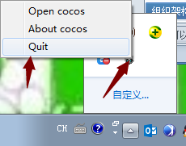

# How to use Cocos Framework？

### Differences between Framework and Cocos 2d-x source code 

Framework is same as Cocos 2d-x in function and API, for it is a precompiled library of Cocos 2d-x. There are also differences. Framework, the precompiled library,  will help you save time in compiling your project, especially to C++ projects. Secondly, developers can edit cocos source codes in Framework v3.7+. 

### 5 Steps to Use Framework

Here is a simple to guide for getting started with Cocos Framework. Follow the steps below: 

1 Download Cocos Framework. 

2 Install Cocos Framework (You can change the default location, but with no spaces or special characters in the installation path). 

3 Restart cocos (you need to exit the Launcher at the lower right corner of your screen). 

***Note**: you need to quit cocos before creating the project.* 

 

4 Create a new project, and then select version and language of Cocos Framework. 

5 Publish projects to VS. 

After publishing the project to VS, click "Run" or F5 and you can see the following interface.  
 
 

