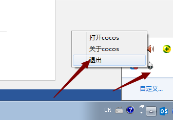
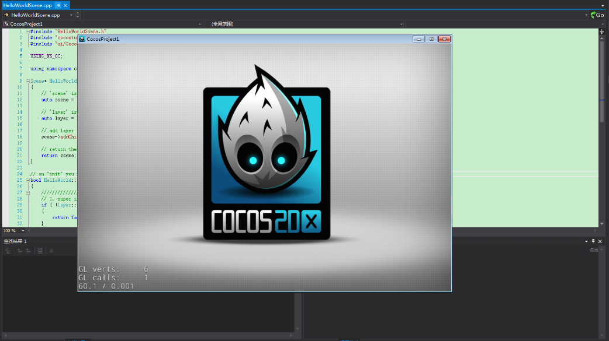

#如何使用Cocos Framework？

###Framework和2dx源碼的區別

&emsp;&emsp;Framework是一個cocos2dx的預編譯庫，所以在功能與API上與cocos2dx是一致的。相比來說，因為是預編譯庫，所以在開發編譯你的專案時會節省大量編譯時間，特別是對於C++專案，如果有用過VS來編譯cocos2dx的項目的話對編譯時間應該深有體會。同時也因為是預編譯庫，在用於開發時，我們無法對cocos的源碼進行中斷點調試，並且也不能改動cocos的源碼（但之framework3.7之後已提供自行編譯framework的方式來允許使用者改動cocos的源碼）。以上是二者的主要不同點。

###Framework的使用步驟

其實，Framework的使用步驟很簡單，之所以有這個簡略使用步驟，是怕浪費大家的時間。廢話少說，步驟如下：

&emsp;&emsp;1,下載framework

&emsp;&emsp;2,安裝framework（注意路徑不要有空格和特殊字元，可改變預設路徑）

&emsp;&emsp;3,重新開機cocos（要關閉電腦螢幕右下角的launcher）

&emsp;&emsp; 

&emsp;&emsp;4,新建專案,選擇framework版本,語言等

&emsp;&emsp;5,發佈項目到VS。發佈到VS後，點擊運行或F5即可運行出這個介面。
 
&emsp;&emsp; 
