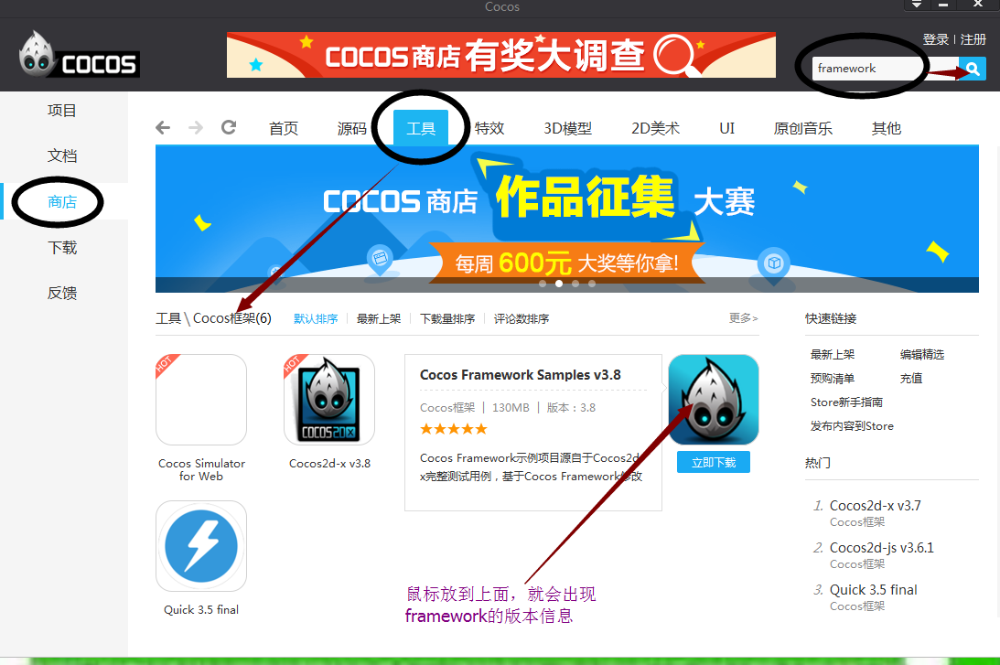
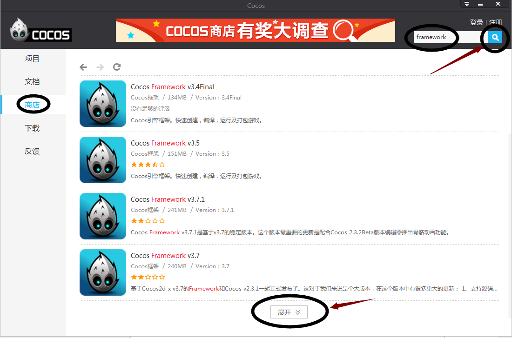
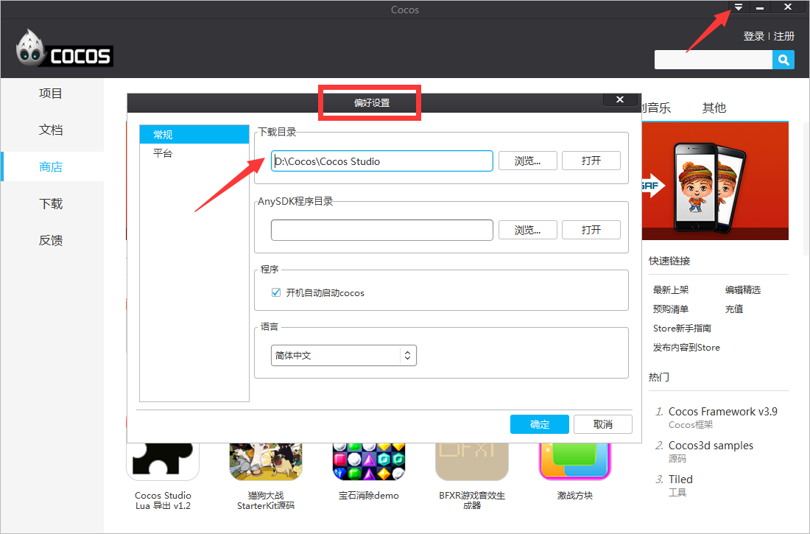
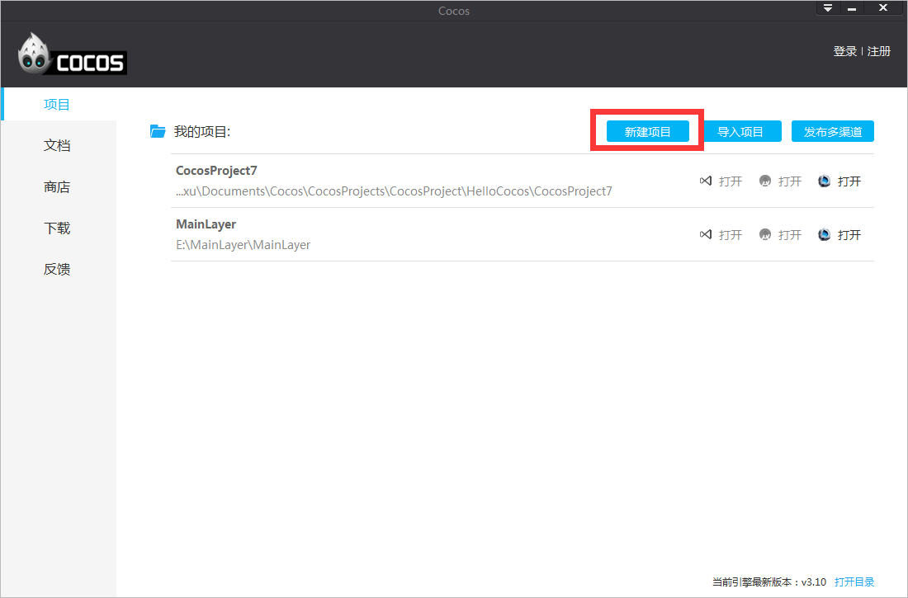
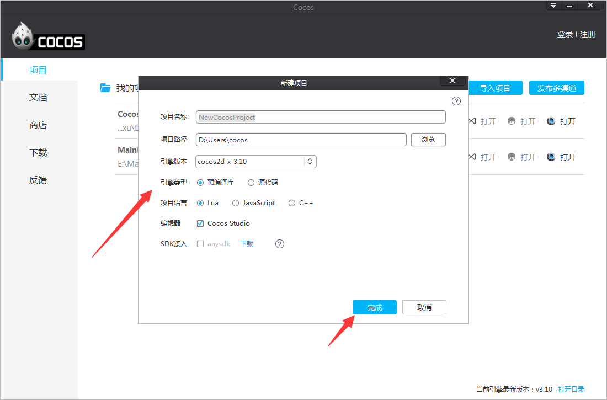
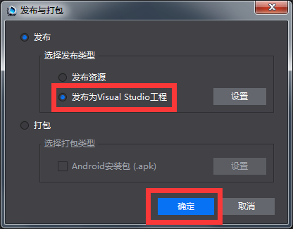

#如何使用Cocos Framework？
###Framework和2dx源码的区别
&emsp;&emsp;Framework是一个cocos2dx的预编译库，所以在功能与API上与cocos2dx是一致的。相比来说，因为是预编译库，所以在开发编译你的项目时会节省大量编译时间，特别是对于C++项目，如果有用过VS来编译cocos2dx的项目的话对编译时间应该深有体会。同时也因为是预编译库，在用于开发时，我们无法对cocos的源码进行断点调试，并且也不能改动cocos的源码（但之framework3.7之后已提供自行编译framework的方式来允许用户改动cocos的源码）。以上是二者的主要不同点。

###Framework的简略使用步骤

其实，Framework的使用步骤很简单，之所以有这个简略使用步骤，是怕浪费大家的时间。废话少说，步骤如下：

&emsp;&emsp;1,下载framework，cocos商店可以下载

&emsp;&emsp;2,安装framework（注意路径不要有空格和特殊字符，可改变默认路径）

&emsp;&emsp;3,重新启动cocos（要关闭电脑屏幕右下角的launcher）

&emsp;&emsp;4,新建项目,选择framework版本,语言等

&emsp;&emsp;5,发布项目到VS

###Framework的详细使用步骤

####哪里下载Framework

&emsp;&emsp;目前只能从Cocos商店下载（从2.3.2.3版本开始，Cocos有两个安装包：带Framework的Cocos安装包和不带Framework的Cocos安装包）
 

&emsp;&emsp;第一种搜索方式（如上图）：商店---工具----Cocos 框架，选择Framework---立即下载。这种搜索方式只会出现最新的Framework版本。

 

&emsp;&emsp;第二种搜索方式（如上图）：直接在右上角搜索“Framework”，点击搜索。这种搜索方式会出现所有可下载的Framework。

###Framework的安装

&emsp;&emsp;下载过Framework后，开始安装，同样有两种安装方式。（我习惯用第二种安装方式）

&emsp;&emsp;第一种：自动安装。在Cocos Launcher中，选择“下载”,“已下载”，找到你下载的Framework，点击“安装”，下一步,下一步,直到安装完毕。
 
 

&emsp;&emsp;第二种（如上图）：手动安装。Cocos Launcher右上角有个设置下载路径的地方，找到硬盘路径并打开，会有一个Framework的安装包，点击安装,并一步一步走下去就行。（注意：如果要自定义路径，那么路径不要有中文和空格等特殊字符。）

###使用Framework创建项目并运行
 
 

&emsp;&emsp;使用Framework创建项目之前，要先关闭Cocos，如上图

&emsp;&emsp;创建Framework项目并发布到VS的步骤为下图所示：

 

 

	注意：项目路径不要有中文和空格等特殊字符。

 

&emsp;&emsp;发布到VS后，点击运行或F5即可运行出这个界面。
 
 

