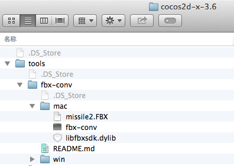

# How to: Use FBX File? #

  Currently cocos support .c3b/.c3t/.obj files. If you want to use .fbx files, you need to convert them to the file types that cocos supports. 

How to convert: 

1 Locate tools/fbx-conv folder in engine directory, and find the converter;
        
    

2 Choose appropriate converter for different operating system; 

    

3 Convert the .fbx file to a .c3b file. See   3D Models for more details. 
