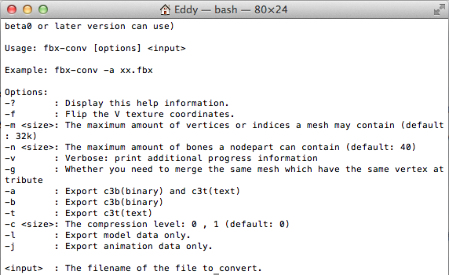

# **如何使用FBX模型?** #

  目前cocos支援的模型格式有.c3b/.c3t/.obj三種，用戶要使用.fbx格式的模型需要進行一次轉換，轉換為cocos支持的格式。
  使用步驟

  1）在引擎目錄尋找tools/fbx-conv資料夾找到轉換工具，如下圖所示：
        
    

  2）根據作業系統使用不同的轉換檔進行轉換，具體使用方法如下圖所示：

    

  3）fbx成功轉換為.c3b檔後就可以使用了，具體使用方法詳見3D模型控制項使用方法；
