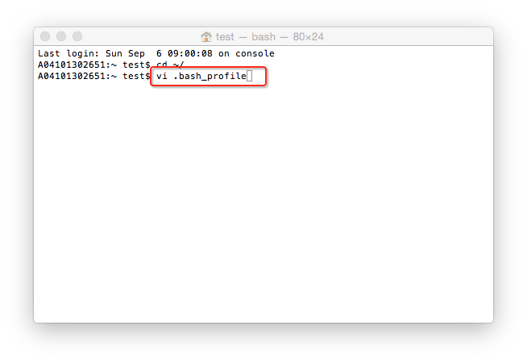
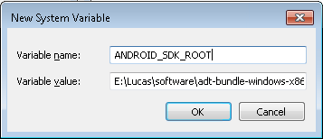
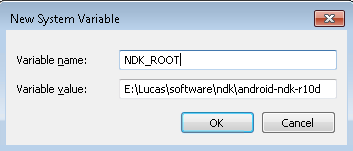
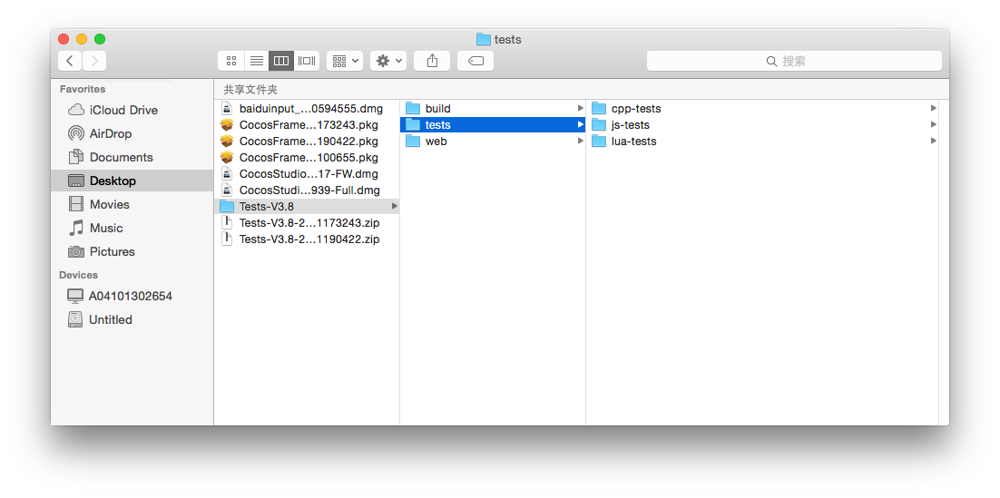

#How to Use FrameworkTest

###1 Prerequisite 

- Download and install an appropriate version of Cocos Framework. 

- Unzip the **Tests.zip** file to any location (path name cannot contain Chinese and other special characters). 

- Environment configuration. 

&emsp;&emsp;**On Mac**

1. Download and install the latest version of Xcode. 

2. Select a supported browser (Firefox, Chrome or Safari, etc.).

3. Configure Android development environment. 

    a. Download and install JDK.
  
    b. Download and unzip NDK and Android SDK. 

    c. Configure `NDK_ROOT` and `Android _SDK_ROOT` with following method: 

&emsp;&emsp;&emsp;&emsp;i)&emsp; Run commands below in terminal, and then press Enter to edit the file. 

&emsp;&emsp;&emsp;&emsp;&emsp;&emsp; `cd ~/`

&emsp;&emsp;&emsp;&emsp;&emsp;&emsp; `vi .bash_profile`

&emsp;&emsp;&emsp;&emsp;ii) Add the following commands: 
                    		
&emsp;&emsp;&emsp;&emsp;&emsp;&emsp;&emsp;&emsp;`export ANDROID_SDK_ROOT=`

&emsp;&emsp;&emsp;&emsp;&emsp;&emsp;&emsp;&emsp;`export NDK_ROOT=`

&emsp;&emsp;&emsp;&emsp;&emsp;&emsp;&emsp;Type the SDK and NDK path after `=`. 

&emsp;&emsp;&emsp;&emsp;iii)&emsp;Save, exit and restart the terminal to complete the configuration of Android development environment.  

&emsp;&emsp;**On Windows**

1. Download and install the latest version of Visual Studio. 

2. Select a supported browser (Firefox, Chrome or Safari, etc.).

3. Configure Android development environment. 

    a. Download and install JDK, and configure Java environment.
  
    b. Download and unzip NDK and Android SDK. 

    c. Configure `NDK_ROOT` and `Android _SDK_ROOT` with following method: right click Computer -> Properties -> Advanced system settings -> Advanced -> Environment Variables -> New 

&emsp;&emsp;
&emsp;

&emsp;&emsp;
&emsp;

&emsp;&emsp;&emsp;Set up the environment variable to where your SDK and NDK are installed. 

###2 Tests.zip file

&emsp;&emsp; There are three projects in the file: `cpp-tests`, `js-tests` and `lua-tests`. 

###3 Run the test project 
    
&emsp;&emsp;`TESTS_PATH` is where `test` file is unzipped. 

&emsp;&emsp;For example,  the command for the file in my computer is: 

     cocos run -s /Users/test/Downloads/Tests-V3.8/tests/cpp-tests -p ios
    
&emsp;&emsp;**Run Tests on Mac**

&emsp;&emsp;Run commands below in terminal: 

    //执行此命令，编译cpp-tests示例项目，在ios模拟器运行
    cocos run -s TESTS_PATH/tests/cpp-tests -p ios
    		
    //执行此命令，编译cpp-tests示例项目，在mac平台运行
    cocos run -s TESTS_PATH/tests/cpp-tests -p mac
    		
    //执行此命令，编译cpp-tests示例项目，在安卓手机上运行
    cocos run -s TESTS_PATH/tests/cpp-tests -p android
    		
    //执行此命令，编译js-tests示例项目，在ios模拟器运行
    cocos run -s TESTS_PATH/tests/js-tests -p ios
    		
    //执行此命令，编译js-tests示例项目，在mac平台运行
    cocos run -s TESTS_PATH/tests/js-tests -p mac
    		
    //执行此命令，编译js-tests示例项目，在安卓手机运行
    cocos run -s TEST S_PATH/tests/js-tests -p android
    		
    //执行此命令，编译js-tests示例项目，在浏览器运行
    cocos run -s TESTS_PATH/tests/js-tests -p web
    
    //执行此命令，编译lua-tests示例项目，在ios模拟器运行
    cocos run -s TESTS_PATH/tests/lua-tests -p ios
    		
    //执行此命令，编译lua-tests示例项目，在mac平台运行
    cocos run -s TESTS_PATH/tests/lua-tests -p mac
    		
    //执行此命令，编译lua-tests示例项目，在安卓手机运行
    cocos run -s TESTS_PATH/tests/lua-tests -p android

&emsp;&emsp;**Run Tests on Windows**

&emsp;&emsp;Run commands below in terminal: 
    
    //执行此命令，编译cpp-tests示例项目，在安卓手机运行
    cocos run -s TESTS_PATH/tests/cpp-tests -p android
    
    //执行此命令，编译cpp-tests示例项目，在windows平台运行
    cocos run -s TESTS_PATH/tests/cpp-tests -p win32
    
    //执行此命令，编译cpp-tests示例项目，在安卓手机运行
    cocos run -s TESTS_PATH/tests/js-tests -p android
    
    //执行此命令，编译js-tests示例项目，在windows平台运行
    cocos run -s TESTS_PATH/tests/js-tests -p win32
     
    //执行此命令，编译js-tests示例项目，在浏览器中运行
    cocos run -s TESTS_PATH/tests/js-tests -p web
    
    //执行此命令，编译lua-tests示例项目，在安卓手机运行
    cocos run -s TESTS_PATH/tests/lua-tests -p android
    
    //执行此命令，编译lua-tests示例项目，在windows平台运行
    cocos run -s TESTS_PATH/tests/lua-tests -p win32

###4 Q&A

- If the version of Cocos Framework does not match the version of Tests, the compilation will fail. 

- If no Cocos Framework in your computer, the command cannot run. 

- When running Android command, please make sure to connect Android device to a computer and enable USB debug mode. 

- When running iOS command, iOS simulator will be used to run Sample projects.  
