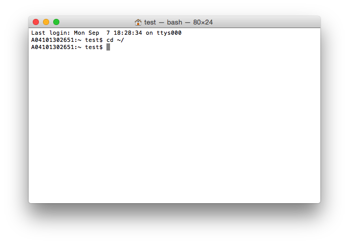
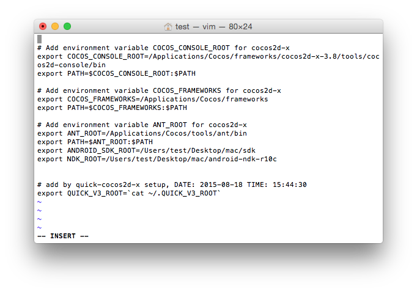
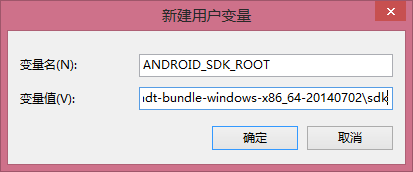
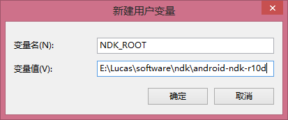
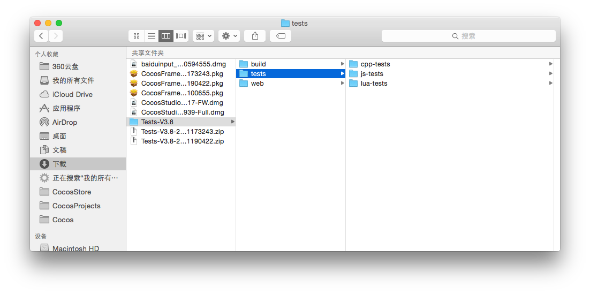

#Cocos Framework Test使用文档

###一&emsp;使用前提

&emsp;1&emsp;安装相应版本的`Cocos Framework`

&emsp;2&emsp;`Tests`的`zip`包可解压到任意路径下（但路径不能包含中文及特殊字符）

&emsp;3&emsp;配置开发环境

&emsp;&emsp;**MAC下环境配置**

&emsp;&emsp;(1)&emsp;安装新版本`Xcode`

&emsp;&emsp;(2)&emsp;系统中有可用的浏览器（`Firefox`，`Chrome`，`Safari`等任一个）

&emsp;&emsp;(3)&emsp;配置安卓开发环境

&emsp;&emsp;&emsp;&emsp;a)&emsp;安装`JDK`

&emsp;&emsp;&emsp;&emsp;b)&emsp;下载`NDK`和安卓`SDK`，并解压

&emsp;&emsp;&emsp;&emsp;c)&emsp;设置`NDK_ROOT`和`ANDROID_SDK_ROOT`，方法如下所示：

&emsp;&emsp;&emsp;&emsp;&emsp;&emsp;i)&emsp;打开终端命令行，输入:`cd ~/`

&emsp;&emsp;&emsp;&emsp;&emsp;&emsp;ii)&emsp;然后输入:`vi .bash_profile`，回车进入vi编辑文档页面

&emsp;&emsp;&emsp;&emsp;&emsp;&emsp;&emsp;然后在文件结尾加入如下两行：
                    		
&emsp;&emsp;&emsp;&emsp;&emsp;&emsp;&emsp;&emsp;`export ANDROID_SDK_ROOT=`

&emsp;&emsp;&emsp;&emsp;&emsp;&emsp;&emsp;&emsp;`export NDK_ROOT=`

&emsp;&emsp;&emsp;&emsp;&emsp;&emsp;&emsp;在`=`的后面加入`SDK`和`NDK`的路径即可

&emsp;&emsp;&emsp;&emsp;&emsp;&emsp;iii)&emsp;保存退出，重启终端，即可完成安卓环境的配置

&emsp;&emsp;**Windows下环境配置**

&emsp;&emsp;(1)&emsp;安装新版本 `Visual Studio`

&emsp;&emsp;(2)&emsp;系统中有可用的浏览器（`Firefox`，`Chrome`，`Safari`等任一个）

&emsp;&emsp;(3)&emsp;配置安卓开发环境

&emsp;&emsp;&emsp;&emsp;a)&emsp;安装`JDK`，并配置`Java`环境

&emsp;&emsp;&emsp;&emsp;b)&emsp;下载`NDK`和安卓`SDK`，并解压，然后设置`ANDROID_SDK_ROOT`和`NDK_ROOT`

&emsp;&emsp;&emsp;&emsp;&emsp;&emsp;右键计算机——>属性——>高级系统设置——>环境变量——>新建

&emsp;&emsp;&emsp;&emsp;&emsp;&emsp;如下所示：

&emsp;&emsp;
&emsp;&emsp;&emsp;

&emsp;&emsp;
&emsp;&emsp;&emsp;

&emsp;&emsp;&emsp;&emsp;&emsp;&emsp;变量值分别为`SDK`和`NDK`解压后的绝对路径

###二&emsp;Tests.zip包中的内容

&emsp;&emsp;zip 包中包含 `cpp-tests`, `js-tests`, `lua-tests` 三个工程。

###三&emsp;使用方法
    
&emsp;&emsp;命令中的`TESTS_PATH` 是`test`项目解压后的绝对路径，取决于用户的解压路径，如笔者的解压后的如下图所示:

&emsp;&emsp;则相应的命令执行就是：

    cocos run -s /Users/test/Downloads/Tests-V3.8/tests/cpp-tests -p ios
    
&emsp;1&emsp;**MAC平台测试**

&emsp;&emsp;在终端执行如下命令：

    //执行此命令，编译cpp-tests示例项目，在ios模拟器运行
    cocos run -s TESTS_PATH/tests/cpp-tests -p ios
    		
    //执行此命令，编译cpp-tests示例项目，在mac平台运行
    cocos run -s TESTS_PATH/tests/cpp-tests -p mac
    		
    //执行此命令，编译cpp-tests示例项目，在安卓手机上运行
    cocos run -s TESTS_PATH/tests/cpp-tests -p android
    		
    //执行此命令，编译js-tests示例项目，在ios模拟器运行
    cocos run -s TESTS_PATH/tests/js-tests -p ios
    		
    //执行此命令，编译js-tests示例项目，在mac平台运行
    cocos run -s TESTS_PATH/tests/js-tests -p mac
    		
    //执行此命令，编译js-tests示例项目，在安卓手机运行
    cocos run -s TEST S_PATH/tests/js-tests -p android
    		
    //执行此命令，编译js-tests示例项目，在浏览器运行
    cocos run -s TESTS_PATH/tests/js-tests -p web
    
    //执行此命令，编译lua-tests示例项目，在ios模拟器运行
    cocos run -s TESTS_PATH/tests/lua-tests -p ios
    		
    //执行此命令，编译lua-tests示例项目，在mac平台运行
    cocos run -s TESTS_PATH/tests/lua-tests -p mac
    		
    //执行此命令，编译lua-tests示例项目，在安卓手机运行
    cocos run -s TESTS_PATH/tests/lua-tests -p android

&emsp;2&emsp;**Windows平台测试**

&emsp;&emsp;在命令行执行如下命令：
    
    //执行此命令，编译cpp-tests示例项目，在安卓手机运行
    cocos run -s TESTS_PATH/tests/cpp-tests -p android
    
    //执行此命令，编译cpp-tests示例项目，在windows平台运行
    cocos run -s TESTS_PATH/tests/cpp-tests -p win32
    
    //执行此命令，编译cpp-tests示例项目，在安卓手机运行
    cocos run -s TESTS_PATH/tests/js-tests -p android
    
    //执行此命令，编译js-tests示例项目，在windows平台运行
    cocos run -s TESTS_PATH/tests/js-tests -p win32
     
    //执行此命令，编译js-tests示例项目，在浏览器中运行
    cocos run -s TESTS_PATH/tests/js-tests -p web
    
    //执行此命令，编译lua-tests示例项目，在安卓手机运行
    cocos run -s TESTS_PATH/tests/lua-tests -p android
    
    //执行此命令，编译lua-tests示例项目，在windows平台运行
    cocos run -s TESTS_PATH/tests/lua-tests -p win32

&emsp;以上每一条命令都应该可以正常编译运行相应的测试例工程。

###四&emsp;Q&A

&emsp;1&emsp;`Cocos Framework`版本和`Tests`包版本不匹配会编译不通过

&emsp;2&emsp;电脑上未安装`Cocos Framework`，命令无法被执行

&emsp;3&emsp;在执行安卓命令时，需将手机连接电脑，并打开`usb`调试

&emsp;3&emsp;在执行`ios`命令时，系统会启动`ios`模拟器运行示例项目