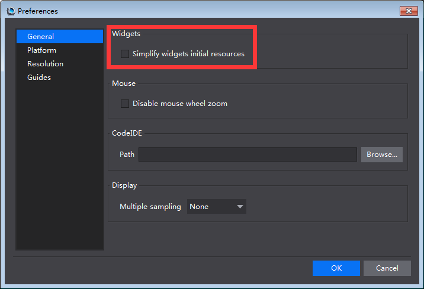
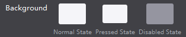
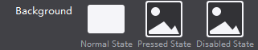
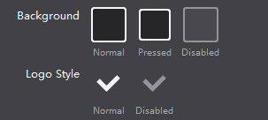
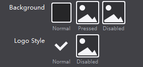
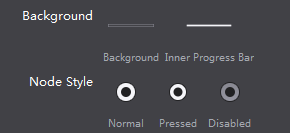
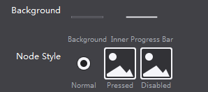

#How to: Simplify Widgets Initial Resources#

If you want to simplify widgets' initial resources, please do the following:  

**Menu** -> **Edit** -> **Preferences** -> **General** -> check the **simplify widgets initial resources** option. By default, the option is unchecked, and only available for Button, CheckBox and Slider.  
&emsp;&emsp;

**Button**

    when the option is checked  

**CheckBox**

    when the option is checked  

**Slider**

    when the option is checked  
  

