# No Android Devices Found？

There are a few reasons why you might be getting an error message when trying to get files onto your Android device. Following are some options for you to solve these problems.

1 Check USB cable.
 
Some data lines are just charging cable, having no ability to transfer data. 

2 Replug to check the wire the device are attached properly.

Reconnect the device to check the USB ports.

3 Try another USB interface.

Power supply shortage of the USB port may lead to the unrecognized connection.

4 Try another data line.

A bad USB component may cause errors such as "unrecognized USB device". 

5 Change the USB connection options.

The default option may be "charging". The issue can be solved by changing the mode to "mass storage". Different devices have different options. I choose two popular mobiles to show how to changing the connection modes.

### Samsung###

1)  If the picture  appears when connect Samsung devices to the computer, you need to change the connection option. Slide down the screen as the following picture shows.

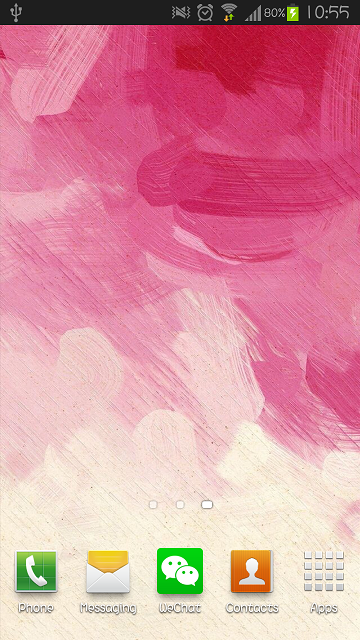
 
 2）Click the circle in the following picture.      

 
 3）Enable "Media Device (MTP)", and the system will find the phone.       

### Huawei 

1）Usually, a pop-up window will appear to select connection mode after connecting the device. Enable "Media Device (MTP)", and the system will find the phone.

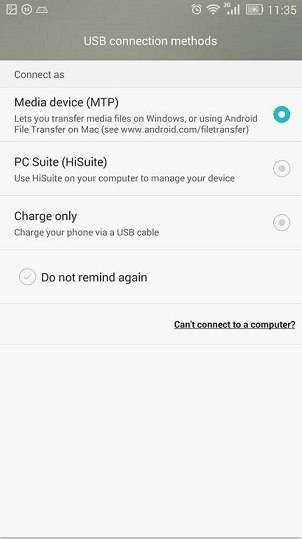

2）Slide down the screen if there is no pop-out notification for you to select connection modes.

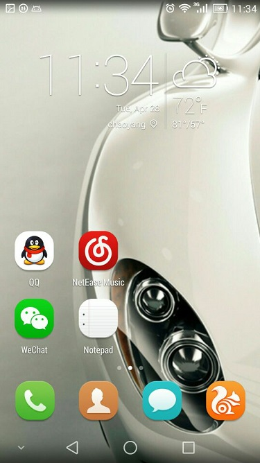

3）Click the circle in the following picture.  
 
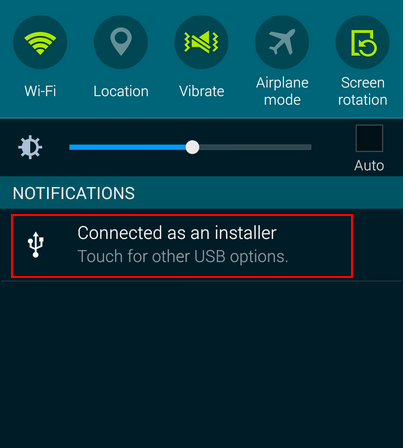

4）Enable "Media Device (MTP)", and the system will find the phone.  
 
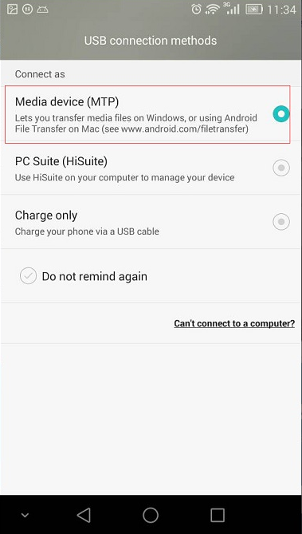

6. Enable USB debugging mode? USB debugging mode is also Developer mode, allows apps to be copied via USB to the device.  For different Android versions there will be different configurations to turn the USB debugging mode.  
    
(1) Android 1.5 - Android 3.2, Settings > Application > Develop > enable "USB debugging". There may be slightly differences for phones with different ROM.

(2) Android 4.0.X，Settings > Developer Options > Enable “USB Debugging”.

(3) Android 4.1.X，Settings > Developer Options > Enable “USB Debugging”.

(4) Android 4.2 - Android 4.3，Settings > "About phone” > "Build Number” > Developer Options> Enable “USB Debugging”.

Follow the steps below to enable USB Debugging for Android v2.3 and Android v4.2. 

**Android v2.3**

- Press the menu button -> select Settings. 

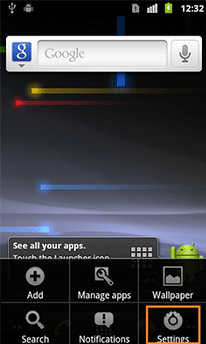

- Select Applications. 

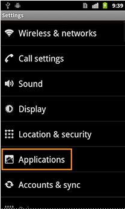

- Select Development. 

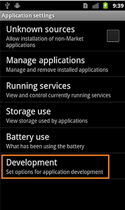

- Enable USB Debugging. 

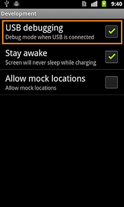

**Android v4.2**

- Select Settings -> Select About Phone. 

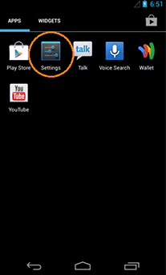  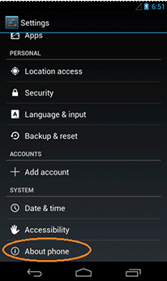

- Quick tap Build number, until the Developer Mode being activated. 

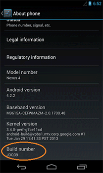

- You'll see the message "You are now a developer!"

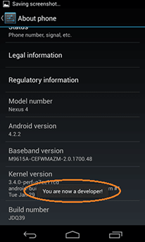

- Tap the Back button and you'll see the Developer options menu under System on your Settings screen.

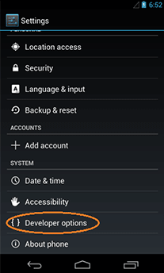

- Select USB Debugging. 

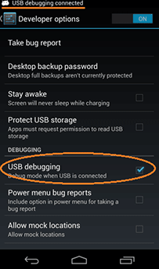

- Click OK to enable USB debugging. 

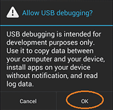

- Now the USB debugging mode has been successfully enabled

7.  Restart the computer or Android device

    Multiple programs are running at the same time, and that leads to timeout errors. Restart the Android device, run Cocos Studio, try to connect again.
