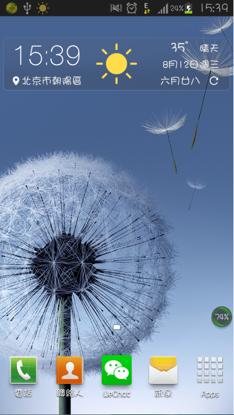
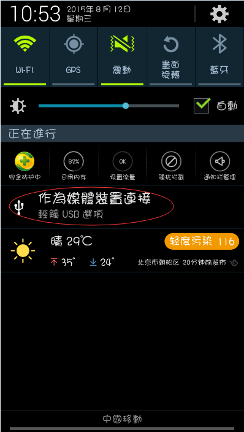
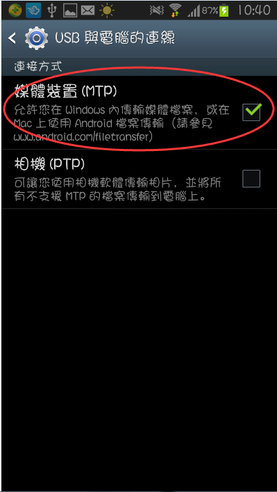
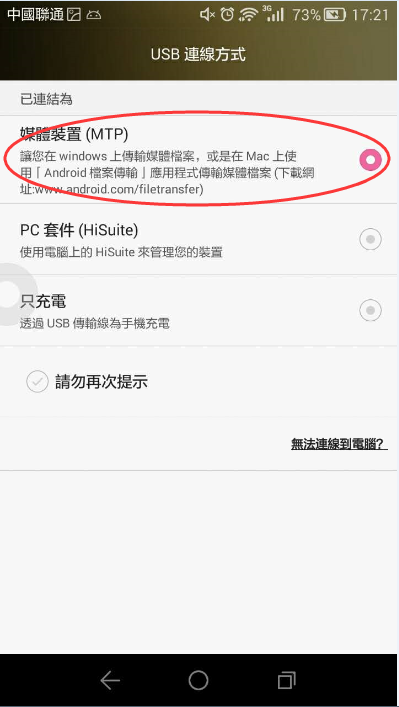
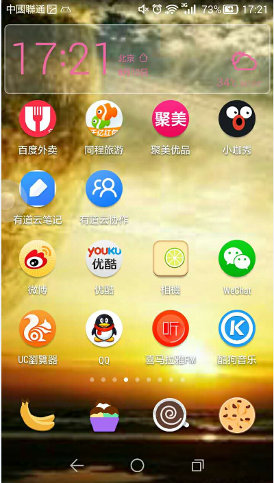
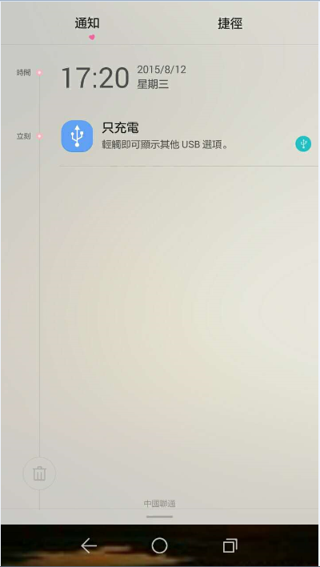
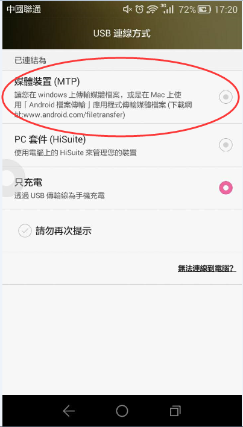

#Android設備接入後無反應
Android設備和電腦用USB線連接之後，點擊在Android設備運行，編輯器提示未檢測到Android設備，可能由於下面的幾種原因導致的，大家可以參考給出的解決方式進行修復。 

- 1.檢查一下連接設備的是否為資料線？因為有些只是充電線，不具備傳輸資料的功能哦；
- 2.嘗試下重新插拔資料線？手機介面和資料線可能因為接觸不良，導致無法連接到您的設備；
- 3.換個USB接口試試？您的電腦USB介面可能供電不足，導致無法正常連接；
- 4.換條數據線？資料線可能因為老化,損壞或不具有資料傳輸功能，使您的設備無法正常連接；
- 5.換個連接方式？因為可能設備中將連接模式設置成“僅為設備充電”，這個模式不會讓設備和電腦連接，大家更改設置就能正常連接了。不同設備更改連接模式的操作不同，這裡我列舉了兩種常見的手機類型供大家參考；

 
    （1）三星更改連接模式教程

        1）新的三星設備接入電腦時如下圖左上角的
 
        
        圖示如果出現，就說明需要你更改連接模式，此時請根據下圖動作，從螢幕頂端至上而下的滑動。

 
        2）滑動後顯示的介面中，點擊下圖畫圈處

 
        3）在打開的介面中，點擊“媒體設備（MTP）”，就能正常連接了。

    （2）華為更改連接模式教程

         1）華為手機接入後，正常是會直接彈出連接****模式提醒彈窗，這時直接選擇“媒體設備（MTP）”模式即可正常連接

 
         2） 如果你的華為設備沒有自動彈出連接模式選擇，就從螢幕頂端至上而下的滑動。

 
         3）滑動後顯示的介面中，點擊下圖畫圈處

 
         4）在打開的介面中，點擊“媒體設備（MTP）”，就能正常連接了。

- 6.是否為USB調試模式？USB調試模式是安卓系統提供的一個用於開發工作的功能，使用該功能才能在Android設備上安裝遊戲軟體等。不同的Andriod系統版本打開USB調試模式的方法不同，所以請根據您的Android系統版本號，我們來查看一下具體的方法。
    
    (1)Android 1.5-Android 3.2，進入“設置”->“應用”->“開發”->“USB調試”進行勾選，不同的手機由於
    ROM 不一樣，可能有細微的差別。

    (2)Android 4.0.X，點擊“設置”->“開發人員選項”->“USB調試”進行勾選。

    (3)Android 4.1.X，點擊“設置”->“開發人員選項”->“右上角打開開發模式”->“USB調試模式”進行勾選。

    (4)Android 4.2-Android 4.3，點擊“設置”->“關於手機”->“版本號（連續按兩下後返回主功能表）”->“開發人員選項”-> “右上角打開開發模式”->“USB調試模式”進行勾選。

- 7.實在不行，要不重啟電腦和Android設備？您的設備後臺可能存在大量程式運行，導致連接逾時。請重啟您的設備，打開Cocos Studio，再重新嘗試連接。
